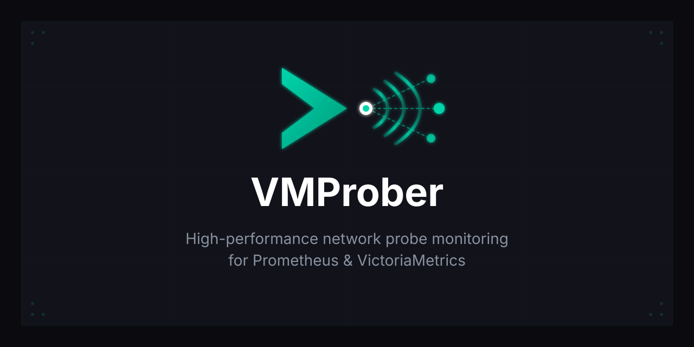
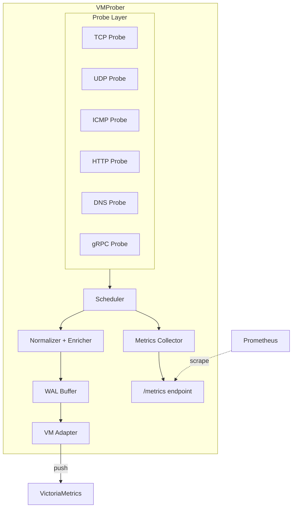

<p align="center">
  
</p>

<p align="center">
  <strong>High-performance network probe monitoring for Prometheus & VictoriaMetrics</strong>
</p>

<p align="center">
  <a href="https://golang.org"></a>
  <a href="LICENSE"></a>
  <a href="https://github.com/gdagil/vmprober/releases"></a>
  <a href="https://github.com/gdagil/vmprober/actions"></a>
</p>

<p align="center">
  <a href="#features">Features</a> •
  <a href="#quick-start">Quick Start</a> •
  <a href="#configuration">Configuration</a> •
  <a href="#api">API</a> •
  <a href="#metrics">Metrics</a> •
  <a href="#contributing">Contributing</a>
</p>

---

## Overview

**VMProber** is a standalone Go application designed for comprehensive network and service monitoring. It supports TCP, UDP, ICMP, HTTP/HTTPS, DNS, and gRPC probes for testing connectivity, availability, and health of your infrastructure. VMProber works with both pull (Prometheus scrape) and push (VictoriaMetrics remote write) models for exporting metrics, making it flexible for various monitoring architectures.

<p align="center">
  
</p>

## Features

| Feature | Description |
|---------|-------------|
| 🔌 **Multi-Protocol Probes** | TCP, UDP, ICMP, HTTP/HTTPS, DNS, and gRPC probe support for comprehensive connectivity and service testing |
| 📊 **Dual Export Modes** | Pull mode (Prometheus `/metrics`) and Push mode (VictoriaMetrics) |
| 📝 **Write-Ahead Log (WAL)** | Fault-tolerant metric buffering for reliable delivery |
| ⚡ **High Performance** | Efficient scheduler with rate limiting and concurrent probe execution |
| 🔄 **Hot Reload** | Configuration changes without service restart |
| 🏥 **Health Checks** | Built-in `/health` and `/ready` endpoints for orchestration |
| 🎨 **Web Dashboard** | Modern, responsive UI for real-time monitoring |
| 📈 **Rich Metrics** | Detailed probe metrics with histograms, counters, and gauges |

## Quick Start

### Prerequisites

- Go 1.23 or higher
- Docker (optional, for containerized deployment)

### Build from Source

```bash
# Clone the repository
git clone https://github.com/gdagil/vmprober.git
cd vmprober

# Install dependencies
make deps

# Build the binary
make build
```

### Run

```bash
# Run with example configuration
./bin/vmprober --config=config/vmprober/config.yaml.example
```

### Docker

```bash
# Build Docker image
make docker-build

# Run with Docker Compose (includes VictoriaMetrics + Grafana)
docker-compose up -d
```

### Using Pre-built Binaries

Download the latest release for your platform from [Releases](https://github.com/gdagil/vmprober/releases):

- `vmprober-linux-amd64` - Linux (x86_64)
- `vmprober-darwin` - macOS (ARM64/x86_64)

## Project Structure

```
vmprober/
├── cmd/vmprober/          # Application entry point
├── internal/
│   ├── adapter/           # VictoriaMetrics push adapter
│   ├── config/            # Configuration management
│   ├── metrics/           # Prometheus metrics collector
│   ├── normalizer/        # Result normalization & enrichment
│   ├── observability/     # Logging, tracing, profiling
│   ├── probe/             # Probe implementations (TCP, UDP, ICMP, HTTP, DNS, gRPC)
│   ├── scheduler/         # Task scheduler with priorities
│   ├── server/            # HTTP server & web dashboard
│   ├── shutdown/          # Graceful shutdown manager
│   ├── types/             # Common types
│   └── wal/               # Write-Ahead Log system
├── pkg/interfaces/        # Public interfaces
├── config/                # Configuration examples
└── docs/                  # Documentation & assets (GitHub Pages)
```

## Configuration

VMProber uses YAML configuration. Copy and modify the example:

```bash
cp config/vmprober/config.yaml.example config.yaml
```

### Key Configuration Sections

```yaml
# HTTP Server
listen:
  address: ":8429"

# Pull mode (Prometheus scrape)
pull:
  enabled: true

# Push mode (VictoriaMetrics)
push:
  enabled: true
  endpoint: "http://vminsert:8480/insert/0/prometheus/api/v1/import"
  interval: 30s
  batch_size: 1000

# Scheduler settings
scheduler:
  workers: 10
  queue_size: 1000

# Monitoring targets
targets:
  static:
    # TCP probe
    - host: "example.com"
      port: 443
      proto: tcp
      interval: 30s
      timeout: 5s

    # HTTP/HTTPS probe
    - host: "api.example.com"
      port: 443
      proto: https
      interval: 30s
      http:
        method: GET
        path: /health
        expected_status_code: 200

    # DNS probe
    - host: "8.8.8.8"
      port: 53
      proto: dns
      dns:
        query_name: "google.com"
        query_type: A

    # gRPC probe
    - host: "grpc.example.com"
      port: 50051
      proto: grpc
      grpc:
        service: "my.Service"
        expected_status: SERVING

# Default probe settings
probes:
  tcp:
    connect_timeout: 5s
  http:
    method: GET
    expected_status_code: 200
  dns:
    query_type: A
    protocol: udp
  grpc:
    expected_status: SERVING

# Metrics configuration
metrics:
  namespace: "vmprober"
  subsystem: "probe"
```

See [Configuration Guide](docs/getting-started/configuration.md) for detailed documentation.

## API Endpoints

| Endpoint | Method | Description |
|----------|--------|-------------|
| `/` | GET | Web dashboard |
| `/metrics` | GET | Prometheus metrics |
| `/health` | GET | Health check (liveness) |
| `/ready` | GET | Readiness check |
| `/api/v1/stats` | GET | Probe statistics JSON |
| `/api/v1/config` | GET | Current configuration |
| `/debug/pprof/` | GET | Go profiling endpoints |

### Example Requests

```bash
# Get Prometheus metrics
curl http://localhost:8429/metrics

# Health check
curl http://localhost:8429/health

# Get probe statistics
curl http://localhost:8429/api/v1/stats
```

## Metrics

VMProber exports comprehensive metrics with the `vmprober_` prefix:

### Probe Metrics

| Metric | Type | Description |
|--------|------|-------------|
| `vmprober_probe_success_total` | Counter | Total successful probes |
| `vmprober_probe_failure_total` | Counter | Total failed probes |
| `vmprober_probe_attempts_total` | Counter | Total probe attempts |
| `vmprober_probe_rtt_seconds` | Histogram | Round-trip time distribution |
| `vmprober_probe_up` | Gauge | Current probe status (1=up, 0=down) |

### Scheduler Metrics

| Metric | Type | Description |
|--------|------|-------------|
| `vmprober_scheduler_jobs_total` | Gauge | Total scheduled jobs |
| `vmprober_scheduler_jobs_running` | Gauge | Currently running jobs |
| `vmprober_scheduler_jobs_failed` | Counter | Failed job executions |

### WAL Metrics

| Metric | Type | Description |
|--------|------|-------------|
| `vmprober_wal_segments_total` | Gauge | WAL segment count |
| `vmprober_wal_bytes_written` | Counter | Bytes written to WAL |
| `vmprober_wal_bytes_sent` | Counter | Bytes sent from WAL |

## Deployment

### Docker Compose (Recommended)

The included `docker-compose.yml` provides a complete monitoring stack:

- **VMProber** - Probe monitoring service
- **VictoriaMetrics** - Time-series database (vmstorage, vminsert, vmselect)
- **Grafana** - Visualization with pre-configured dashboards

```bash
# Start the full stack
docker-compose up -d

# View logs
docker-compose logs -f vmprober

# Stop
docker-compose down
```

### Kubernetes

See [Kubernetes Deployment Guide](docs/operations/deployment.md) for Helm charts and manifests.

### Systemd

```bash
# Copy binary
sudo cp bin/vmprober /usr/local/bin/

# Create systemd service
sudo tee /etc/systemd/system/vmprober.service << EOF
[Unit]
Description=VMProber Network Monitor
After=network.target

[Service]
Type=simple
ExecStart=/usr/local/bin/vmprober --config=/etc/vmprober/config.yaml
Restart=always
RestartSec=5

[Install]
WantedBy=multi-user.target
EOF

# Enable and start
sudo systemctl enable vmprober
sudo systemctl start vmprober
```

## Development

### Requirements

- Go 1.23+
- Make
- Docker & Docker Compose (for integration tests)

### Commands

```bash
# Install dependencies
make deps

# Run tests
make test

# Run tests with coverage
make test-coverage

# Format code
make fmt

# Run linter
make lint

# Build all platforms
make build-all

# Run E2E tests
make e2e-test
```

### Running Locally

```bash
# Start VictoriaMetrics stack
docker-compose up -d vmstorage vminsert vmselect grafana

# Run VMProber locally
go run ./cmd/vmprober --config=config/vmprober/config.yaml.example
```

## Architecture



## Documentation

Full documentation is available at:
- **Online**: [VMProber Documentation](https://gdagil.github.io/vmprober/)
- **Local**: See the `docs/` directory

### Documentation Sections

- [Getting Started](docs/getting-started/) - Installation, quick start, configuration
- [Architecture](docs/architecture/) - System design and principles
- [Components](docs/components/) - Detailed component documentation
- [Operations](docs/operations/) - Deployment, Docker, troubleshooting
- [Development](docs/development/) - Development setup and guidelines
- [Reference](docs/reference/) - API and metrics reference
- [Guides](docs/guides/) - Step-by-step tutorials

## Contributing

We welcome contributions! Please see [CONTRIBUTING.md](CONTRIBUTING.md) for:

- Code of Conduct
- Development workflow
- Coding standards
- Pull request process

## License

This project is licensed under the MIT License - see the [LICENSE](LICENSE) file for details.

## Acknowledgments

- [VictoriaMetrics](https://victoriametrics.com/) - High-performance time-series database
- [Prometheus](https://prometheus.io/) - Monitoring system and TSDB
- [Grafana](https://grafana.com/) - Observability platform

---

<p align="center">
  
  <br>
  <sub>Made with ❤️ by gdagil and llms</sub>
</p>
