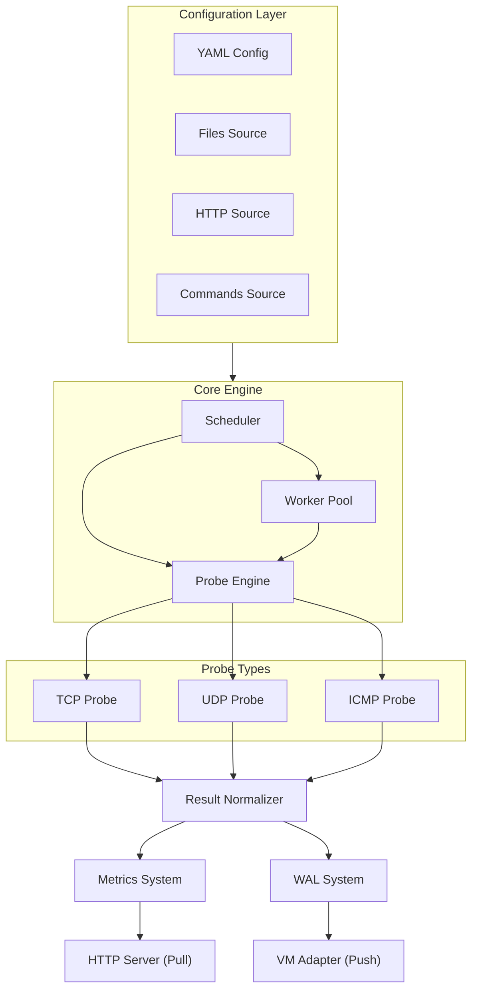

# System Overview

VMProber is a high-performance, reliable network monitoring tool designed for production environments.

## High-Level Architecture

## Core Components

### 1. Configuration Layer
- Loads configuration from multiple sources
- Supports hot reload
- Validates configuration on load

### 2. Scheduler
- Manages probe execution schedule
- Implements jitter for load distribution
- Handles rate limiting per host and globally

### 3. Worker Pool
- Executes probes concurrently
- Limits concurrency to prevent resource exhaustion
- Manages worker lifecycle

### 4. Probe Engine
- Executes different probe types (TCP, UDP, ICMP)
- Handles timeouts and retries
- Collects detailed probe results

### 5. Result Normalizer
- Normalizes probe results to unified format
- Performs deduplication
- Enriches with metadata

### 6. Metrics System
- Collects Prometheus metrics
- Exposes via HTTP endpoint
- Supports custom labels and buckets

### 7. WAL System
- Write-Ahead Log for reliability
- Ensures no data loss on crashes
- Supports compression and rotation

### 8. Export Layer
- **Pull Mode**: HTTP server for Prometheus scraping
- **Push Mode**: VictoriaMetrics adapter with retry logic

## Data Flow

1. **Configuration Loading**: Config loaded from various sources
2. **Target Discovery**: Targets discovered and scheduled
3. **Probe Execution**: Workers execute probes based on schedule
4. **Result Processing**: Results normalized and deduplicated
5. **Storage**: Results written to WAL
6. **Metrics Update**: Metrics updated in real-time
7. **Export**: Metrics exported via pull or push mode

## Key Design Principles

### Reliability
- WAL ensures no data loss
- Retry logic with exponential backoff
- Graceful shutdown with proper cleanup

### Performance
- Efficient scheduling with jitter
- Rate limiting to prevent overload
- Batch processing for exports

### Observability
- Comprehensive metrics
- Structured logging
- Health and readiness checks

### Extensibility
- Pluggable probe types
- Interface-based design
- Hot reload support

## Next Steps

- [Design Principles](design-principles.md) - Architectural decisions
- [Component Architecture](components.md) - Detailed component design
- [Data Flow](data-flow.md) - How data moves through the system
