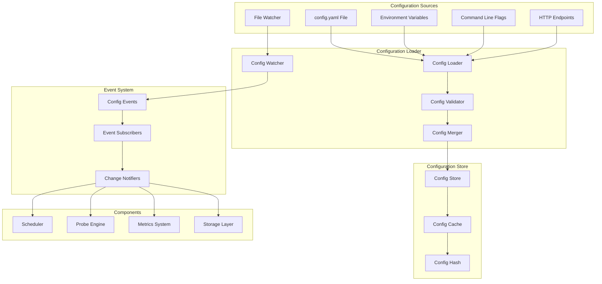

# VMProber Configuration Module

## Обзор модуля конфигурации

Модуль конфигурации VMProber отвечает за загрузку, валидацию, hot reload и управление конфигурацией всех компонентов системы. Он обеспечивает надежную работу с config.yaml и поддерживает динамическое обновление без перезапуска приложения.

## Архитектура модуля конфигурации



## Основные компоненты

### 1. ConfigLoader
Основной загрузчик конфигурации, который объединяет данные из различных источников.

### 2. ConfigValidator
Валидатор конфигурации, проверяющий корректность всех настроек.

### 3. ConfigWatcher
Отслеживатель изменений в файлах конфигурации с поддержкой hot reload.

### 4. ConfigStore
Централизованное хранилище конфигурации с кэшированием и хешированием.

### 5. ConfigEventSystem
Система событий для уведомления компонентов об изменениях конфигурации.

## Структуры данных

### Config
Основная структура конфигурации, содержащая все настройки VMProber.

```go
type Config struct {
    Listen       ListenConfig       `yaml:"listen" json:"listen"`
    Pull         PullConfig         `yaml:"pull" json:"pull"`
    Push         PushConfig         `yaml:"push" json:"push"`
    Scheduler    SchedulerConfig    `yaml:"scheduler" json:"scheduler"`
    Targets      TargetsConfig      `yaml:"targets" json:"targets"`
    Probes       ProbesConfig       `yaml:"probes" json:"probes"`
    Metrics      MetricsConfig      `yaml:"metrics" json:"metrics"`
    WAL          WALConfig          `yaml:"wal" json:"wal"`
    Logging      LoggingConfig      `yaml:"logging" json:"logging"`
    TLS          TLSConfig          `yaml:"tls" json:"tls"`
    Observability ObservabilityConfig `yaml:"observability" json:"observability"`
    
    // Метаданные
    Version      string            `yaml:"-" json:"version,omitempty"`
    Source       string            `yaml:"-" json:"source,omitempty"`
    Hash         string            `yaml:"-" json:"hash,omitempty"`
    Timestamp    time.Time         `yaml:"-" json:"timestamp,omitempty"`
}
```

### ListenConfig
Конфигурация HTTP сервера.

```go
type ListenConfig struct {
    Port    int              `yaml:"port" json:"port"`
    Host    string           `yaml:"host" json:"host"`
    TLS     *TLSServerConfig `yaml:"tls,omitempty" json:"tls,omitempty"`
}
```

### PullConfig
Конфигурация pull режима (Prometheus scrape).

```go
type PullConfig struct {
    Enabled bool           `yaml:"enabled" json:"enabled"`
    Path    string         `yaml:"path" json:"path"`
    Timeout time.Duration  `yaml:"timeout" json:"timeout"`
}
```

### PushConfig
Конфигурация push режима (VictoriaMetrics).

```go
type PushConfig struct {
    Enabled     bool              `yaml:"enabled" json:"enabled"`
    Endpoints   []EndpointConfig  `yaml:"endpoints" json:"endpoints"`
    Retry       RetryConfig       `yaml:"retry" json:"retry"`
    Dedup       DedupConfig       `yaml:"dedup" json:"dedup"`
    Batch       BatchConfig       `yaml:"batch" json:"batch"`
    RemoteWrite RemoteWriteConfig `yaml:"remote_write" json:"remote_write"`
}
```

### SchedulerConfig
Конфигурация планировщика задач.

```go
type SchedulerConfig struct {
    Concurrent     int                    `yaml:"concurrent" json:"concurrent"`
    RPSLimit       int                    `yaml:"rps_limit" json:"rps_limit"`
    PerHostCap     int                    `yaml:"per_host_cap" json:"per_host_cap"`
    Jitter         float64                `yaml:"jitter" json:"jitter"`
    Timeouts       map[string]time.Duration `yaml:"timeouts" json:"timeouts"`
    QueueSize      int                    `yaml:"queue_size" json:"queue_size"`
    WorkerTimeout  time.Duration          `yaml:"worker_timeout" json:"worker_timeout"`
}
```

### TargetsConfig
Конфигурация управления целями.

```go
type TargetsConfig struct {
    Static         []TargetConfig    `yaml:"static" json:"static"`
    Files          []FileConfig      `yaml:"files" json:"files"`
    URLs           []URLConfig       `yaml:"urls" json:"urls"`
    Commands       []CommandConfig   `yaml:"commands" json:"commands"`
    ReloadInterval time.Duration     `yaml:"reload_interval" json:"reload_interval"`
    HotReload      bool              `yaml:"hot_reload" json:"hot_reload"`
}
```

### ProbesConfig
Конфигурация проб по умолчанию.

```go
type ProbesConfig struct {
    Defaults map[string]interface{} `yaml:"defaults" json:"defaults"`
    TCP      TCPConfig              `yaml:"tcp" json:"tcp"`
    UDP      UDPConfig              `yaml:"udp" json:"udp"`
    ICMP     ICMPConfig             `yaml:"icmp" json:"icmp"`
}
```

### MetricsConfig
Конфигурация системы метрик.

```go
type MetricsConfig struct {
    Namespace            string            `yaml:"namespace" json:"namespace"`
    IncludeLabels        []string          `yaml:"include_labels" json:"include_labels"`
    CustomLabels         map[string]string `yaml:"custom_labels" json:"custom_labels"`
    Buckets              []float64         `yaml:"buckets" json:"buckets"`
    EnableProcessMetrics bool              `yaml:"enable_process_metrics" json:"enable_process_metrics"`
    EnableGoMetrics      bool              `yaml:"enable_go_metrics" json:"enable_go_metrics"`
}
```

### WALConfig
Конфигурация Write-Ahead Log.

```go
type WALConfig struct {
    Dir             string        `yaml:"dir" json:"dir"`
    MaxSize         string        `yaml:"max_size" json:"max_size"`
    MaxAge          time.Duration `yaml:"max_age" json:"max_age"`
    Retention       time.Duration `yaml:"retention" json:"retention"`
    Compression     string        `yaml:"compression" json:"compression"`
    SyncInterval    time.Duration `yaml:"sync_interval" json:"sync_interval"`
    BufferSize      string        `yaml:"buffer_size" json:"buffer_size"`
    SegmentSize     string        `yaml:"segment_size" json:"segment_size"`
    IndexCacheSize  int           `yaml:"index_cache_size" json:"index_cache_size"`
}
```

### LoggingConfig
Конфигурация системы логирования.

```go
type LoggingConfig struct {
    Level         string             `yaml:"level" json:"level"`
    Format        string             `yaml:"format" json:"format"`
    Output        string             `yaml:"output" json:"output"`
    File          FileLoggingConfig  `yaml:"file" json:"file"`
    Structured    bool               `yaml:"structured" json:"structured"`
    IncludeSource bool               `yaml:"include_source" json:"include_source"`
}
```

### TLSConfig
Конфигурация TLS.

```go
type TLSConfig struct {
    ClientCerts ClientCertsConfig `yaml:"client_certs" json:"client_certs"`
    ServerCerts ServerCertsConfig `yaml:"server_certs" json:"server_certs"`
    InsecureSkipVerify bool       `yaml:"insecure_skip_verify" json:"insecure_skip_verify"`
    MinVersion         string     `yaml:"min_version" json:"min_version"`
    MaxVersion         string     `yaml:"max_version" json:"max_version"`
    CipherSuites       []string   `yaml:"cipher_suites" json:"cipher_suites"`
}
```

### ObservabilityConfig
Конфигурация наблюдаемости.

```go
type ObservabilityConfig struct {
    Pprof       PprofConfig       `yaml:"pprof" json:"pprof"`
    OpenCensus  OpenCensusConfig  `yaml:"opencensus" json:"opencensus"`
    Prometheus  PrometheusConfig  `yaml:"prometheus" json:"prometheus"`
    HealthCheck HealthCheckConfig `yaml:"health_check" json:"health_check"`
}
```

## Интерфейсы

### ConfigProvider
Основной интерфейс провайдера конфигурации.

```go
type ConfigProvider interface {
    // Load загружает конфигурацию
    Load(ctx context.Context) (*Config, error)
    
    // Watch отслеживает изменения в конфигурации
    Watch(ctx context.Context) (<-chan ConfigUpdate, <-chan error)
    
    // Validate валидирует конфигурацию
    Validate(ctx context.Context, config *Config) error
    
    // GetCurrent возвращает текущую конфигурацию
    GetCurrent() *Config
    
    // GetHash возвращает хеш текущей конфигурации
    GetHash() string
    
    // Close закрывает провайдер
    Close(ctx context.Context) error
}
```

### ConfigLoader
Интерфейс загрузчика конфигурации.

```go
type ConfigLoader interface {
    // LoadFromFile загружает конфигурацию из файла
    LoadFromFile(ctx context.Context, path string) (*Config, error)
    
    // LoadFromBytes загружает конфигурацию из байтов
    LoadFromBytes(ctx context.Context, data []byte) (*Config, error)
    
    // Merge объединяет несколько конфигураций
    Merge(ctx context.Context, configs []*Config) (*Config, error)
    
    // ApplyDefaults применяет значения по умолчанию
    ApplyDefaults(ctx context.Context, config *Config) error
}
```

### ConfigValidator
Интерфейс валидатора конфигурации.

```go
type ConfigValidator interface {
    // Validate валидирует конфигурацию
    Validate(ctx context.Context, config *Config) error
    
    // ValidateSection валидирует секцию конфигурации
    ValidateSection(ctx context.Context, section string, config interface{}) error
    
    // GetValidationErrors возвращает ошибки валидации
    GetValidationErrors() []ValidationError
}
```

### ConfigWatcher
Интерфейс отслеживателя изменений.

```go
type ConfigWatcher interface {
    // Watch начинает отслеживание файлов
    Watch(ctx context.Context, paths []string) error
    
    // AddWatch добавляет путь для отслеживания
    AddWatch(ctx context.Context, path string) error
    
    // RemoveWatch удаляет путь из отслеживания
    RemoveWatch(ctx context.Context, path string) error
    
    // Events возвращает канал событий
    Events() <-chan fsnotify.Event
    
    // Errors возвращает канал ошибок
    Errors() <-chan error
    
    // Close закрывает watcher
    Close(ctx context.Context) error
}
```

### ConfigStore
Интерфейс хранилища конфигурации.

```go
type ConfigStore interface {
    // Set устанавливает конфигурацию
    Set(ctx context.Context, config *Config) error
    
    // Get возвращает текущую конфигурацию
    Get(ctx context.Context) (*Config, error)
    
    // GetHash возвращает хеш конфигурации
    GetHash(ctx context.Context) (string, error)
    
    // Subscribe подписывается на изменения
    Subscribe(ctx context.Context) (<-chan *Config, <-chan error)
    
    // Clear очищает конфигурацию
    Clear(ctx context.Context) error
}
```

## Основные функции

### 1. Загрузка конфигурации

```go
// Загрузка из файла с валидацией
func LoadConfig(ctx context.Context, configPath string) (*Config, error) {
    loader := NewConfigLoader()
    validator := NewConfigValidator()
    
    // Загрузка
    config, err := loader.LoadFromFile(ctx, configPath)
    if err != nil {
        return nil, fmt.Errorf("failed to load config: %w", err)
    }
    
    // Применение значений по умолчанию
    err = loader.ApplyDefaults(ctx, config)
    if err != nil {
        return nil, fmt.Errorf("failed to apply defaults: %w", err)
    }
    
    // Валидация
    err = validator.Validate(ctx, config)
    if err != nil {
        return nil, fmt.Errorf("config validation failed: %w", err)
    }
    
    return config, nil
}
```

### 2. Hot Reload

```go
// Настройка hot reload
func SetupHotReload(ctx context.Context, configPath string) (*ConfigProvider, error) {
    provider := NewConfigProvider(configPath)
    
    // Загрузка начальной конфигурации
    config, err := provider.Load(ctx)
    if err != nil {
        return nil, err
    }
    
    // Запуск отслеживания изменений
    updates, errs := provider.Watch(ctx)
    
    go func() {
        for {
            select {
            case update := <-updates:
                handleConfigUpdate(ctx, update)
            case err := <-errs:
                log.Error("config watch error", "error", err)
            case <-ctx.Done():
                return
            }
        }
    }()
    
    return provider, nil
}
```

### 3. Валидация конфигурации

```go
// Валидация секций конфигурации
func (v *ConfigValidator) Validate(ctx context.Context, config *Config) error {
    var errs []ValidationError
    
    // Валидация listen секции
    if err := v.validateListen(ctx, config.Listen); err != nil {
        errs = append(errs, err...)
    }
    
    // Валидация scheduler секции
    if err := v.validateScheduler(ctx, config.Scheduler); err != nil {
        errs = append(errs, err...)
    }
    
    // Валидация targets секции
    if err := v.validateTargets(ctx, config.Targets); err != nil {
        errs = append(errs, err...)
    }
    
    // Валидация probes секции
    if err := v.validateProbes(ctx, config.Probes); err != nil {
        errs = append(errs, err...)
    }
    
    // Валидация metrics секции
    if err := v.validateMetrics(ctx, config.Metrics); err != nil {
        errs = append(errs, err...)
    }
    
    // Валидация wal секции
    if err := v.validateWAL(ctx, config.WAL); err != nil {
        errs = append(errs, err...)
    }
    
    if len(errs) > 0 {
        return &ValidationErrorList{Errors: errs}
    }
    
    return nil
}
```

### 4. Применение значений по умолчанию

```go
// Применение значений по умолчанию
func (l *ConfigLoader) ApplyDefaults(ctx context.Context, config *Config) error {
    // Значения по умолчанию для listen
    if config.Listen.Port == 0 {
        config.Listen.Port = 8429
    }
    if config.Listen.Host == "" {
        config.Listen.Host = "0.0.0.0"
    }
    
    // Значения по умолчанию для scheduler
    if config.Scheduler.Concurrent == 0 {
        config.Scheduler.Concurrent = 100
    }
    if config.Scheduler.RPSLimit == 0 {
        config.Scheduler.RPSLimit = 1000
    }
    if config.Scheduler.PerHostCap == 0 {
        config.Scheduler.PerHostCap = 10
    }
    if config.Scheduler.Jitter == 0 {
        config.Scheduler.Jitter = 0.1
    }
    
    // Значения по умолчанию для probes
    if config.Probes.Defaults == nil {
        config.Probes.Defaults = make(map[string]interface{})
    }
    if config.Probes.Defaults["count"] == nil {
        config.Probes.Defaults["count"] = 3
    }
    if config.Probes.Defaults["interval"] == nil {
        config.Probes.Defaults["interval"] = "30s"
    }
    if config.Probes.Defaults["timeout"] == nil {
        config.Probes.Defaults["timeout"] = "5s"
    }
    
    // Значения по умолчанию для metrics
    if config.Metrics.Namespace == "" {
        config.Metrics.Namespace = "vmprober"
    }
    if len(config.Metrics.IncludeLabels) == 0 {
        config.Metrics.IncludeLabels = []string{"job", "instance", "probe", "target", "proto"}
    }
    
    // Значения по умолчанию для logging
    if config.Logging.Level == "" {
        config.Logging.Level = "info"
    }
    if config.Logging.Format == "" {
        config.Logging.Format = "json"
    }
    if config.Logging.Output == "" {
        config.Logging.Output = "stdout"
    }
    
    return nil
}
```

### 5. Отслеживание изменений файлов

```go
// Отслеживание изменений в файлах конфигурации
func (w *ConfigWatcher) Watch(ctx context.Context, paths []string) error {
    for _, path := range paths {
        if err := w.AddWatch(ctx, path); err != nil {
            return fmt.Errorf("failed to watch path %s: %w", path, err)
        }
    }
    
    go w.startWatching(ctx)
    return nil
}

func (w *ConfigWatcher) startWatching(ctx context.Context) {
    for {
        select {
        case event := <-w.watcher.Events:
            w.handleEvent(ctx, event)
        case err := <-w.watcher.Errors:
            w.handleError(ctx, err)
        case <-ctx.Done():
            w.Close(ctx)
            return
        }
    }
}

func (w *ConfigWatcher) handleEvent(ctx context.Context, event fsnotify.Event) {
    // Игнорируем события создания файлов
    if event.Op&fsnotify.Create == fsnotify.Create {
        return
    }
    
    // Проверяем, что файл действительно изменился
    if event.Op&(fsnotify.Write|fsnotify.Remove|fsnotify.Rename) == 0 {
        return
    }
    
    // Отправляем событие об изменении
    select {
    case w.events <- event:
    default:
        log.Warn("config event channel full, dropping event")
    }
}
```

### 6. Обработка изменений конфигурации

```go
// Обработка изменений конфигурации
func handleConfigUpdate(ctx context.Context, update ConfigUpdate) {
    log.Info("config update received", 
        "type", update.Type,
        "source", update.Source,
        "timestamp", update.Timestamp)
    
    switch update.Type {
    case UpdateTypeFull:
        handleFullConfigUpdate(ctx, update)
    case UpdateTypePartial:
        handlePartialConfigUpdate(ctx, update)
    case UpdateTypeError:
        handleConfigError(ctx, update)
    }
}

func handleFullConfigUpdate(ctx context.Context, update ConfigUpdate) {
    // Уведомляем все компоненты об изменении конфигурации
    notifyComponents(ctx, update.NewConfig)
    
    // Обновляем метрики
    updateConfigMetrics(ctx, update)
    
    // Логируем изменения
    logConfigChanges(ctx, update.Changes)
}

func handlePartialConfigUpdate(ctx context.Context, update ConfigUpdate) {
    // Обрабатываем только измененные секции
    for _, change := range update.Changes {
        switch change.Path {
        case "targets":
            updateTargetsConfig(ctx, change.NewValue)
        case "scheduler":
            updateSchedulerConfig(ctx, change.NewValue)
        case "probes":
            updateProbesConfig(ctx, change.NewValue)
        case "metrics":
            updateMetricsConfig(ctx, change.NewValue)
        }
    }
}
```

## Конфигурационные источники

### 1. Файлы конфигурации
- **config.yaml**: Основной файл конфигурации
- **config.yml**: Альтернативное расширение
- ***.yaml**: Дополнительные файлы конфигурации

### 2. Переменные окружения
- **VMPROBER_CONFIG_PATH**: Путь к файлу конфигурации
- **VMPROBER_LOG_LEVEL**: Уровень логирования
- **VMPROBER_LISTEN_PORT**: Порт HTTP сервера

### 3. Аргументы командной строки
- **--config**: Путь к файлу конфигурации
- **--log-level**: Уровень логирования
- **--listen-port**: Порт HTTP сервера

### 4. HTTP endpoints
- **Конфигурационные серверы**: Динамическая загрузка конфигурации
- **Service discovery**: Автоматическое обнаружение настроек

## Валидация конфигурации

### 1. Структурная валидация
- Проверка обязательных полей
- Валидация типов данных
- Проверка диапазонов значений

### 2. Семантическая валидация
- Проверка доступности файлов и директорий
- Валидация URL и сетевых адресов
- Проверка прав доступа

### 3. Бизнес-логика валидация
- Проверка совместимости настроек
- Валидация лимитов и квот
- Проверка зависимостей между компонентами

## Hot Reload механизм

### 1. Отслеживание файлов
- Использование fsnotify для мониторинга файлов
- Поддержка рекурсивного отслеживания директорий
- Обработка атомарных обновлений

### 2. Применение изменений
- Graceful обновление компонентов
- Сохранение состояния во время обновления
- Rollback при ошибках

### 3. Уведомления
- Событийная система для компонентов
- Асинхронная обработка изменений
- Мониторинг применения изменений

## Обработка ошибок

### 1. Ошибки загрузки
- Некорректный YAML синтаксис
- Отсутствующие обязательные поля
- Недоступные файлы конфигурации

### 2. Ошибки валидации
- Некорректные значения параметров
- Конфликтующие настройки
- Недоступные ресурсы

### 3. Ошибки применения
- Ошибки hot reload
- Проблемы с правами доступа
- Таймауты при обновлении

## Мониторинг конфигурации

### 1. Метрики конфигурации
- Время загрузки конфигурации
- Количество изменений конфигурации
- Ошибки валидации

### 2. Логирование
- События загрузки конфигурации
- Изменения параметров
- Ошибки и предупреждения

### 3. Трассировка
- Время обработки изменений
- Производительность валидации
- Трассировка hot reload операций

## Безопасность

### 1. Валидация входных данных
- Проверка размера конфигурационных файлов
- Ограничение глубины вложенности YAML
- Санитизация строковых параметров

### 2. Контроль доступа
- Проверка прав доступа к файлам
- Валидация путей к файлам
- Защита от directory traversal

### 3. Шифрование
- Поддержка зашифрованных конфигурационных файлов
- Безопасное хранение секретов
- Интеграция с системами управления секретами