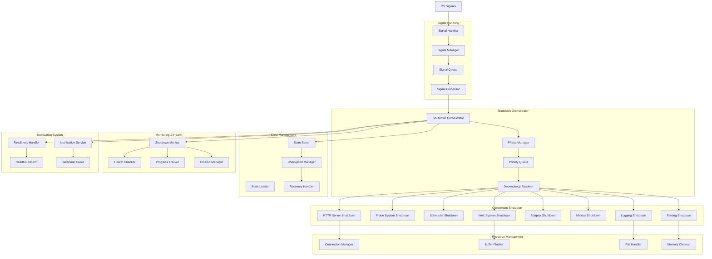

# VMProber Graceful Shutdown System

## Обзор системы graceful shutdown

Система graceful shutdown VMProber обеспечивает корректное завершение работы всех компонентов системы при получении сигналов остановки. Система реализует поэтапное завершение операций с приоритизацией критических компонентов, timeout механизмами и comprehensive логированием процесса остановки.

## Архитектура системы graceful shutdown



## Основные компоненты

### 1. Signal Handler
Обработчик системных сигналов для инициации graceful shutdown.

### 2. Shutdown Orchestrator
Центральный оркестратор для координации процесса остановки.

### 3. Phase Manager
Менеджер фаз остановки с приоритизацией компонентов.

### 4. Component Shutdown
Специализированные обработчики остановки для каждого компонента.

### 5. Resource Manager
Управление ресурсами и их корректным освобождением.

## Интерфейсы

### ShutdownManager Interface
```go
type ShutdownManager interface {
    // Init инициализирует менеджер остановки
    Init(ctx context.Context, config *ShutdownConfig) error
    
    // Register регистрирует компонент для graceful shutdown
    Register(ctx context.Context, component ShutdownComponent) error
    
    // Unregister отменяет регистрацию компонента
    Unregister(ctx context.Context, componentID string) error
    
    // Initiate инициирует graceful shutdown
    Initiate(ctx context.Context, reason ShutdownReason) error
    
    // ForceShutdown принудительно завершает работу
    ForceShutdown(ctx context.Context, reason ShutdownReason) error
    
    // GetStatus возвращает статус остановки
    GetStatus() *ShutdownStatus
    
    // WaitForCompletion ожидает завершения остановки
    WaitForCompletion(ctx context.Context) error
    
    // IsShuttingDown проверяет, выполняется ли остановка
    IsShuttingDown() bool
}
```

### ShutdownComponent Interface
```go
type ShutdownComponent interface {
    // ID возвращает уникальный идентификатор компонента
    ID() string
    
    // Name возвращает имя компонента
    Name() string
    
    // Priority возвращает приоритет остановки (меньше = выше приоритет)
    Priority() int
    
    // Dependencies возвращает список зависимостей
    Dependencies() []string
    
    // Shutdown выполняет graceful shutdown компонента
    Shutdown(ctx context.Context, timeout time.Duration) error
    
    // ForceShutdown принудительно завершает компонент
    ForceShutdown(ctx context.Context, timeout time.Duration) error
    
    // IsHealthy проверяет состояние компонента
    IsHealthy(ctx context.Context) bool
    
    // GetStatus возвращает статус компонента
    GetStatus() ComponentStatus
}
```

### SignalHandler Interface
```go
type SignalHandler interface {
    // Start запускает обработчик сигналов
    Start(ctx context.Context) error
    
    // Stop останавливает обработчик сигналов
    Stop(ctx context.Context) error
    
    // Register регистрирует callback для сигнала
    Register(ctx context.Context, signal os.Signal, callback SignalCallback) error
    
    // Unregister отменяет регистрацию callback
    Unregister(ctx context.Context, signal os.Signal) error
    
    // GetSignals возвращает список обрабатываемых сигналов
    GetSignals() []os.Signal
    
    // IsRunning проверяет, запущен ли обработчик
    IsRunning() bool
}
```

## Core Data Structures

### ShutdownConfig
```go
type ShutdownConfig struct {
    // Основные настройки
    Enabled           bool              `yaml:"enabled" json:"enabled"`
    
    // Timeout настройки
    Timeout           TimeoutConfig     `yaml:"timeout" json:"timeout"`
    
    // Фазы остановки
    Phases            []ShutdownPhase   `yaml:"phases" json:"phases"`
    
    // Signal настройки
    Signals           SignalConfig      `yaml:"signals" json:"signals"`
    
    // Health check настройки
    HealthCheck       HealthCheckConfig `yaml:"health_check" json:"health_check"`
    
    // Notification настройки
    Notification      NotificationConfig `yaml:"notification" json:"notification"`
    
    // Logging настройки
    Logging           LoggingConfig     `yaml:"logging" json:"logging"`
    
    // State management
    StateManagement   StateConfig       `yaml:"state_management" json:"state_management"`
    
    // Resource cleanup
    ResourceCleanup   ResourceConfig    `yaml:"resource_cleanup" json:"resource_cleanup"`
    
    // Monitoring
    Monitoring        MonitoringConfig  `yaml:"monitoring" json:"monitoring"`
}

type TimeoutConfig struct {
    // Общий timeout для graceful shutdown
    Graceful          time.Duration     `yaml:"graceful" json:"graceful"`
    
    // Timeout для каждой фазы
    PerPhase          map[string]time.Duration `yaml:"per_phase" json:"per_phase"`
    
    // Timeout для каждого компонента
    PerComponent      map[string]time.Duration `yaml:"per_component" json:"per_component"`
    
    // Timeout для force shutdown
    Force             time.Duration     `yaml:"force" json:"force"`
    
    // Timeout для health checks
    HealthCheck       time.Duration     `yaml:"health_check" json:"health_check"`
    
    // Timeout для notification
    Notification      time.Duration     `yaml:"notification" json:"notification"`
}

type ShutdownPhase struct {
    Name          string                 `yaml:"name" json:"name"`
    Description   string                 `yaml:"description" json:"description"`
    Priority      int                    `yaml:"priority" json:"priority"`
    Timeout       time.Duration          `yaml:"timeout" json:"timeout"`
    Components    []string               `yaml:"components" json:"components"`
    Parallel      bool                   `yaml:"parallel" json:"parallel"`
    Dependencies  []string               `yaml:"dependencies" json:"dependencies"`
    Conditions    []PhaseCondition       `yaml:"conditions" json:"conditions"`
    Actions       []PhaseAction          `yaml:"actions" json:"actions"`
}

type SignalConfig struct {
    // Обрабатываемые сигналы
    Signals       []string               `yaml:"signals" json:"signals"`
    
    // Ignore signals
    Ignore        []string               `yaml:"ignore" json:"ignore"`
    
    // Handler настройки
    Handler       HandlerConfig          `yaml:"handler" json:"handler"`
    
    // Retry настройки
    Retry         RetryConfig            `yaml:"retry" json:"retry"`
}

type NotificationConfig struct {
    // Включение уведомлений
    Enabled       bool                   `yaml:"enabled" json:"enabled"`
    
    // Webhook настройки
    Webhooks      []WebhookConfig        `yaml:"webhooks" json:"webhooks"`
    
    // Health endpoint настройки
    HealthEndpoint HealthEndpointConfig  `yaml:"health_endpoint" json:"health_endpoint"`
    
    // Readiness endpoint настройки
    ReadinessEndpoint ReadinessEndpointConfig `yaml:"readiness_endpoint" json:"readiness_endpoint"`
    
    // Logging настройки
    Logging       NotificationLoggingConfig `yaml:"logging" json:"logging"`
}

type StateConfig struct {
    // Включение сохранения состояния
    Enabled       bool                   `yaml:"enabled" json:"enabled"`
    
    // Directory для сохранения состояния
    Directory     string                 `yaml:"directory" json:"directory"`
    
    // Формат сохранения
    Format        string                 `yaml:"format" json:"format"` // "json", "yaml", "binary"
    
    // Compression
    Compression   CompressionConfig      `yaml:"compression" json:"compression"`
    
    // Encryption
    Encryption    EncryptionConfig       `yaml:"encryption" json:"encryption"`
    
    // Retention
    Retention     RetentionConfig        `yaml:"retention" json:"retention"`
    
    // Auto recovery
    AutoRecovery  AutoRecoveryConfig     `yaml:"auto_recovery" json:"auto_recovery"`
}
```

### ShutdownStatus
```go
type ShutdownStatus struct {
    // Общий статус
    Status        ShutdownStatusType     `json:"status"`
    Reason        ShutdownReason         `json:"reason"`
    StartTime     time.Time              `json:"start_time"`
    EndTime       *time.Time             `json:"end_time,omitempty"`
    Duration      time.Duration          `json:"duration"`
    
    // Текущая фаза
    CurrentPhase  string                 `json:"current_phase"`
    PhaseProgress float64                `json:"phase_progress"`
    
    // Компоненты
    Components    map[string]*ComponentStatus `json:"components"`
    
    // Прогресс
    TotalComponents int                  `json:"total_components"`
    CompletedComponents int              `json:"completed_components"`
    FailedComponents int                 `json:"failed_components"`
    
    // Health status
    HealthStatus  HealthStatusType       `json:"health_status"`
    
    // Resource usage
    MemoryUsage   uint64                 `json:"memory_usage"`
    CPUUsage      float64                `json:"cpu_usage"`
    
    // Logs
    Logs          []ShutdownLogEntry     `json:"logs"`
    
    // Metrics
    Metrics       ShutdownMetrics        `json:"metrics"`
}

type ComponentStatus struct {
    ID           string                 `json:"id"`
    Name         string                 `json:"name"`
    Status       ComponentStatusType    `json:"status"`
    Priority     int                    `json:"priority"`
    StartTime    time.Time              `json:"start_time"`
    EndTime      *time.Time             `json:"end_time,omitempty"`
    Duration     time.Duration          `json:"duration"`
    Error        *string                `json:"error,omitempty"`
    HealthCheck  HealthStatusType       `json:"health_check"`
    Dependencies []string               `json:"dependencies"`
    Resources    ResourceUsage          `json:"resources"`
}

type ShutdownLogEntry struct {
    Timestamp    time.Time              `json:"timestamp"`
    Level        string                 `json:"level"`
    Phase        string                 `json:"phase"`
    Component    string                 `json:"component"`
    Message      string                 `json:"message"`
    Details      map[string]interface{} `json:"details,omitempty"`
}

type ShutdownMetrics struct {
    TotalDuration time.Duration         `json:"total_duration"`
    PhaseDurations map[string]time.Duration `json:"phase_durations"`
    ComponentDurations map[string]time.Duration `json:"component_durations"`
    MemoryFreed    uint64               `json:"memory_freed"`
    ConnectionsClosed int               `json:"connections_closed"`
    FilesClosed    int                  `json:"files_closed"`
    BuffersFlushed int                  `json:"buffers_flushed"`
}
```

## Signal Handling Implementation

### DefaultSignalHandler
```go
type DefaultSignalHandler struct {
    config     *SignalConfig
    callbacks  map[os.Signal][]SignalCallback
    mu         sync.RWMutex
    ctx        context.Context
    cancel     context.CancelFunc
    running    bool
    logger     *zap.Logger
    metrics    *SignalMetrics
}

type SignalCallback func(ctx context.Context, signal os.Signal) error

func NewDefaultSignalHandler(config *SignalConfig, logger *zap.Logger) *DefaultSignalHandler {
    ctx, cancel := context.WithCancel(context.Background())
    
    handler := &DefaultSignalHandler{
        config:    config,
        callbacks: make(map[os.Signal][]SignalCallback),
        ctx:       ctx,
        cancel:    cancel,
        running:   false,
        logger:    logger,
        metrics:   NewSignalMetrics(),
    }
    
    return handler
}

func (h *DefaultSignalHandler) Start(ctx context.Context) error {
    h.mu.Lock()
    defer h.mu.Unlock()
    
    if h.running {
        return nil
    }
    
    // Создание канала для сигналов
    signalChan := make(chan os.Signal, 1)
    
    // Регистрация сигналов
    signals := h.parseSignals()
    signal.Notify(signalChan, signals...)
    
    h.running = true
    
    // Запуск горутины для обработки сигналов
    go h.signalProcessingLoop(ctx, signalChan)
    
    h.logger.Info("signal handler started", "signals", signals)
    return nil
}

func (h *DefaultSignalHandler) Stop(ctx context.Context) error {
    h.mu.Lock()
    defer h.mu.Unlock()
    
    if !h.running {
        return nil
    }
    
    // Остановка обработки сигналов
    signal.Stop(h.callbacks)
    
    h.running = false
    h.cancel()
    
    h.logger.Info("signal handler stopped")
    return nil
}

func (h *DefaultSignalHandler) Register(ctx context.Context, signal os.Signal, callback SignalCallback) error {
    h.mu.Lock()
    defer h.mu.Unlock()
    
    h.callbacks[signal] = append(h.callbacks[signal], callback)
    
    h.logger.Debug("signal callback registered", "signal", signal.String())
    return nil
}

func (h *DefaultSignalHandler) signalProcessingLoop(ctx context.Context, signalChan <-chan os.Signal) {
    for {
        select {
        case sig := <-signalChan:
            h.handleSignal(ctx, sig)
        case <-ctx.Done():
            return
        }
    }
}

func (h *DefaultSignalHandler) handleSignal(ctx context.Context, signal os.Signal) {
    h.mu.RLock()
    callbacks := h.callbacks[signal]
    h.mu.RUnlock()
    
    h.logger.Info("signal received", "signal", signal.String(), "callbacks", len(callbacks))
    
    // Выполнение всех callbacks для сигнала
    for i, callback := range callbacks {
        select {
        case <-ctx.Done():
            return
        default:
        }
        
        h.logger.Debug("executing signal callback", "signal", signal.String(), "callback_index", i)
        
        if err := callback(ctx, signal); err != nil {
            h.logger.Error("signal callback failed", "signal", signal.String(), "callback_index", i, "error", err)
            h.metrics.RecordCallbackError(signal.String())
        } else {
            h.logger.Debug("signal callback completed", "signal", signal.String(), "callback_index", i)
            h.metrics.RecordCallbackSuccess(signal.String())
        }
    }
    
    h.metrics.RecordSignal(signal.String())
}

func (h *DefaultSignalHandler) parseSignals() []os.Signal {
    var signals []os.Signal
    
    for _, signalStr := range h.config.Signals {
        switch signalStr {
        case "SIGTERM":
            signals = append(signals, syscall.SIGTERM)
        case "SIGINT":
            signals = append(signals, syscall.SIGINT)
        case "SIGHUP":
            signals = append(signals, syscall.SIGHUP)
        case "SIGUSR1":
            signals = append(signals, syscall.SIGUSR1)
        case "SIGUSR2":
            signals = append(signals, syscall.SIGUSR2)
        case "SIGQUIT":
            signals = append(signals, syscall.SIGQUIT)
        }
    }
    
    return signals
}
```

## Shutdown Orchestrator Implementation

### DefaultShutdownManager
```go
type DefaultShutdownManager struct {
    config       *ShutdownConfig
    components   map[string]ShutdownComponent
    phases       []ShutdownPhase
    status       *ShutdownStatus
    signalHandler SignalHandler
    healthMonitor *HealthMonitor
    stateManager *StateManager
    mu           sync.RWMutex
    ctx          context.Context
    cancel       context.CancelFunc
    logger       *zap.Logger
    metrics      *ShutdownMetrics
}

func NewDefaultShutdownManager(config *ShutdownConfig, logger *zap.Logger) (*DefaultShutdownManager, error) {
    ctx, cancel := context.WithCancel(context.Background())
    
    manager := &DefaultShutdownManager{
        config:       config,
        components:   make(map[string]ShutdownComponent),
        phases:       config.Phases,
        status: &ShutdownStatus{
            Status:      ShutdownStatusIdle,
            Components:  make(map[string]*ComponentStatus),
            Logs:        make([]ShutdownLogEntry, 0),
            Metrics:     ShutdownMetrics{},
        },
        signalHandler: NewDefaultSignalHandler(&config.Signals, logger),
        healthMonitor: NewHealthMonitor(&config.HealthCheck, logger),
        stateManager:  NewStateManager(&config.StateManagement, logger),
        ctx:           ctx,
        cancel:        cancel,
        logger:        logger,
        metrics:       NewShutdownMetrics(),
    }
    
    // Инициализация signal handler
    if err := manager.signalHandler.Start(ctx); err != nil {
        return nil, fmt.Errorf("failed to start signal handler: %w", err)
    }
    
    // Регистрация shutdown callback
    manager.signalHandler.Register(ctx, syscall.SIGTERM, manager.shutdownCallback)
    manager.signalHandler.Register(ctx, syscall.SIGINT, manager.shutdownCallback)
    manager.signalHandler.Register(ctx, syscall.SIGHUP, manager.reloadCallback)
    
    return manager, nil
}

func (m *DefaultShutdownManager) Initiate(ctx context.Context, reason ShutdownReason) error {
    m.mu.Lock()
    defer m.mu.Unlock()
    
    if m.status.Status != ShutdownStatusIdle {
        m.logger.Warn("shutdown already in progress", "current_status", m.status.Status)
        return nil
    }
    
    m.logger.Info("initiating graceful shutdown", "reason", reason)
    
    // Обновление статуса
    m.status.Status = ShutdownStatusInProgress
    m.status.Reason = reason
    m.status.StartTime = time.Now()
    
    // Запуск graceful shutdown в отдельной горутине
    go func() {
        if err := m.executeGracefulShutdown(ctx, reason); err != nil {
            m.logger.Error("graceful shutdown failed, forcing shutdown", "error", err)
            m.ForceShutdown(ctx, reason)
        }
    }()
    
    return nil
}

func (m *DefaultShutdownManager) ForceShutdown(ctx context.Context, reason ShutdownReason) error {
    m.mu.Lock()
    defer m.mu.Unlock()
    
    m.logger.Warn("forcing shutdown", "reason", reason)
    
    // Обновление статуса
    m.status.Status = ShutdownStatusForceShutdown
    m.status.Reason = reason
    
    // Принудительное завершение всех компонентов
    return m.forceShutdownAllComponents(ctx)
}

func (m *DefaultShutdownManager) executeGracefulShutdown(ctx context.Context, reason ShutdownReason) error {
    start := time.Now()
    
    // Логирование начала остановки
    m.logShutdownEvent("info", "", "", "Starting graceful shutdown", map[string]interface{}{
        "reason": reason,
        "components": len(m.components),
        "phases": len(m.phases),
    })
    
    // Сохранение состояния перед остановкой
    if err := m.saveState(ctx); err != nil {
        m.logger.Warn("failed to save state", "error", err)
    }
    
    // Выполнение фаз остановки
    for _, phase := range m.phases {
        if err := m.executePhase(ctx, phase); err != nil {
            m.logger.Error("phase execution failed", "phase", phase.Name, "error", err)
            return err
        }
    }
    
    // Финальная очистка ресурсов
    if err := m.finalCleanup(ctx); err != nil {
        m.logger.Error("final cleanup failed", "error", err)
    }
    
    // Обновление статуса
    m.status.Status = ShutdownStatusCompleted
    m.status.EndTime = time.Now()
    m.status.Duration = time.Since(start)
    
    // Логирование завершения остановки
    m.logShutdownEvent("info", "", "", "Graceful shutdown completed", map[string]interface{}{
        "duration": m.status.Duration.String(),
        "reason": reason,
    })
    
    // Уведомление о завершении
    m.notifyShutdownComplete(ctx)
    
    return nil
}

func (m *DefaultShutdownManager) executePhase(ctx context.Context, phase ShutdownPhase) error {
    m.mu.Lock()
    m.status.CurrentPhase = phase.Name
    m.mu.Unlock()
    
    m.logger.Info("executing shutdown phase", "phase", phase.Name, "description", phase.Description)
    
    phaseStart := time.Now()
    
    // Проверка условий выполнения фазы
    if !m.checkPhaseConditions(ctx, phase) {
        m.logger.Info("phase conditions not met, skipping", "phase", phase.Name)
        return nil
    }
    
    // Выполнение действий фазы
    if err := m.executePhaseActions(ctx, phase); err != nil {
        m.logger.Error("phase actions failed", "phase", phase.Name, "error", err)
        return err
    }
    
    // Получение компонентов фазы
    components := m.getPhaseComponents(phase)
    
    if phase.Parallel {
        // Параллельное выполнение компонентов
        return m.executeComponentsParallel(ctx, phase, components)
    } else {
        // Последовательное выполнение компонентов
        return m.executeComponentsSequential(ctx, phase, components)
    }
}

func (m *DefaultShutdownManager) executeComponentsSequential(ctx context.Context, phase ShutdownPhase, components []ShutdownComponent) error {
    for i, component := range components {
        select {
        case <-ctx.Done():
            return ctx.Err()
        default:
        }
        
        m.logger.Info("shutting down component", "phase", phase.Name, "component", component.Name(), "progress", fmt.Sprintf("%d/%d", i+1, len(components)))
        
        if err := m.shutdownComponent(ctx, component, phase.Timeout); err != nil {
            m.logger.Error("component shutdown failed", "phase", phase.Name, "component", component.Name(), "error", err)
            return err
        }
        
        // Обновление прогресса
        m.updatePhaseProgress(phase.Name, float64(i+1)/float64(len(components)))
    }
    
    return nil
}

func (m *DefaultShutdownManager) executeComponentsParallel(ctx context.Context, phase ShutdownPhase, components []ShutdownComponent) error {
    var wg sync.WaitGroup
    var mu sync.Mutex
    var firstError error
    
    // Создание канала для ошибок
    errChan := make(chan error, len(components))
    
    for _, component := range components {
        wg.Add(1)
        
        go func(comp ShutdownComponent) {
            defer wg.Done()
            
            m.logger.Info("shutting down component (parallel)", "phase", phase.Name, "component", comp.Name())
            
            if err := m.shutdownComponent(ctx, comp, phase.Timeout); err != nil {
                errChan <- fmt.Errorf("component %s: %w", comp.Name(), err)
            }
        }(component)
    }
    
    // Ожидание завершения всех компонентов
    done := make(chan struct{})
    go func() {
        wg.Wait()
        close(done)
    }()
    
    // Ожидание завершения или ошибки
    select {
    case <-done:
        // Все компоненты завершены
        close(errChan)
        
        // Проверка ошибок
        for err := range errChan {
            if firstError == nil {
                firstError = err
            }
            m.logger.Error("component shutdown error", "error", err)
        }
        
        return firstError
        
    case <-ctx.Done():
        return ctx.Err()
        
    case err := <-errChan:
        firstError = err
        return firstError
    }
}

func (m *DefaultShutdownManager) shutdownComponent(ctx context.Context, component ShutdownComponent, timeout time.Duration) error {
    componentID := component.ID()
    
    // Создание контекста с timeout
    componentCtx, cancel := context.WithTimeout(ctx, timeout)
    defer cancel()
    
    // Обновление статуса компонента
    m.mu.Lock()
    if status, exists := m.status.Components[componentID]; exists {
        status.Status = ComponentStatusShuttingDown
        status.StartTime = time.Now()
    }
    m.mu.Unlock()
    
    // Выполнение graceful shutdown
    if err := component.Shutdown(componentCtx, timeout); err != nil {
        m.logger.Warn("graceful shutdown failed, trying force shutdown", "component", component.Name(), "error", err)
        
        // Попытка force shutdown
        if err := component.ForceShutdown(componentCtx, timeout/2); err != nil {
            m.logger.Error("force shutdown also failed", "component", component.Name(), "error", err)
            
            // Обновление статуса с ошибкой
            m.mu.Lock()
            if status, exists := m.status.Components[componentID]; exists {
                status.Status = ComponentStatusFailed
                status.Error = err.Error()
                status.EndTime = time.Now()
                status.Duration = time.Since(status.StartTime)
            }
            m.mu.Unlock()
            
            return err
        }
    }
    
    // Обновление статуса успешного завершения
    m.mu.Lock()
    if status, exists := m.status.Components[componentID]; exists {
        status.Status = ComponentStatusCompleted
        status.EndTime = time.Now()
        status.Duration = time.Since(status.StartTime)
    }
    m.status.CompletedComponents++
    m.mu.Unlock()
    
    m.logger.Info("component shutdown completed", "component", component.Name(), "duration", time.Since(time.Now()))
    
    return nil
}

func (m *DefaultShutdownManager) Register(ctx context.Context, component ShutdownComponent) error {
    m.mu.Lock()
    defer m.mu.Unlock()
    
    componentID := component.ID()
    
    if _, exists := m.components[componentID]; exists {
        return fmt.Errorf("component %s already registered", componentID)
    }
    
    m.components[componentID] = component
    
    // Инициализация статуса компонента
    m.status.Components[componentID] = &ComponentStatus{
        ID:           componentID,
        Name:         component.Name(),
        Status:       ComponentStatusRegistered,
        Priority:     component.Priority(),
        Dependencies: component.Dependencies(),
    }
    
    m.status.TotalComponents++
    
    m.logger.Info("component registered for graceful shutdown", "component", component.Name(), "priority", component.Priority())
    
    return nil
}

func (m *DefaultShutdownManager) shutdownCallback(ctx context.Context, signal os.Signal) error {
    var reason ShutdownReason
    
    switch signal {
    case syscall.SIGTERM:
        reason = ShutdownReasonSIGTERM
    case syscall.SIGINT:
        reason = ShutdownReasonSIGINT
    case syscall.SIGHUP:
        reason = ShutdownReasonSIGHUP
    default:
        reason = ShutdownReasonSignal
    }
    
    return m.Initiate(ctx, reason)
}

func (m *DefaultShutdownManager) reloadCallback(ctx context.Context, signal os.Signal) error {
    m.logger.Info("SIGHUP received, initiating configuration reload")
    
    // Здесь можно добавить логику перезагрузки конфигурации
    // без полного shutdown
    
    return nil
}

func (m *DefaultShutdownManager) saveState(ctx context.Context) error {
    if !m.config.StateManagement.Enabled {
        return nil
    }
    
    m.logger.Info("saving application state")
    
    // Создание snapshot состояния
    state := &ApplicationState{
        Timestamp:    time.Now(),
        Components:   m.collectComponentStates(),
        Configuration: m.getCurrentConfiguration(),
        Metrics:      m.collectMetrics(),
        HealthStatus: m.healthMonitor.Check(ctx),
    }
    
    // Сохранение состояния
    if err := m.stateManager.Save(ctx, state); err != nil {
        return fmt.Errorf("failed to save state: %w", err)
    }
    
    m.logger.Info("application state saved successfully")
    return nil
}

func (m *DefaultShutdownManager) notifyShutdownComplete(ctx context.Context) {
    if !m.config.Notification.Enabled {
        return
    }
    
    m.logger.Info("notifying shutdown completion")
    
    // Уведомление через webhooks
    for _, webhook := range m.config.Notification.Webhooks {
        go m.sendWebhookNotification(ctx, webhook)
    }
    
    // Обновление health endpoint
    go m.updateHealthEndpoint(ctx)
    
    // Обновление readiness endpoint
    go m.updateReadinessEndpoint(ctx)
}
```

## Component Shutdown Implementations

### HTTP Server Shutdown Component
```go
type HTTPServerShutdownComponent struct {
    server     HTTPServer
    config     *ServerConfig
    logger     *zap.Logger
}

func NewHTTPServerShutdownComponent(server HTTPServer, config *ServerConfig, logger *zap.Logger) *HTTPServerShutdownComponent {
    return &HTTPServerShutdownComponent{
        server: server,
        config: config,
        logger: logger,
    }
}

func (c *HTTPServerShutdownComponent) ID() string {
    return "http_server"
}

func (c *HTTPServerShutdownComponent) Name() string {
    return "HTTP Server"
}

func (c *HTTPServerShutdownComponent) Priority() int {
    return 10 // Высокий приоритет
}

func (c *HTTPServerShutdownComponent) Dependencies() []string {
    return []string{} // Нет зависимостей
}

func (c *HTTPServerShutdownComponent) Shutdown(ctx context.Context, timeout time.Duration) error {
    c.logger.Info("starting HTTP server graceful shutdown")
    
    // Создание контекста с timeout
    shutdownCtx, cancel := context.WithTimeout(ctx, timeout)
    defer cancel()
    
    // Graceful shutdown HTTP сервера
    if err := c.server.Stop(shutdownCtx); err != nil {
        return fmt.Errorf("HTTP server graceful shutdown failed: %w", err)
    }
    
    c.logger.Info("HTTP server graceful shutdown completed")
    return nil
}

func (c *HTTPServerShutdownComponent) ForceShutdown(ctx context.Context, timeout time.Duration) error {
    c.logger.Warn("forcing HTTP server shutdown")
    
    // Принудительное закрытие сервера
    // В реальной реализации здесь может быть принудительное закрытие соединений
    
    c.logger.Info("HTTP server force shutdown completed")
    return nil
}

func (c *HTTPServerShutdownComponent) IsHealthy(ctx context.Context) bool {
    // Проверка состояния HTTP сервера
    return c.server != nil
}

func (c *HTTPServerShutdownComponent) GetStatus() ComponentStatus {
    return ComponentStatus{
        ID:       c.ID(),
        Name:     c.Name(),
        Status:   ComponentStatusCompleted,
        Priority: c.Priority(),
    }
}
```

### WAL System Shutdown Component
```go
type WALShutdownComponent struct {
    walManager WALManager
    config     *WALConfig
    logger     *zap.Logger
}

func NewWALShutdownComponent(walManager WALManager, config *WALConfig, logger *zap.Logger) *WALShutdownComponent {
    return &WALShutdownComponent{
        walManager: walManager,
        config:     config,
        logger:     logger,
    }
}

func (c *WALShutdownComponent) ID() string {
    return "wal_system"
}

func (c *WALShutdownComponent) Name() string {
    return "WAL System"
}

func (c *WALShutdownComponent) Priority() int {
    return 20 // Средний приоритет
}

func (c *WALShutdownComponent) Dependencies() []string {
    return []string{"metrics_system"} // Зависит от системы метрик
}

func (c *WALShutdownComponent) Shutdown(ctx context.Context, timeout time.Duration) error {
    c.logger.Info("starting WAL system graceful shutdown")
    
    // Создание контекста с timeout
    shutdownCtx, cancel := context.WithTimeout(ctx, timeout)
    defer cancel()
    
    // Принудительный flush всех буферов
    if err := c.walManager.Flush(shutdownCtx); err != nil {
        c.logger.Warn("WAL flush failed", "error", err)
    }
    
    // Закрытие WAL manager
    if err := c.walManager.Close(shutdownCtx); err != nil {
        return fmt.Errorf("WAL system graceful shutdown failed: %w", err)
    }
    
    c.logger.Info("WAL system graceful shutdown completed")
    return nil
}

func (c *WALShutdownComponent) ForceShutdown(ctx context.Context, timeout time.Duration) error {
    c.logger.Warn("forcing WAL system shutdown")
    
    // Принудительное закрытие без flush
    // Это может привести к потере данных, поэтому используется только в крайних случаях
    
    c.logger.Info("WAL system force shutdown completed")
    return nil
}

func (c *WALShutdownComponent) IsHealthy(ctx context.Context) bool {
    // Проверка состояния WAL системы
    stats := c.walManager.GetStats()
    return stats != nil && stats.HealthStatus == "healthy"
}

func (c *WALShutdownComponent) GetStatus() ComponentStatus {
    return ComponentStatus{
        ID:       c.ID(),
        Name:     c.Name(),
        Status:   ComponentStatusCompleted,
        Priority: c.Priority(),
    }
}
```

## Configuration Examples

### Basic Shutdown Configuration
```yaml
shutdown:
  enabled: true
  
  timeout:
    graceful: 30s
    force: 10s
  
  signals:
    signals:
      - "SIGTERM"
      - "SIGINT"
    ignore:
      - "SIGUSR1"
      - "SIGUSR2"
  
  phases:
    - name: "http_shutdown"
      description: "Shutdown HTTP server"
      priority: 1
      timeout: 10s
      components:
        - "http_server"
      parallel: false
    
    - name: "component_shutdown"
      description: "Shutdown application components"
      priority: 2
      timeout: 15s
      components:
        - "probe_system"
        - "scheduler"
        - "normalizer"
      parallel: true
    
    - name: "storage_shutdown"
      description: "Shutdown storage systems"
      priority: 3
      timeout: 20s
      components:
        - "wal_system"
        - "metrics_system"
      parallel: false
```

### Advanced Shutdown Configuration
```yaml
shutdown:
  enabled: true
  
  timeout:
    graceful: 60s
    force: 15s
    per_phase:
      http_shutdown: 10s
      component_shutdown: 20s
      storage_shutdown: 25s
    per_component:
      http_server: 5s
      wal_system: 15s
      metrics_system: 10s
    health_check: 5s
    notification: 10s
  
  phases:
    - name: "preparation"
      description: "Prepare for shutdown"
      priority: 0
      timeout: 5s
      components: []
      parallel: false
      actions:
        - type: "save_state"
          config:
            directory: "/var/lib/vmprober/state"
            format: "json"
        - type: "log_event"
          config:
            level: "info"
            message: "Starting graceful shutdown"
    
    - name: "http_shutdown"
      description: "Shutdown HTTP server and stop accepting requests"
      priority: 1
      timeout: 10s
      components:
        - "http_server"
      parallel: false
      conditions:
        - type: "health_check"
          component: "http_server"
          expected: "healthy"
    
    - name: "probe_shutdown"
      description: "Stop probe execution"
      priority: 2
      timeout: 15s
      components:
        - "probe_system"
        - "scheduler"
      parallel: true
      dependencies: ["http_shutdown"]
    
    - name: "data_shutdown"
      description: "Flush and close data systems"
      priority: 3
      timeout: 20s
      components:
        - "wal_system"
        - "metrics_system"
        - "adapter_system"
      parallel: false
      dependencies: ["probe_shutdown"]
    
    - name: "cleanup"
      description: "Final cleanup and resource release"
      priority: 4
      timeout: 10s
      components: []
      parallel: false
      actions:
        - type: "cleanup_resources"
          config:
            cleanup_temp_files: true
            cleanup_logs: false
            cleanup_caches: true
        - type: "log_event"
          config:
            level: "info"
            message: "Graceful shutdown completed"
  
  signals:
    signals:
      - "SIGTERM"
      - "SIGINT"
      - "SIGHUP"
    ignore:
      - "SIGUSR1"
      - "SIGUSR2"
    handler:
      async: true
      buffer_size: 100
      retry:
        attempts: 3
        delay: 1s
  
  health_check:
    enabled: true
    interval: 5s
    timeout: 3s
    threshold: 3
    components:
      - name: "http_server"
        type: "http"
        endpoint: "/health"
        expected_status: 200
      - name: "wal_system"
        type: "custom"
        checker: "wal_health_checker"
  
  notification:
    enabled: true
    
    webhooks:
      - name: "slack"
        url: "https://hooks.slack.com/services/..."
        method: "POST"
        headers:
          Content-Type: "application/json"
        body: |
          {
            "text": "VMProber shutdown completed",
            "attachments": [
              {
                "color": "good",
                "fields": [
                  {
                    "title": "Duration",
                    "value": "{{.Duration}}",
                    "short": true
                  },
                  {
                    "title": "Reason",
                    "value": "{{.Reason}}",
                    "short": true
                  }
                ]
              }
            ]
          }
        timeout: 10s
        retry:
          attempts: 3
          backoff: "exponential"
      
      - name: "webhook"
        url: "http://monitoring-system:8429/shutdown"
        method: "POST"
        headers:
          Authorization: "Bearer {{.Token}}"
        timeout: 5s
    
    health_endpoint:
      enabled: true
      path: "/shutdown/health"
      status_code: 503
      response_body: |
        {
          "status": "shutting_down",
          "timestamp": "{{.Timestamp}}",
          "reason": "{{.Reason}}",
          "progress": {{.Progress}}
        }
    
    readiness_endpoint:
      enabled: true
      path: "/shutdown/ready"
      status_code: 503
      response_body: |
        {
          "status": "not_ready",
          "message": "Service is shutting down",
          "timestamp": "{{.Timestamp}}"
        }
    
    logging:
      enabled: true
      level: "info"
      include_details: true
  
  state_management:
    enabled: true
    directory: "/var/lib/vmprober/shutdown"
    format: "json"
    compression:
      enabled: true
      algorithm: "gzip"
      level: 6
    encryption:
      enabled: false
      algorithm: "AES-256"
    retention:
      max_age: 168h  # 7 days
      max_files: 10
    auto_recovery:
      enabled: true
      on_startup: true
  
  resource_cleanup:
    enabled: true
    cleanup_temp_files: true
    cleanup_logs: false
    cleanup_caches: true
    cleanup_connections: true
    cleanup_memory: true
    parallel_cleanup: true
  
  monitoring:
    enabled: true
    metrics:
      enabled: true
      namespace: "vmprober_shutdown"
    logging:
      enabled: true
      level: "info"
      format: "json"
    alerting:
      enabled: true
      rules:
        - name: "shutdown_timeout"
          condition: "vmprober_shutdown_duration > 60s"
          severity: "warning"
        - name: "shutdown_failed"
          condition: "vmprober_shutdown_status == \"failed\""
          severity: "critical"
```

## Performance Optimizations

### 1. Parallel Shutdown
- Параллельное завершение независимых компонентов
- Оптимизация зависимостей между компонентами
- Batch обработка компонентов с похожими требованиями

### 2. Resource Management
- Приоритетное освобождение критических ресурсов
- Connection pooling для быстрого закрытия соединений
- Memory management для предотвращения утечек

### 3. State Management
- Incremental state saving
- Compression для экономии места
- Async state operations

### 4. Timeout Management
- Dynamic timeout adjustment
- Component-specific timeouts
- Graceful degradation при timeout

## Monitoring and Alerting

### 1. Shutdown Metrics
- Время выполнения shutdown
- Количество успешных/неуспешных завершений
- Использование ресурсов во время shutdown
- Прогресс по фазам и компонентам

### 2. Health Monitoring
- Состояние компонентов во время shutdown
- Availability health checks
- Resource usage monitoring

### 3. Alerting Rules
```yaml
groups:
- name: vmprober_shutdown
  rules:
  - alert: ShutdownTimeout
    expr: vmprober_shutdown_duration_seconds > 60
    for: 1m
    labels:
      severity: warning
    annotations:
      summary: "VMProber shutdown is taking too long"
      
  - alert: ShutdownFailed
    expr: vmprober_shutdown_status == "failed"
    for: 0m
    labels:
      severity: critical
    annotations:
      summary: "VMProber shutdown failed"
      
  - alert: ComponentShutdownFailed
    expr: vmprober_component_shutdown_status == "failed"
    for: 1m
    labels:
      severity: critical
    annotations:
      summary: "VMProber component shutdown failed"
```

## Testing Strategy

### 1. Unit Tests
- Signal handler testing
- Component shutdown testing
- Phase execution testing
- Timeout handling testing

### 2. Integration Tests
- End-to-end shutdown testing
- Component interaction testing
- State management testing
- Resource cleanup testing

### 3. Load Tests
- Shutdown under load
- Concurrent shutdown requests
- Resource exhaustion scenarios
- Long-running operation shutdown

### 4. Chaos Engineering
- Signal delivery failure testing
- Component failure during shutdown
- Network partition during shutdown
- Disk space exhaustion testing