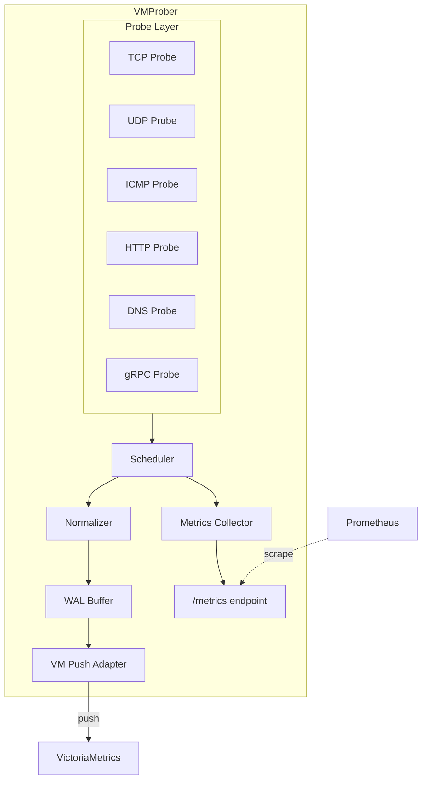

<p align="center">
  
</p>

# VMProber Documentation

Welcome to the VMProber documentation. VMProber is a high-performance Go application for comprehensive network and service monitoring. It supports TCP, UDP, ICMP, HTTP/HTTPS, DNS, and gRPC probes with both pull (Prometheus) and push (VictoriaMetrics) modes for exporting metrics.

<p align="center">
  
</p>

---

## Quick Navigation

### 📚 Getting Started

Start here if you're new to VMProber:

| Guide | Description |
|-------|-------------|
| [Installation](getting-started/installation) | How to install and build VMProber |
| [Quick Start](getting-started/quick-start) | Get up and running in 5 minutes |
| [Configuration](getting-started/configuration) | Understanding configuration files |
| [Basic Usage](getting-started/basic-usage) | Your first probes and metrics |

### 🏗️ Architecture

Understand how VMProber works under the hood:

| Topic | Description |
|-------|-------------|
| [System Overview](architecture/overview) | High-level system architecture |
| [Design Principles](architecture/design-principles) | Architectural decisions and patterns |

### 🔧 Components

Deep dive into VMProber components:

| Component | Description |
|-----------|-------------|
| [Probe System](components/probes) | TCP, UDP, ICMP, HTTP/HTTPS, DNS, and gRPC probes |

### 🚀 Operations

Deploy and operate VMProber in production:

| Guide | Description |
|-------|-------------|
| [Deployment](operations/deployment) | Docker, Kubernetes, systemd |
| [Docker Guide](operations/docker) | Container deployment details |
| [Troubleshooting](operations/troubleshooting) | Common issues and solutions |

### 👨‍💻 Development

For contributors and developers:

| Topic | Description |
|-------|-------------|
| [Development Setup](development/setup) | Environment and tooling |
| [E2E Testing](development/e2e-testing) | End-to-end testing guide |

### 📖 Reference

API and technical reference:

| Reference | Description |
|-----------|-------------|
| [API Reference](reference/api) | HTTP API endpoints |
| [Metrics Reference](reference/metrics) | All exported metrics |

### 📘 Guides

Step-by-step tutorials for common tasks:

| Guide | Description |
|-------|-------------|
| [Monitoring Setup](guides/monitoring-setup) | Setting up Prometheus/Grafana |

---

## Key Features

| Feature | Description |
|---------|-------------|
| ✅ **Multi-protocol probes** | TCP, UDP, ICMP, HTTP/HTTPS, DNS, and gRPC support |
| ✅ **Dual export modes** | Pull (Prometheus) and Push (VictoriaMetrics) |
| ✅ **Reliability** | WAL system for fault tolerance |
| ✅ **Performance** | Efficient scheduling with rate limiting |
| ✅ **Observability** | Comprehensive metrics, logging, and profiling |
| ✅ **Production-ready** | Graceful shutdown, health checks, hot reload |
| ✅ **Modern Dashboard** | Real-time web interface |

## System Architecture



## Quick Start Example

```yaml
# config.yaml
listen:
  port: 8429
  host: "0.0.0.0"

pull:
  enabled: true

push:
  enabled: true
  endpoints:
    - url: "http://vminsert:8480/insert/0/prometheus/api/v1/import"

targets:
  static:
    # TCP probe
    - host: "example.com"
      port: 443
      proto: tcp
      interval: 30s

    # HTTPS health check
    - host: "api.example.com"
      port: 443
      proto: https
      interval: 30s
      http:
        method: GET
        path: /health
        expected_status_code: 200

    # DNS check
    - host: "8.8.8.8"
      port: 53
      proto: dns
      dns:
        query_name: "google.com"
        query_type: A

    # gRPC health check
    - host: "grpc.example.com"
      port: 50051
      proto: grpc
      grpc:
        service: "my.Service"
        expected_status: SERVING
```

```bash
# Run VMProber
./vmprober --config=config.yaml

# Check metrics
curl http://localhost:8429/metrics
```

## Getting Help

- **Documentation Issues**: Open an issue in the repository
- **Questions**: Check [Troubleshooting](operations/troubleshooting) first
- **Bugs**: Report via [GitHub Issues](https://github.com/gdagil/vmprober/issues)
- **Feature Requests**: Open a [GitHub Discussion](https://github.com/gdagil/vmprober/discussions)
- **Contributing**: See [CONTRIBUTING.md](../CONTRIBUTING.md)

---

<p align="center">
  <strong>Repository</strong>: <a href="https://github.com/gdagil/vmprober">github.com/gdagil/vmprober</a>
</p>

<p align="center">
  
</p>
