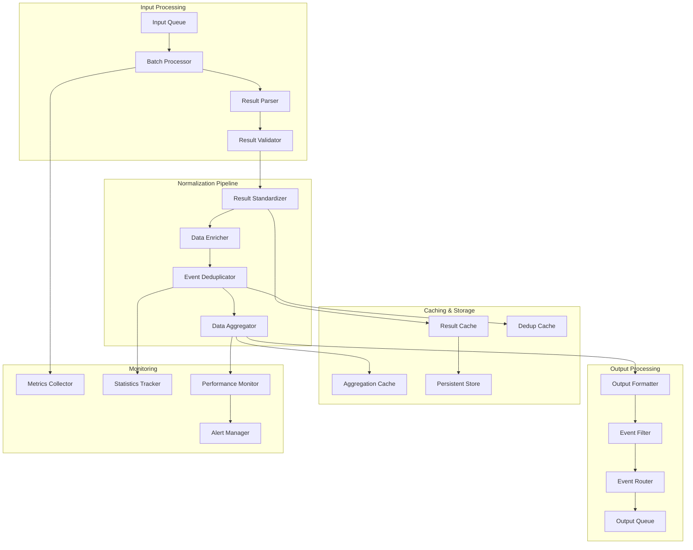

# VMProber Normalizer System

## Обзор системы нормализации

Нормализатор VMProber отвечает за приведение результатов проб к унифицированному формату, дедупликацию событий, обогащение метрик и подготовку данных для дальнейшей обработки. Система обеспечивает консистентность данных и оптимизирует производительность последующих этапов.

## Архитектура нормализатора



## Основные компоненты

### 1. Result Parser
Парсер для различных форматов входных данных.

### 2. Result Validator
Валидатор корректности и полноты данных.

### 3. Result Standardizer
Стандартизатор для приведения к единому формату.

### 4. Data Enricher
Обогатитель данных дополнительной информацией.

### 5. Event Deduplicator
Дедупликатор для исключения повторяющихся событий.

### 6. Data Aggregator
Агрегатор для группировки и суммирования данных.

## Интерфейсы

### Normalizer Interface
```go
type Normalizer interface {
    // Normalize нормализует результат пробы
    Normalize(ctx context.Context, result *ProbeResult) (*NormalizedEvent, error)
    
    // NormalizeBatch нормализует пакет результатов
    NormalizeBatch(ctx context.Context, results []*ProbeResult) ([]*NormalizedEvent, error)
    
    // Dedup проверяет на дубликаты
    Dedup(ctx context.Context, event *NormalizedEvent) (bool, error)
    
    // Enrich обогащает событие дополнительной информацией
    Enrich(ctx context.Context, event *NormalizedEvent) error
    
    // Aggregate агрегирует события
    Aggregate(ctx context.Context, events []*NormalizedEvent) ([]*AggregatedEvent, error)
    
    // GetStats возвращает статистику нормализатора
    GetStats() NormalizerStats
    
    // Close закрывает нормализатор
    Close(ctx context.Context) error
}
```

### EventDeduplicator Interface
```go
type EventDeduplicator interface {
    // Check проверяет является ли событие дубликатом
    Check(ctx context.Context, event *NormalizedEvent) (bool, error)
    
    // Mark отмечает событие как обработанное
    Mark(ctx context.Context, event *NormalizedEvent) error
    
    // Cleanup очищает устаревшие записи
    Cleanup(ctx context.Context, olderThan time.Duration) error
    
    // GetStats возвращает статистику дедупликации
    GetStats() DedupStats
}
```

### DataEnricher Interface
```go
type DataEnricher interface {
    // Enrich обогащает событие данными
    Enrich(ctx context.Context, event *NormalizedEvent) error
    
    // AddSource добавляет источник данных для обогащения
    AddSource(ctx context.Context, source DataSource) error
    
    // RemoveSource удаляет источник данных
    RemoveSource(ctx context.Context, sourceID string) error
    
    // GetSources возвращает список источников
    GetSources(ctx context.Context) ([]DataSource, error)
}
```

## Core Data Structures

### NormalizedEvent
```go
type NormalizedEvent struct {
    Timestamp   time.Time              `json:"timestamp"`
    SeriesID    string                 `json:"series_id"`
    Metrics     map[string]float64     `json:"metrics"`
    Labels      map[string]string      `json:"labels"`
    Tags        []string               `json:"tags"`
    Metadata    map[string]interface{} `json:"metadata"`
    Source      string                 `json:"source"`
    
    // Дополнительные поля для нормализации
    ProbeType   ProbeType              `json:"probe_type"`
    Target      string                 `json:"target"`
    SourceIP    string                 `json:"source_ip"`
    TargetIP    string                 `json:"target_ip"`
    TargetPort  int                    `json:"target_port"`
    Protocol    string                 `json:"protocol"`
    Success     bool                   `json:"success"`
    RTT         time.Duration          `json:"rtt"`
    Error       string                 `json:"error,omitempty"`
    Attempt     int                    `json:"attempt"`
    TLS         bool                   `json:"tls"`
    Role        string                 `json:"role"`
    SocketFamily string                `json:"socket_family"`
    
    // Внутренние поля
    hash        string                 `json:"-"`
    processedAt time.Time              `json:"-"`
}
```

### AggregatedEvent
```go
type AggregatedEvent struct {
    SeriesID    string                 `json:"series_id"`
    WindowStart time.Time              `json:"window_start"`
    WindowEnd   time.Time              `json:"window_end"`
    Count       int64                  `json:"count"`
    Metrics     map[string]float64     `json:"metrics"`
    Labels      map[string]string      `json:"labels"`
    Aggregations map[string]float64    `json:"aggregations"`
    
    // Агрегаты
    MinRTT      *time.Duration         `json:"min_rtt,omitempty"`
    MaxRTT      *time.Duration         `json:"max_rtt,omitempty"`
    AvgRTT      *time.Duration         `json:"avg_rtt,omitempty"`
    P50RTT      *time.Duration         `json:"p50_rtt,omitempty"`
    P95RTT      *time.Duration         `json:"p95_rtt,omitempty"`
    P99RTT      *time.Duration         `json:"p99_rtt,omitempty"`
    
    SuccessRate float64                `json:"success_rate"`
    ErrorRate   float64                `json:"error_rate"`
    TotalRTT    time.Duration          `json:"total_rtt"`
    
    // Метаданные
    WindowSize  time.Duration          `json:"window_size"`
    Source      string                 `json:"source"`
}
```

## Result Parser

### Multi-format Parser
```go
type ResultParser struct {
    parsers map[string]ResultParserFunc
    mu      sync.RWMutex
}

type ResultParserFunc func(ctx context.Context, data []byte) (*ProbeResult, error)

func NewResultParser() *ResultParser {
    parser := &ResultParser{
        parsers: make(map[string]ResultParserFunc),
    }
    
    // Регистрация стандартных парсеров
    parser.RegisterParser("json", parseJSONResult)
    parser.RegisterParser("protobuf", parseProtobufResult)
    parser.RegisterParser("text", parseTextResult)
    
    return parser
}

func (p *ResultParser) RegisterParser(format string, parserFunc ResultParserFunc) {
    p.mu.Lock()
    defer p.mu.Unlock()
    p.parsers[format] = parserFunc
}

func (p *ResultParser) Parse(ctx context.Context, format string, data []byte) (*ProbeResult, error) {
    p.mu.RLock()
    parserFunc := p.parsers[format]
    p.mu.RUnlock()
    
    if parserFunc == nil {
        return nil, fmt.Errorf("unsupported format: %s", format)
    }
    
    return parserFunc(ctx, data)
}

func parseJSONResult(ctx context.Context, data []byte) (*ProbeResult, error) {
    var result ProbeResult
    if err := json.Unmarshal(data, &result); err != nil {
        return nil, fmt.Errorf("failed to parse JSON result: %w", err)
    }
    
    // Валидация обязательных полей
    if result.Timestamp.IsZero() {
        result.Timestamp = time.Now()
    }
    
    if result.Attempt <= 0 {
        result.Attempt = 1
    }
    
    return &result, nil
}

func parseProtobufResult(ctx context.Context, data []byte) (*ProbeResult, error) {
    // Реализация парсинга protobuf
    // Требует определения protobuf схемы
    return nil, fmt.Errorf("protobuf parsing not implemented")
}

func parseTextResult(ctx context.Context, data []byte) (*ProbeResult, error) {
    // Парсинг текстового формата
    lines := strings.Split(string(data), "\n")
    
    result := &ProbeResult{
        Timestamp: time.Now(),
        Attempt:   1,
    }
    
    for _, line := range lines {
        line = strings.TrimSpace(line)
        if line == "" {
            continue
        }
        
        parts := strings.SplitN(line, ":", 2)
        if len(parts) != 2 {
            continue
        }
        
        key := strings.TrimSpace(parts[0])
        value := strings.TrimSpace(parts[1])
        
        switch key {
        case "success":
            result.Success = value == "true"
        case "rtt":
            if rtt, err := time.ParseDuration(value); err == nil {
                result.RTT = rtt
            }
        case "error":
            result.Error = value
        case "target":
            result.TargetIP = value
        case "source":
            result.SourceIP = value
        }
    }
    
    return result, nil
}
```

## Result Validator

### Comprehensive Validator
```go
type ResultValidator struct {
    rules   []ValidationRule
    mu      sync.RWMutex
}

type ValidationRule struct {
    Name        string
    Description string
    Validate    func(ctx context.Context, result *ProbeResult) error
    Severity    ValidationSeverity
}

type ValidationSeverity string

const (
    SeverityError   ValidationSeverity = "error"
    SeverityWarning ValidationSeverity = "warning"
    SeverityInfo    ValidationSeverity = "info"
)

func NewResultValidator() *ResultValidator {
    validator := &ResultValidator{
        rules: make([]ValidationRule, 0),
    }
    
    // Регистрация стандартных правил валидации
    validator.AddRule(ValidationRule{
        Name:        "timestamp_required",
        Description: "Timestamp is required",
        Validate: func(ctx context.Context, result *ProbeResult) error {
            if result.Timestamp.IsZero() {
                return fmt.Errorf("timestamp is required")
            }
            return nil
        },
        Severity: SeverityError,
    })
    
    validator.AddRule(ValidationRule{
        Name:        "rtt_positive",
        Description: "RTT must be positive",
        Validate: func(ctx context.Context, result *ProbeResult) error {
            if result.RTT < 0 {
                return fmt.Errorf("RTT cannot be negative")
            }
            return nil
        },
        Severity: SeverityError,
    })
    
    validator.AddRule(ValidationRule{
        Name:        "attempt_positive",
        Description: "Attempt number must be positive",
        Validate: func(ctx context.Context, result *ProbeResult) error {
            if result.Attempt <= 0 {
                return fmt.Errorf("attempt number must be positive")
            }
            return nil
        },
        Severity: SeverityError,
    })
    
    validator.AddRule(ValidationRule{
        Name:        "target_required",
        Description: "Target is required",
        Validate: func(ctx context.Context, result *ProbeResult) error {
            if result.TargetIP == "" && result.TargetPort == 0 {
                return fmt.Errorf("target IP or port is required")
            }
            return nil
        },
        Severity: SeverityError,
    })
    
    return validator
}

func (v *ResultValidator) AddRule(rule ValidationRule) {
    v.mu.Lock()
    defer v.mu.Unlock()
    v.rules = append(v.rules, rule)
}

func (v *ResultValidator) Validate(ctx context.Context, result *ProbeResult) ([]ValidationError, error) {
    v.mu.RLock()
    rules := make([]ValidationRule, len(v.rules))
    copy(rules, v.rules)
    v.mu.RUnlock()
    
    var errors []ValidationError
    
    for _, rule := range rules {
        if err := rule.Validate(ctx, result); err != nil {
            errors = append(errors, ValidationError{
                Rule:        rule.Name,
                Message:     err.Error(),
                Severity:    rule.Severity,
                Timestamp:   time.Now(),
            })
        }
    }
    
    return errors, nil
}

type ValidationError struct {
    Rule        string              `json:"rule"`
    Message     string              `json:"message"`
    Severity    ValidationSeverity  `json:"severity"`
    Timestamp   time.Time           `json:"timestamp"`
}
```

## Result Standardizer

### Standardization Engine
```go
type ResultStandardizer struct {
    config     *StandardizerConfig
    labelMap   map[string]string
    tagMap     map[string]string
    mu         sync.RWMutex
}

type StandardizerConfig struct {
    DefaultLabels map[string]string `json:"default_labels"`
    DefaultTags   []string          `json:"default_tags"`
    LabelMappings map[string]string `json:"label_mappings"`
    TagMappings   map[string]string `json:"tag_mappings"`
    ProtocolMap   map[string]string `json:"protocol_map"`
    RoleMap       map[string]string `json:"role_map"`
}

func NewResultStandardizer(config *StandardizerConfig) *ResultStandardizer {
    return &ResultStandardizer{
        config:   config,
        labelMap: make(map[string]string),
        tagMap:   make(map[string]string),
    }
}

func (s *ResultStandardizer) Standardize(ctx context.Context, result *ProbeResult) (*NormalizedEvent, error) {
    event := &NormalizedEvent{
        Timestamp:   result.Timestamp,
        ProbeType:   result.Protocol,
        Target:      s.buildTargetString(result),
        SourceIP:    result.SourceIP,
        TargetIP:    result.TargetIP,
        TargetPort:  result.TargetPort,
        Protocol:    s.mapProtocol(result.Protocol),
        Success:     result.Success,
        RTT:         result.RTT,
        Error:       result.Error,
        Attempt:     result.Attempt,
        TLS:         result.TLS,
        Role:        s.mapRole(result.Role),
        SocketFamily: result.SocketFamily,
        processedAt: time.Now(),
    }
    
    // Генерация SeriesID
    event.SeriesID = s.generateSeriesID(event)
    
    // Установка меток
    event.Labels = s.buildLabels(result)
    
    // Установка тегов
    event.Tags = s.buildTags(result)
    
    // Установка метрик
    event.Metrics = s.buildMetrics(result)
    
    // Установка метаданных
    event.Metadata = s.buildMetadata(result)
    
    // Вычисление хеша для дедупликации
    event.hash = s.computeHash(event)
    
    return event, nil
}

func (s *ResultStandardizer) buildTargetString(result *ProbeResult) string {
    if result.TargetPort > 0 {
        return fmt.Sprintf("%s:%d", result.TargetIP, result.TargetPort)
    }
    return result.TargetIP
}

func (s *ResultStandardizer) mapProtocol(probeType ProbeType) string {
    if s.config.ProtocolMap != nil {
        if mapped, exists := s.config.ProtocolMap[string(probeType)]; exists {
            return mapped
        }
    }
    return string(probeType)
}

func (s *ResultStandardizer) mapRole(role string) string {
    if s.config.RoleMap != nil {
        if mapped, exists := s.config.RoleMap[role]; exists {
            return mapped
        }
    }
    return role
}

func (s *ResultStandardizer) buildLabels(result *ProbeResult) map[string]string {
    labels := make(map[string]string)
    
    // Добавление меток по умолчанию
    for k, v := range s.config.DefaultLabels {
        labels[k] = v
    }
    
    // Добавление меток из результата
    labels["probe_type"] = string(result.Protocol)
    labels["target"] = s.buildTargetString(result)
    labels["source_ip"] = result.SourceIP
    labels["target_ip"] = result.TargetIP
    labels["protocol"] = s.mapProtocol(result.Protocol)
    labels["success"] = strconv.FormatBool(result.Success)
    labels["role"] = s.mapRole(result.Role)
    labels["socket_family"] = result.SocketFamily
    
    if result.TargetPort > 0 {
        labels["target_port"] = strconv.Itoa(result.TargetPort)
    }
    
    if result.TLS {
        labels["tls"] = "true"
    }
    
    if result.Error != "" {
        labels["has_error"] = "true"
    }
    
    // Применение маппингов меток
    for sourceKey, targetKey := range s.config.LabelMappings {
        if value, exists := labels[sourceKey]; exists {
            labels[targetKey] = value
            delete(labels, sourceKey)
        }
    }
    
    return labels
}

func (s *ResultStandardizer) buildTags(result *ProbeResult) []string {
    tags := make([]string, 0, len(s.config.DefaultTags))
    tags = append(tags, s.config.DefaultTags...)
    
    // Добавление тегов из результата
    if result.Success {
        tags = append(tags, "success")
    } else {
        tags = append(tags, "failure")
    }
    
    tags = append(tags, string(result.Protocol))
    
    if result.TLS {
        tags = append(tags, "tls")
    }
    
    if result.Error != "" {
        tags = append(tags, "error")
    }
    
    // Применение маппингов тегов
    var mappedTags []string
    for _, tag := range tags {
        if mappedTag, exists := s.config.TagMappings[tag]; exists {
            mappedTags = append(mappedTags, mappedTag)
        } else {
            mappedTags = append(mappedTags, tag)
        }
    }
    
    return mappedTags
}

func (s *ResultStandardizer) buildMetrics(result *ProbeResult) map[string]float64 {
    metrics := make(map[string]float64)
    
    // Основные метрики
    if result.Success {
        metrics["probe_success"] = 1.0
    } else {
        metrics["probe_success"] = 0.0
    }
    
    metrics["probe_rtt_ms"] = result.RTT.Seconds() * 1000
    metrics["probe_attempts"] = float64(result.Attempt)
    
    if result.Error != "" {
        metrics["probe_errors"] = 1.0
    } else {
        metrics["probe_errors"] = 0.0
    }
    
    // Дополнительные метрики
    if result.DNSResult != nil {
        metrics["dns_lookup_time_ms"] = result.DNSResult.LookupTime.Seconds() * 1000
        metrics["dns_resolved_ips"] = float64(len(result.DNSResult.ResolvedIPs))
    }
    
    return metrics
}

func (s *ResultStandardizer) buildMetadata(result *ProbeResult) map[string]interface{} {
    metadata := make(map[string]interface{})
    
    metadata["probe_type"] = result.Protocol
    metadata["timestamp"] = result.Timestamp
    metadata["attempt"] = result.Attempt
    
    if result.Payload != nil {
        metadata["payload_size"] = len(result.Payload)
    }
    
    if result.Response != nil {
        metadata["response_size"] = len(result.Response)
    }
    
    if result.DNSResult != nil {
        metadata["dns_result"] = result.DNSResult
    }
    
    return metadata
}

func (s *ResultStandardizer) generateSeriesID(event *NormalizedEvent) string {
    // Генерация уникального ID серии на основе ключевых меток
    key := fmt.Sprintf("%s:%s:%s:%d:%s",
        event.ProbeType,
        event.Target,
        event.Protocol,
        event.TargetPort,
        event.Role)
    
    hash := sha256.Sum256([]byte(key))
    return hex.EncodeToString(hash[:])[:16]
}

func (s *ResultStandardizer) computeHash(event *NormalizedEvent) string {
    // Вычисление хеша для дедупликации
    data := fmt.Sprintf("%s:%s:%s:%d:%s:%s:%v",
        event.Timestamp.Format(time.RFC3339Nano),
        event.ProbeType,
        event.Target,
        event.TargetPort,
        event.Protocol,
        event.Role,
        event.Metrics)
    
    hash := sha256.Sum256([]byte(data))
    return hex.EncodeToString(hash[:])
}
```

## Data Enricher

### Multi-source Enricher
```go
type DataEnricher struct {
    sources   map[string]DataSource
    config    *EnricherConfig
    cache     *EnrichmentCache
    mu        sync.RWMutex
}

type DataSource interface {
    ID() string
    Type() string
    Enrich(ctx context.Context, event *NormalizedEvent) error
    GetStats() DataSourceStats
}

type EnricherConfig struct {
    CacheTTL        time.Duration `json:"cache_ttl"`
    MaxCacheSize    int           `json:"max_cache_size"`
    EnableGeoIP     bool          `json:"enable_geoip"`
    EnableDNS       bool          `json:"enable_dns"`
    EnableWHOIS     bool          `json:"enable_whois"`
    Timeout         time.Duration `json:"timeout"`
}

type EnrichmentCache struct {
    entries map[string]*CacheEntry
    mu      sync.RWMutex
    ttl     time.Duration
    maxSize int
}

type CacheEntry struct {
    Data      interface{}
    Timestamp time.Time
    Hits      int64
}

func NewDataEnricher(config *EnricherConfig) *DataEnricher {
    enricher := &DataEnricher{
        sources: make(map[string]DataSource),
        config:  config,
        cache: &EnrichmentCache{
            entries: make(map[string]*CacheEntry),
            ttl:     config.CacheTTL,
            maxSize: config.MaxCacheSize,
        },
    }
    
    // Регистрация стандартных источников
    if config.EnableDNS {
        enricher.RegisterSource(NewDNSEnricher())
    }
    
    if config.EnableGeoIP {
        enricher.RegisterSource(NewGeoIPEnricher())
    }
    
    enricher.RegisterSource(NewMetadataEnricher())
    
    return enricher
}

func (e *DataEnricher) RegisterSource(source DataSource) {
    e.mu.Lock()
    defer e.mu.Unlock()
    e.sources[source.ID()] = source
}

func (e *DataEnricher) Enrich(ctx context.Context, event *NormalizedEvent) error {
    var errs []error
    
    e.mu.RLock()
    sources := make([]DataSource, 0, len(e.sources))
    for _, source := range e.sources {
        sources = append(sources, source)
    }
    e.mu.RUnlock()
    
    // Обогащение от всех источников
    for _, source := range sources {
        if err := e.enrichFromSource(ctx, source, event); err != nil {
            errs = append(errs, fmt.Errorf("source %s: %w", source.ID(), err))
        }
    }
    
    if len(errs) > 0 {
        return fmt.Errorf("enrichment errors: %v", errs)
    }
    
    return nil
}

func (e *DataEnricher) enrichFromSource(ctx context.Context, source DataSource, event *NormalizedEvent) error {
    // Проверка кэша
    cacheKey := fmt.Sprintf("%s:%s", source.ID(), event.TargetIP)
    if cachedData := e.cache.Get(ctx, cacheKey); cachedData != nil {
        // Применение кэшированных данных
        return e.applyCachedData(ctx, source, event, cachedData)
    }
    
    // Выполнение обогащения
    enrichCtx, cancel := context.WithTimeout(ctx, e.config.Timeout)
    defer cancel()
    
    if err := source.Enrich(enrichCtx, event); err != nil {
        return err
    }
    
    // Кэширование результата
    e.cache.Set(ctx, cacheKey, event.Metadata[source.ID()])
    
    return nil
}

func (e *DataEnricher) applyCachedData(ctx context.Context, source DataSource, event *NormalizedEvent, cachedData interface{}) error {
    // Применение кэшированных данных к событию
    switch data := cachedData.(type) {
    case *DNSEnrichmentData:
        event.Metadata["dns"] = data
        event.Labels["dns_resolved"] = "true"
        if data.GeoLocation != nil {
            event.Labels["country"] = data.GeoLocation.Country
            event.Labels["city"] = data.GeoLocation.City
        }
    case *GeoIPEnrichmentData:
        event.Metadata["geoip"] = data
        event.Labels["country"] = data.Country
        event.Labels["city"] = data.City
        event.Labels["latitude"] = fmt.Sprintf("%f", data.Latitude)
        event.Labels["longitude"] = fmt.Sprintf("%f", data.Longitude)
    }
    
    return nil
}

// DNS Enricher
type DNSEnricher struct {
    resolver *net.Resolver
    cache    *DNSCache
}

type DNSEnrichmentData struct {
    Hostname    string            `json:"hostname"`
    IPs         []string          `json:"ips"`
    CNAMEs      []string          `json:"cnames"`
    TXTRecords  []string          `json:"txt_records"`
    GeoLocation *GeoLocation      `json:"geo_location,omitempty"`
}

type GeoLocation struct {
    Country string  `json:"country"`
    City    string  `json:"city"`
    Latitude float64 `json:"latitude"`
    Longitude float64 `json:"longitude"`
}

func NewDNSEnricher() *DNSEnricher {
    return &DNSEnricher{
        resolver: &net.Resolver{
            PreferGo: true,
            Dial: func(ctx context.Context, network, address string) (net.Conn, error) {
                dialer := &net.Dialer{
                    Timeout: 5 * time.Second,
                }
                return dialer.DialContext(ctx, network, address)
            },
        },
        cache: NewDNSCache(5 * time.Minute),
    }
}

func (d *DNSEnricher) ID() string {
    return "dns_enricher"
}

func (d *DNSEnricher) Type() string {
    return "dns"
}

func (d *DNSEnricher) Enrich(ctx context.Context, event *NormalizedEvent) error {
    ip := event.TargetIP
    
    // Проверка кэша
    if cached := d.cache.Get(ctx, ip); cached != nil {
        event.Metadata["dns"] = cached
        return nil
    }
    
    // Reverse DNS lookup
    names, err := d.resolver.LookupAddr(ctx, ip)
    if err != nil {
        return fmt.Errorf("reverse DNS lookup failed: %w", err)
    }
    
    enrichmentData := &DNSEnrichmentData{
        Hostname: strings.Trim(names[0], "."),
        IPs:      []string{ip},
    }
    
    // Forward lookup для получения всех IP
    if ips, err := d.resolver.LookupHost(ctx, enrichmentData.Hostname); err == nil {
        enrichmentData.IPs = ips
    }
    
    // Кэширование результата
    d.cache.Set(ctx, ip, enrichmentData)
    
    event.Metadata["dns"] = enrichmentData
    event.Labels["hostname"] = enrichmentData.Hostname
    
    return nil
}

func (d *DNSEnricher) GetStats() DataSourceStats {
    return DataSourceStats{
        SourceID: d.ID(),
        Type:     d.Type(),
        Requests: d.cache.GetStats().Requests,
        Hits:     d.cache.GetStats().Hits,
        Misses:   d.cache.GetStats().Misses,
    }
}

// GeoIP Enricher
type GeoIPEnricher struct {
    db GeoIPDatabase
}

type GeoIPEnrichmentData struct {
    IP          string       `json:"ip"`
    Country     string       `json:"country"`
    City        string       `json:"city"`
    Latitude    float64      `json:"latitude"`
    Longitude   float64      `json:"longitude"`
    ISP         string       `json:"isp"`
    Organization string     `json:"organization"`
}

type GeoIPDatabase interface {
    Lookup(ctx context.Context, ip string) (*GeoIPEnrichmentData, error)
}

func NewGeoIPEnricher() *GeoIPEnricher {
    // Инициализация базы данных GeoIP
    // Может быть MaxMind, IP2Location, или другая база
    return &GeoIPEnricher{
        db: NewMaxMindDatabase(), // Пример
    }
}

func (g *GeoIPEnricher) ID() string {
    return "geoip_enricher"
}

func (g *GeoIPEnricher) Type() string {
    return "geoip"
}

func (g *GeoIPEnricher) Enrich(ctx context.Context, event *NormalizedEvent) error {
    ip := event.TargetIP
    
    // Пропуск private IP адресов
    if isPrivateIP(ip) {
        return nil
    }
    
    geoData, err := g.db.Lookup(ctx, ip)
    if err != nil {
        return fmt.Errorf("GeoIP lookup failed: %w", err)
    }
    
    event.Metadata["geoip"] = geoData
    event.Labels["country"] = geoData.Country
    event.Labels["city"] = geoData.City
    event.Labels["isp"] = geoData.ISP
    
    return nil
}

func (g *GeoIPEnricher) GetStats() DataSourceStats {
    return DataSourceStats{
        SourceID: g.ID(),
        Type:     g.Type(),
        Requests: 0, // Реализовать статистику
        Hits:     0,
        Misses:   0,
    }
}

func isPrivateIP(ipStr string) bool {
    ip := net.ParseIP(ipStr)
    if ip == nil {
        return false
    }
    
    // Проверка private IP ranges
    privateRanges := []net.IPNet{
        {IP: net.ParseIP("10.0.0.0"), Mask: net.CIDRMask(8, 32)},
        {IP: net.ParseIP("172.16.0.0"), Mask: net.CIDRMask(12, 32)},
        {IP: net.ParseIP("192.168.0.0"), Mask: net.CIDRMask(16, 32)},
        {IP: net.ParseIP("127.0.0.0"), Mask: net.CIDRMask(8, 32)},
        {IP: net.ParseIP("169.254.0.0"), Mask: net.CIDRMask(16, 32)},
    }
    
    for _, privateRange := range privateRanges {
        if privateRange.Contains(ip) {
            return true
        }
    }
    
    return false
}
```

## Event Deduplicator

### Advanced Deduplication
```go
type EventDeduplicator struct {
    cache     *DedupCache
    config    *DedupConfig
    stats     *DedupStats
    mu        sync.RWMutex
}

type DedupConfig struct {
    WindowSize    time.Duration `json:"window_size"`
    MaxEntries    int           `json:"max_entries"`
    CleanupInterval time.Duration `json:"cleanup_interval"`
    HashAlgorithm string        `json:"hash_algorithm"`
}

type DedupCache struct {
    entries map[string]*DedupEntry
    mu      sync.RWMutex
    config  *DedupConfig
}

type DedupEntry struct {
    Hash       string    `json:"hash"`
    Event      *NormalizedEvent
    Timestamp  time.Time `json:"timestamp"`
    LastSeen   time.Time `json:"last_seen"`
    Count      int64     `json:"count"`
}

func NewEventDeduplicator(config *DedupConfig) *EventDeduplicator {
    deduplicator := &EventDeduplicator{
        cache: &DedupCache{
            entries: make(map[string]*DedupEntry),
            config:  config,
        },
        config: config,
        stats: &DedupStats{
            TotalProcessed: 0,
            DuplicatesFound: 0,
            UniqueEvents: 0,
        },
    }
    
    // Запуск периодической очистки
    go deduplicator.startCleanup()
    
    return deduplicator
}

func (d *EventDeduplicator) Check(ctx context.Context, event *NormalizedEvent) (bool, error) {
    d.mu.Lock()
    defer d.mu.Unlock()
    
    d.stats.TotalProcessed++
    
    // Вычисление ключа для поиска дубликатов
    key := d.generateDedupKey(event)
    
    // Проверка кэша
    entry, exists := d.cache.entries[key]
    if !exists {
        // Новый уникальный event
        d.cache.entries[key] = &DedupEntry{
            Hash:      event.hash,
            Event:     event,
            Timestamp: event.Timestamp,
            LastSeen:  time.Now(),
            Count:     1,
        }
        d.stats.UniqueEvents++
        return false, nil
    }
    
    // Проверка временного окна
    if time.Since(entry.Timestamp) > d.config.WindowSize {
        // Запись устарела, считаем новой
        entry.Hash = event.hash
        entry.Event = event
        entry.Timestamp = event.Timestamp
        entry.LastSeen = time.Now()
        entry.Count = 1
        d.stats.UniqueEvents++
        return false, nil
    }
    
    // Проверка хеша для точного совпадения
    if entry.Hash == event.hash {
        // Точный дубликат
        entry.LastSeen = time.Now()
        entry.Count++
        d.stats.DuplicatesFound++
        return true, nil
    }
    
    // Обновление записи с новым хешем
    entry.Hash = event.hash
    entry.Event = event
    entry.LastSeen = time.Now()
    entry.Count++
    d.stats.UniqueEvents++
    
    return false, nil
}

func (d *EventDeduplicator) Mark(ctx context.Context, event *NormalizedEvent) error {
    // Обновление статистики последнего просмотра
    key := d.generateDedupKey(event)
    
    d.mu.Lock()
    defer d.mu.Unlock()
    
    if entry, exists := d.cache.entries[key]; exists {
        entry.LastSeen = time.Now()
    }
    
    return nil
}

func (d *EventDeduplicator) Cleanup(ctx context.Context, olderThan time.Duration) error {
    d.mu.Lock()
    defer d.mu.Unlock()
    
    cutoff := time.Now().Add(-olderThan)
    var removed int
    
    for key, entry := range d.cache.entries {
        if entry.LastSeen.Before(cutoff) {
            delete(d.cache.entries, key)
            removed++
        }
    }
    
    log.Debug("deduplicator cleanup completed",
        "removed", removed,
        "remaining", len(d.cache.entries))
    
    return nil
}

func (d *EventDeduplicator) generateDedupKey(event *NormalizedEvent) string {
    // Генерация ключа для дедупликации на основе ключевых полей
    return fmt.Sprintf("%s:%s:%s:%d:%s",
        event.ProbeType,
        event.Target,
        event.Protocol,
        event.TargetPort,
        event.Role)
}

func (d *EventDeduplicator) startCleanup() {
    ticker := time.NewTicker(d.config.CleanupInterval)
    defer ticker.Stop()
    
    for range ticker.C {
        if err := d.Cleanup(context.Background(), d.config.WindowSize); err != nil {
            log.Error("deduplicator cleanup error", "error", err)
        }
    }
}

func (d *EventDeduplicator) GetStats() *DedupStats {
    d.mu.RLock()
    defer d.mu.RUnlock()
    
    stats := *d.stats
    stats.CacheSize = int64(len(d.cache.entries))
    stats.CacheUtilization = float64(len(d.cache.entries)) / float64(d.config.MaxEntries)
    
    return &stats
}
```

## Data Aggregator

### Time-window Aggregator
```go
type DataAggregator struct {
    windows    map[string]*AggregationWindow
    config     *AggregatorConfig
    stats      *AggregatorStats
    mu         sync.RWMutex
}

type AggregationWindow struct {
    SeriesID   string                 `json:"series_id"`
    StartTime  time.Time              `json:"start_time"`
    EndTime    time.Time              `json:"end_time"`
    Events     []*NormalizedEvent     `json:"events"`
    Aggregations map[string]float64   `json:"aggregations"`
    Metrics    map[string]float64     `json:"metrics"`
}

type AggregatorConfig struct {
    WindowSize     time.Duration `json:"window_size"`
    MaxEvents      int           `json:"max_events"`
    AggregationTypes []string    `json:"aggregation_types"`
    Percentiles    []float64     `json:"percentiles"`
    EnableRTTStats bool          `json:"enable_rtt_stats"`
}

func NewDataAggregator(config *AggregatorConfig) *DataAggregator {
    return &DataAggregator{
        windows: make(map[string]*AggregationWindow),
        config:  config,
        stats: &AggregatorStats{
            TotalAggregated: 0,
            WindowsCreated: 0,
            WindowsFlushed: 0,
        },
    }
}

func (a *DataAggregator) Aggregate(ctx context.Context, events []*NormalizedEvent) ([]*AggregatedEvent, error) {
    a.mu.Lock()
    defer a.mu.Unlock()
    
    var aggregatedEvents []*AggregatedEvent
    
    for _, event := range events {
        windowKey := a.getWindowKey(event)
        
        // Получение или создание окна агрегации
        window := a.getOrCreateWindow(windowKey, event)
        
        // Добавление события в окно
        if err := a.addEventToWindow(window, event); err != nil {
            log.Error("failed to add event to window", "error", err)
            continue
        }
        
        // Проверка необходимости flush окна
        if a.shouldFlushWindow(window) {
            aggregatedEvent := a.flushWindow(window)
            aggregatedEvents = append(aggregatedEvents, aggregatedEvent)
            delete(a.windows, windowKey)
            a.stats.WindowsFlushed++
        }
    }
    
    a.stats.TotalAggregated += int64(len(events))
    
    return aggregatedEvents, nil
}

func (a *DataAggregator) getWindowKey(event *NormalizedEvent) string {
    windowStart := event.Timestamp.Truncate(a.config.WindowSize)
    return fmt.Sprintf("%s:%s", event.SeriesID, windowStart.Format(time.RFC3339))
}

func (a *DataAggregator) getOrCreateWindow(key string, event *NormalizedEvent) *AggregationWindow {
    window, exists := a.windows[key]
    if !exists {
        windowStart := event.Timestamp.Truncate(a.config.WindowSize)
        windowEnd := windowStart.Add(a.config.WindowSize)
        
        window = &AggregationWindow{
            SeriesID:   event.SeriesID,
            StartTime:  windowStart,
            EndTime:    windowEnd,
            Events:     make([]*NormalizedEvent, 0, a.config.MaxEvents),
            Aggregations: make(map[string]float64),
            Metrics:    make(map[string]float64),
        }
        
        a.windows[key] = window
        a.stats.WindowsCreated++
    }
    
    return window
}

func (a *DataAggregator) addEventToWindow(window *AggregationWindow, event *NormalizedEvent) error {
    if len(window.Events) >= a.config.MaxEvents {
        return fmt.Errorf("window reached maximum events limit")
    }
    
    window.Events = append(window.Events, event)
    
    // Обновление агрегаций
    a.updateAggregations(window, event)
    
    return nil
}

func (a *DataAggregator) updateAggregations(window *AggregationWindow, event *NormalizedEvent) {
    // Обновление счетчиков
    window.Aggregations["count"]++
    
    if event.Success {
        window.Aggregations["success_count"]++
    } else {
        window.Aggregations["error_count"]++
    }
    
    // Обновление метрик RTT
    if event.RTT > 0 {
        window.Aggregations["total_rtt"] += event.RTT.Seconds()
        window.Aggregations["min_rtt"] = math.Min(window.Aggregations["min_rtt"], event.RTT.Seconds())
        window.Aggregations["max_rtt"] = math.Max(window.Aggregations["max_rtt"], event.RTT.Seconds())
        
        // Добавление RTT в список для вычисления перцентилей
        if window.Events == nil {
            window.Events = make([]*NormalizedEvent, 0)
        }
    }
    
    // Обновление других метрик
    for metricName, value := range event.Metrics {
        if _, exists := window.Metrics[metricName]; !exists {
            window.Metrics[metricName] = 0
        }
        window.Metrics[metricName] += value
    }
}

func (a *DataAggregator) shouldFlushWindow(window *AggregationWindow) bool {
    // Flush по времени
    if time.Now().After(window.EndTime) {
        return true
    }
    
    // Flush по количеству событий
    if len(window.Events) >= a.config.MaxEvents {
        return true
    }
    
    return false
}

func (a *DataAggregator) flushWindow(window *AggregationWindow) *AggregatedEvent {
    aggregatedEvent := &AggregatedEvent{
        SeriesID:    window.SeriesID,
        WindowStart: window.StartTime,
        WindowEnd:   window.EndTime,
        Count:       int64(len(window.Events)),
        Labels:      window.Events[0].Labels, // Берем метки из первого события
        Aggregations: make(map[string]float64),
        Metrics:     make(map[string]float64),
        WindowSize:  a.config.WindowSize,
        Source:      "aggregator",
    }
    
    // Копирование агрегаций
    for k, v := range window.Aggregations {
        aggregatedEvent.Aggregations[k] = v
    }
    
    // Копирование метрик
    for k, v := range window.Metrics {
        aggregatedEvent.Metrics[k] = v
    }
    
    // Вычисление производных метрик
    if aggregatedEvent.Aggregations["count"] > 0 {
        aggregatedEvent.SuccessRate = aggregatedEvent.Aggregations["success_count"] / aggregatedEvent.Aggregations["count"]
        aggregatedEvent.ErrorRate = aggregatedEvent.Aggregations["error_count"] / aggregatedEvent.Aggregations["count"]
        
        if aggregatedEvent.Aggregations["total_rtt"] > 0 {
            avgRTT := aggregatedEvent.Aggregations["total_rtt"] / aggregatedEvent.Aggregations["count"]
            aggregatedEvent.AvgRTT = time.Duration(avgRTT * float64(time.Second))
            aggregatedEvent.TotalRTT = time.Duration(aggregatedEvent.Aggregations["total_rtt"] * float64(time.Second))
        }
        
        if aggregatedEvent.Aggregations["min_rtt"] > 0 {
            aggregatedEvent.MinRTT = time.Duration(aggregatedEvent.Aggregations["min_rtt"] * float64(time.Second))
        }
        
        if aggregatedEvent.Aggregations["max_rtt"] > 0 {
            aggregatedEvent.MaxRTT = time.Duration(aggregatedEvent.Aggregations["max_rtt"] * float64(time.Second))
        }
    }
    
    // Вычисление перцентилей
    if a.config.EnableRTTStats && len(window.Events) > 1 {
        a.computePercentiles(window, aggregatedEvent)
    }
    
    return aggregatedEvent
}

func (a *DataAggregator) computePercentiles(window *AggregationWindow, aggregatedEvent *AggregatedEvent) {
    // Сбор всех RTT значений
    var rttValues []float64
    for _, event := range window.Events {
        if event.RTT > 0 {
            rttValues = append(rttValues, event.RTT.Seconds())
        }
    }
    
    if len(rttValues) == 0 {
        return
    }
    
    // Сортировка для вычисления перцентилей
    sort.Float64s(rttValues)
    
    // Вычисление перцентилей
    for _, p := range a.config.Percentiles {
        if p >= 0 && p <= 100 {
            index := int(float64(len(rttValues)) * p / 100)
            if index >= len(rttValues) {
                index = len(rttValues) - 1
            }
            
            percentileValue := time.Duration(rttValues[index] * float64(time.Second))
            percentileKey := fmt.Sprintf("p%d_rtt", int(p))
            
            switch p {
            case 50:
                aggregatedEvent.P50RTT = percentileValue
            case 95:
                aggregatedEvent.P95RTT = percentileValue
            case 99:
                aggregatedEvent.P99RTT = percentileValue
            }
            
            aggregatedEvent.Aggregations[percentileKey] = rttValues[index]
        }
    }
}

func (a *DataAggregator) GetStats() *AggregatorStats {
    a.mu.RLock()
    defer a.mu.RUnlock()
    
    stats := *a.stats
    stats.ActiveWindows = int64(len(a.windows))
    
    return &stats
}
```

## Statistics and Monitoring

### Normalizer Statistics
```go
type NormalizerStats struct {
    TotalProcessed     int64         `json:"total_processed"`
    TotalNormalized    int64         `json:"total_normalized"`
    TotalEnriched      int64         `json:"total_enriched"`
    TotalDeduped       int64         `json:"total_deduped"`
    TotalAggregated    int64         `json:"total_aggregated"`
    ProcessingTime     time.Duration `json:"processing_time"`
    AvgProcessingTime  time.Duration `json:"avg_processing_time"`
    ErrorCount         int64         `json:"error_count"`
    ErrorRate          float64       `json:"error_rate"`
    Throughput         float64       `json:"throughput"`
    CacheHitRate       float64       `json:"cache_hit_rate"`
}

type DedupStats struct {
    TotalProcessed    int64 `json:"total_processed"`
    DuplicatesFound   int64 `json:"duplicates_found"`
    UniqueEvents      int64 `json:"unique_events"`
    CacheSize         int64 `json:"cache_size"`
    CacheUtilization  float64 `json:"cache_utilization"`
    WindowSize        time.Duration `json:"window_size"`
}

type AggregatorStats struct {
    TotalAggregated int64 `json:"total_aggregated"`
    WindowsCreated  int64 `json:"windows_created"`
    WindowsFlushed  int64 `json:"windows_flushed"`
    ActiveWindows   int64 `json:"active_windows"`
    AvgWindowSize   float64 `json:"avg_window_size"`
}

type DataSourceStats struct {
    SourceID   string        `json:"source_id"`
    Type       string        `json:"type"`
    Requests   int64         `json:"requests"`
    Hits       int64         `json:"hits"`
    Misses     int64         `json:"misses"`
    HitRate    float64       `json:"hit_rate"`
    AvgLatency time.Duration `json:"avg_latency"`
}
```

## Configuration

### Normalizer Configuration
```go
type NormalizerConfig struct {
    Parser      ParserConfig      `json:"parser"`
    Validator   ValidatorConfig   `json:"validator"`
    Standardizer StandardizerConfig `json:"standardizer"`
    Enricher    EnricherConfig    `json:"enricher"`
    Dedup       DedupConfig       `json:"dedup"`
    Aggregator  AggregatorConfig  `json:"aggregator"`
    Caching     CachingConfig     `json:"caching"`
    Monitoring  MonitoringConfig  `json:"monitoring"`
}

type ParserConfig struct {
    EnabledFormats []string `json:"enabled_formats"`
    MaxBatchSize   int      `json:"max_batch_size"`
    Timeout        time.Duration `json:"timeout"`
}

type ValidatorConfig struct {
    EnabledRules []string `json:"enabled_rules"`
    StrictMode   bool     `json:"strict_mode"`
    FailFast     bool     `json:"fail_fast"`
}

type CachingConfig struct {
    Enabled      bool          `json:"enabled"`
    TTL          time.Duration `json:"ttl"`
    MaxSize      int           `json:"max_size"`
    CleanupInterval time.Duration `json:"cleanup_interval"`
}

type MonitoringConfig struct {
    Enabled        bool          `json:"enabled"`
    MetricsInterval time.Duration `json:"metrics_interval"`
    Alerting       AlertingConfig `json:"alerting"`
}
```

## Performance Optimizations

### 1. Batch Processing
- Обработка событий пакетами для снижения накладных расходов
- Параллельная обработка независимых событий
- Оптимизация аллокаций памяти

### 2. Caching Strategy
- Многоуровневое кэширование (L1: memory, L2: persistent)
- TTL-based expiration с background cleanup
- Cache warming для горячих данных

### 3. Memory Management
- Object pooling для часто создаваемых структур
- Слайсы с предварительным выделением
- Cleanup неиспользуемых данных

### 4. Concurrency Control
- Шардирование по ключам для параллельной обработки
- Ограничение количества горутин
- Backpressure для предотвращения перегрузки

## Error Handling

### 1. Graceful Degradation
- Продолжение обработки при ошибках отдельных компонентов
- Fallback к базовой функциональности
- Логирование ошибок с контекстом

### 2. Retry Logic
- Экспоненциальные ретраи для временных ошибок
- Circuit breaker для постоянных ошибок
- Dead letter queue для необработанных событий

### 3. Monitoring
- Метрики ошибок по типам
- Alerting при превышении порогов
- Трассировка проблемных событий

## Testing Strategy

### 1. Unit Tests
- Тестирование каждого компонента отдельно
- Мокирование внешних зависимостей
- Тестирование edge cases и error conditions

### 2. Integration Tests
- End-to-end тестирование pipeline
- Тестирование взаимодействия компонентов
- Performance тестирование под нагрузкой

### 3. Load Testing
- Stress testing с большими объемами данных
- Memory leak testing при длительной работе
- Scalability testing с увеличением нагрузки