# VMProber Observability System

## Обзор системы наблюдаемости

Система наблюдаемости VMProber обеспечивает comprehensive мониторинг, логирование и трассировку всех компонентов системы. Система включает структурированное логирование, метрики процесса, распределенную трассировку, профилирование и автоматическое алертинг.

## Архитектура системы наблюдаемости

```mermaid
graph TB
    subgraph "Logging System"
        LOG_MANAGER[Log Manager]
        STRUCTURED_LOGGER[Structured Logger]
        LOG_PROCESSORS[Log Processors]
        LOG_OUTPUTS[Log Outputs]
        LOG_AGGREGATOR[Log Aggregator]
    end
    
    subgraph "Metrics System"
        METRICS_COLLECTOR[Metrics Collector]
        PROCESS_METRICS[Process Metrics]
        APPLICATION_METRICS[Application Metrics]
        CUSTOM_METRICS[Custom Metrics]
        METRICS_EXPORT[Metrics Export]
    end
    
    subgraph "Tracing System"
        TRACE_COLLECTOR[Trace Collector]
        SPAN_PROCESSOR[Span Processor]
        TRACE_EXPORTER[Trace Exporter]
        CONTEXT_PROPAGATOR[Context Propagator]
        TRACE_STORAGE[Trace Storage]
    end
    
    subgraph "Profiling System"
        PROFILER[Profiler]
        CPU_PROFILER[CPU Profiler]
        MEMORY_PROFILER[Memory Profiler]
        BLOCK_PROFILER[Block Profiler]
        MUTEX_PROFILER[Mutex Profiler]
    end
    
    subgraph "Monitoring & Alerting"
        HEALTH_MONITOR[Health Monitor]
        ALERT_MANAGER[Alert Manager]
        NOTIFICATION_SERVICE[Notification Service]
        DASHBOARD_MANAGER[Dashboard Manager]
        INCIDENT_MANAGER[Incident Manager]
    end
    
    subgraph "Storage & Export"
        LOG_STORAGE[Log Storage]
        METRICS_STORAGE[Metrics Storage]
        TRACE_STORAGE_BACKEND[Trace Storage Backend]
        EXPORT_ENDPOINTS[Export Endpoints]
    end
    
    subgraph "Configuration"
        OBSERVABILITY_CONFIG[Observability Config]
        LOG_CONFIG[Log Config]
        METRICS_CONFIG[Metrics Config]
        TRACE_CONFIG[Trace Config]
        ALERT_CONFIG[Alert Config]
    end
    
    %% Logging Flow
    APPLICATION[Application] --> LOG_MANAGER
    LOG_MANAGER --> STRUCTURED_LOGGER
    STRUCTURED_LOGGER --> LOG_PROCESSORS
    LOG_PROCESSORS --> LOG_OUTPUTS
    LOG_OUTPUTS --> LOG_AGGREGATOR
    LOG_AGGREGATOR --> LOG_STORAGE
    
    %% Metrics Flow
    APPLICATION --> METRICS_COLLECTOR
    METRICS_COLLECTOR --> PROCESS_METRICS
    METRICS_COLLECTOR --> APPLICATION_METRICS
    METRICS_COLLECTOR --> CUSTOM_METRICS
    METRICS_COLLECTOR --> METRICS_EXPORT
    METRICS_EXPORT --> METRICS_STORAGE
    
    %% Tracing Flow
    APPLICATION --> TRACE_COLLECTOR
    TRACE_COLLECTOR --> SPAN_PROCESSOR
    SPAN_PROCESSOR --> CONTEXT_PROPAGATOR
    CONTEXT_PROPAGATOR --> TRACE_EXPORTER
    TRACE_EXPORTER --> TRACE_STORAGE
    
    %% Profiling Flow
    PROFILER --> CPU_PROFILER
    PROFILER --> MEMORY_PROFILER
    PROFILER --> BLOCK_PROFILER
    PROFILER --> MUTEX_PROFILER
    
    %% Monitoring Flow
    METRICS_COLLECTOR --> HEALTH_MONITOR
    LOG_MANAGER --> HEALTH_MONITOR
    HEALTH_MONITOR --> ALERT_MANAGER
    ALERT_MANAGER --> NOTIFICATION_SERVICE
    ALERT_MANAGER --> DASHBOARD_MANAGER
    ALERT_MANAGER --> INCIDENT_MANAGER
    
    %% Configuration Flow
    OBSERVABILITY_CONFIG --> LOG_MANAGER
    OBSERVABILITY_CONFIG --> METRICS_COLLECTOR
    OBSERVABILITY_CONFIG --> TRACE_COLLECTOR
    OBSERVABILITY_CONFIG --> PROFILER
    OBSERVABILITY_CONFIG --> ALERT_MANAGER
```



## Основные компоненты

### 1. Log Manager
Центральный менеджер для управления логированием.

### 2. Metrics Collector
Сборщик метрик приложения и системы.

### 3. Trace Collector
Коллектор распределенной трассировки.

### 4. Profiler
Система профилирования производительности.

### 5. Health Monitor
Мониторинг состояния здоровья системы.

## Интерфейсы

### Logger Interface
```go
type Logger interface {
    // Debug логирует debug сообщение
    Debug(ctx context.Context, msg string, fields ...Field)
    
    // Info логирует info сообщение
    Info(ctx context.Context, msg string, fields ...Field)
    
    // Warn логирует warning сообщение
    Warn(ctx context.Context, msg string, fields ...Field)
    
    // Error логирует error сообщение
    Error(ctx context.Context, msg string, fields ...Field)
    
    // Fatal логирует fatal сообщение и завершает приложение
    Fatal(ctx context.Context, msg string, fields ...Field)
    
    // With создает новый логгер с дополнительными полями
    With(fields ...Field) Logger
    
    // WithRequestID создает логгер с request ID
    WithRequestID(requestID string) Logger
    
    // WithUserID создает логгер с user ID
    WithUserID(userID string) Logger
    
    // Sync синхронизирует буферы
    Sync() error
    
    // Close закрывает логгер
    Close() error
}
```

### MetricsCollector Interface
```go
type MetricsCollector interface {
    // Counter создает или получает counter метрику
    Counter(name string, labels ...string) prometheus.Counter
    
    // Gauge создает или получает gauge метрику
    Gauge(name string, labels ...string) prometheus.Gauge
    
    // Histogram создает или получает histogram метрику
    Histogram(name string, buckets []float64, labels ...string) prometheus.Histogram
    
    // Summary создает или получает summary метрику
    Summary(name string, objectives map[float64]float64, labels ...string) prometheus.Summary
    
    // RecordCounter записывает значение counter
    RecordCounter(ctx context.Context, name string, value float64, labels map[string]string)
    
    // RecordGauge записывает значение gauge
    RecordGauge(ctx context.Context, name string, value float64, labels map[string]string)
    
    // RecordHistogram записывает значение histogram
    RecordHistogram(ctx context.Context, name string, value float64, labels map[string]string)
    
    // GetMetrics возвращает все метрики
    GetMetrics() []prometheus.Metric
    
    // Start запускает сборщик
    Start(ctx context.Context) error
    
    // Stop останавливает сборщик
    Stop(ctx context.Context) error
}
```

### Tracer Interface
```go
type Tracer interface {
    // StartSpan создает новый span
    StartSpan(ctx context.Context, operationName string, opts ...SpanOption) (context.Context, Span)
    
    // GetTracer возвращает tracer с именем
    GetTracer(name string) Tracer
    
    // Inject внедряет span context в carrier
    Inject(ctx context.Context, carrier Carrier) error
    
    // Extract извлекает span context из carrier
    Extract(ctx context.Context, carrier Carrier) (context.Context, Span, error)
    
    // Close закрывает tracer
    Close() error
}
```

### HealthChecker Interface
```go
type HealthChecker interface {
    // Check выполняет проверку здоровья
    Check(ctx context.Context) HealthStatus
    
    // Name возвращает имя проверки
    Name() string
    
    // Description возвращает описание проверки
    Description() string
    
    // Priority возвращает приоритет проверки
    Priority() int
    
    // IsCritical возвращает true если проверка критическая
    IsCritical() bool
}
```

## Core Data Structures

### ObservabilityConfig
```go
type ObservabilityConfig struct {
    // Logging Configuration
    Logging LoggingConfig `yaml:"logging" json:"logging"`
    
    // Metrics Configuration
    Metrics MetricsConfig `yaml:"metrics" json:"metrics"`
    
    // Tracing Configuration
    Tracing TracingConfig `yaml:"tracing" json:"tracing"`
    
    // Profiling Configuration
    Profiling ProfilingConfig `yaml:"profiling" json:"profiling"`
    
    // Health Monitoring
    Health HealthConfig `yaml:"health" json:"health"`
    
    // Alerting Configuration
    Alerting AlertingConfig `yaml:"alerting" json:"alerting"`
    
    // Dashboard Configuration
    Dashboard DashboardConfig `yaml:"dashboard" json:"dashboard"`
}

type LoggingConfig struct {
    // Основные настройки
    Level      string            `yaml:"level" json:"level"`
    Format     string            `yaml:"format" json:"format"` // "json", "text", "colored"
    Output     string            `yaml:"output" json:"output"` // "stdout", "file", "syslog"
    FilePath   string            `yaml:"file_path" json:"file_path"`
    
    // Rotation настройки
    Rotation   RotationConfig    `yaml:"rotation" json:"rotation"`
    
    // Structured logging
    Structured bool              `yaml:"structured" json:"structured"`
    IncludeCaller bool           `yaml:"include_caller" json:"include_caller"`
    IncludeStack bool            `yaml:"include_stack" json:"include_stack"`
    
    // Sampling
    Sampling   SamplingConfig    `yaml:"sampling" json:"sampling"`
    
    // Output настройки
    Outputs    []OutputConfig    `yaml:"outputs" json:"outputs"`
    
    // Filtering
    Filters    []FilterConfig    `yaml:"filters" json:"filters"`
    
    // Enrichment
    Enrichment EnrichmentConfig  `yaml:"enrichment" json:"enrichment"`
}

type MetricsConfig struct {
    // Основные настройки
    Enabled    bool              `yaml:"enabled" json:"enabled"`
    Namespace  string            `yaml:"namespace" json:"namespace"`
    Subsystem  string            `yaml:"subsystem" json:"subsystem"`
    
    // Process метрики
    ProcessMetrics ProcessMetricsConfig `yaml:"process_metrics" json:"process_metrics"`
    
    // Go runtime метрики
    GoMetrics   GoMetricsConfig  `yaml:"go_metrics" json:"go_metrics"`
    
    // Custom метрики
    CustomMetrics CustomMetricsConfig `yaml:"custom_metrics" json:"custom_metrics"`
    
    // Export настройки
    Export      ExportConfig     `yaml:"export" json:"export"`
    
    // Aggregation
    Aggregation AggregationConfig `yaml:"aggregation" json:"aggregation"`
    
    // Retention
    Retention   RetentionConfig  `yaml:"retention" json:"retention"`
}

type TracingConfig struct {
    // Основные настройки
    Enabled     bool              `yaml:"enabled" json:"enabled"`
    ServiceName string            `yaml:"service_name" json:"service_name"`
    ServiceVersion string         `yaml:"service_version" json:"service_version"`
    
    // Sampling
    Sampling    SamplingConfig    `yaml:"sampling" json:"sampling"`
    
    // Exporters
    Exporters   []ExporterConfig  `yaml:"exporters" json:"exporters"`
    
    // Propagators
    Propagators []string          `yaml:"propagators" json:"propagators"`
    
    // Resource attributes
    ResourceAttributes map[string]string `yaml:"resource_attributes" json:"resource_attributes"`
    
    // Span limits
    SpanLimits  SpanLimitsConfig  `yaml:"span_limits" json:"span_limits"`
    
    // Instrumentation
    Instrumentation InstrumentationConfig `yaml:"instrumentation" json:"instrumentation"`
}

type ProfilingConfig struct {
    // Основные настройки
    Enabled     bool              `yaml:"enabled" json:"enabled"`
    
    // CPU профилирование
    CPU         CPUProfilingConfig `yaml:"cpu" json:"cpu"`
    
    // Memory профилирование
    Memory      MemoryProfilingConfig `yaml:"memory" json:"memory"`
    
    // Block профилирование
    Block       BlockProfilingConfig `yaml:"block" json:"block"`
    
    // Mutex профилирование
    Mutex       MutexProfilingConfig `yaml:"mutex" json:"mutex"`
    
    // Goroutine профилирование
    Goroutine   GoroutineProfilingConfig `yaml:"goroutine" json:"goroutine"`
    
    // HTTP endpoints
    HTTP        HTTPProfilingConfig `yaml:"http" json:"http"`
    
    // Storage
    Storage     ProfilingStorageConfig `yaml:"storage" json:"storage"`
}

type HealthConfig struct {
    // Основные настройки
    Enabled     bool              `yaml:"enabled" json:"enabled"`
    
    // Checkers
    Checkers    []CheckerConfig   `yaml:"checkers" json:"checkers"`
    
    // Aggregation
    Aggregation AggregationConfig `yaml:"aggregation" json:"aggregation"`
    
    // Caching
    Cache       CacheConfig       `yaml:"cache" json:"cache"`
    
    // Timeout
    Timeout     time.Duration     `yaml:"timeout" json:"timeout"`
    
    // Retry
    Retry       RetryConfig       `yaml:"retry" json:"retry"`
}

type AlertingConfig struct {
    // Основные настройки
    Enabled     bool              `yaml:"enabled" json:"enabled"`
    
    // Rules
    Rules       []AlertRuleConfig `yaml:"rules" json:"rules"`
    
    // Notifications
    Notifications []NotificationConfig `yaml:"notifications" json:"notifications"`
    
    // Escalation
    Escalation  EscalationConfig  `yaml:"escalation" json:"escalation"`
    
    // Suppression
    Suppression SuppressionConfig `yaml:"suppression" json:"suppression"`
    
    // Testing
    Testing     TestingConfig     `yaml:"testing" json:"testing"`
}
```

### HealthStatus
```go
type HealthStatus struct {
    Status      HealthStatusType `json:"status"`
    Timestamp   time.Time        `json:"timestamp"`
    Checks      []CheckResult    `json:"checks"`
    Summary     string           `json:"summary"`
    Details     map[string]interface{} `json:"details,omitempty"`
    Uptime      time.Duration    `json:"uptime"`
    Version     string           `json:"version"`
    CommitHash  string           `json:"commit_hash"`
    Environment string           `json:"environment"`
}

type CheckResult struct {
    Name        string            `json:"name"`
    Status      HealthStatusType  `json:"status"`
    Duration    time.Duration     `json:"duration"`
    Message     string            `json:"message"`
    Details     map[string]interface{} `json:"details,omitempty"`
    Timestamp   time.Time         `json:"timestamp"`
}

type HealthStatusType string

const (
    HealthStatusHealthy   HealthStatusType = "healthy"
    HealthStatusDegraded  HealthStatusType = "degraded"
    HealthStatusUnhealthy HealthStatusType = "unhealthy"
    HealthStatusUnknown   HealthStatusType = "unknown"
)
```

## Logging System Implementation

### DefaultLogger
```go
type DefaultLogger struct {
    config     *LoggingConfig
    zapLogger  *zap.Logger
    fields     []zap.Field
    mu         sync.RWMutex
    ctx        context.Context
    cancel     context.CancelFunc
    stats      *LogStats
    processors []LogProcessor
}

type LogProcessor interface {
    Process(ctx context.Context, entry *LogEntry) error
    Name() string
    Priority() int
}

type LogEntry struct {
    Timestamp   time.Time         `json:"timestamp"`
    Level       string            `json:"level"`
    Message     string            `json:"message"`
    Fields      map[string]interface{} `json:"fields"`
    Context     map[string]string `json:"context"`
    Caller      string            `json:"caller"`
    Stack       string            `json:"stack,omitempty"`
    RequestID   string            `json:"request_id,omitempty"`
    UserID      string            `json:"user_id,omitempty"`
    ServiceName string            `json:"service_name,omitempty"`
    Version     string            `json:"version,omitempty"`
}

func NewDefaultLogger(config *LoggingConfig, serviceName, version string) (*DefaultLogger, error) {
    // Настройка zap logger
    zapConfig := zap.Config{
        Level:       zap.NewAtomicLevelAt(parseLogLevel(config.Level)),
        Development: config.Level == "debug",
        Sampling: &zap.SamplingConfig{
            Initial:    100,
            Thereafter: 100,
        },
        Encoding: config.Format,
        EncoderConfig: zapcore.EncoderConfig{
            TimeKey:        "timestamp",
            LevelKey:       "level",
            NameKey:        "logger",
            CallerKey:      "caller",
            FunctionKey:    zapcore.OmitKey,
            MessageKey:     "message",
            StacktraceKey:  "stacktrace",
            LineEnding:     zapcore.JSONLineEnding,
            EncodeLevel:    zapcore.LowercaseLevelEncoder,
            EncodeTime:     zapcore.ISO8601TimeEncoder,
            EncodeDuration: zapcore.SecondsDurationEncoder,
            EncodeCaller:   zapcore.ShortCallerEncoder,
        },
        OutputPaths:      getOutputPaths(config),
        ErrorOutputPaths: getErrorOutputPaths(config),
    }
    
    logger, err := zapConfig.Build()
    if err != nil {
        return nil, fmt.Errorf("failed to build logger: %w", err)
    }
    
    ctx, cancel := context.WithCancel(context.Background())
    
    defaultLogger := &DefaultLogger{
        config: config,
        zapLogger: logger,
        fields: []zap.Field{
            zap.String("service_name", serviceName),
            zap.String("version", version),
        },
        ctx:       ctx,
        cancel:    cancel,
        stats:     &LogStats{},
        processors: make([]LogProcessor, 0),
    }
    
    // Инициализация процессоров логов
    defaultLogger.initializeProcessors()
    
    return defaultLogger, nil
}

func (l *DefaultLogger) Debug(ctx context.Context, msg string, fields ...Field) {
    l.log(ctx, "debug", msg, fields...)
}

func (l *DefaultLogger) Info(ctx context.Context, msg string, fields ...Field) {
    l.log(ctx, "info", msg, fields...)
}

func (l *DefaultLogger) Warn(ctx context.Context, msg string, fields ...Field) {
    l.log(ctx, "warn", msg, fields...)
}

func (l *DefaultLogger) Error(ctx context.Context, msg string, fields ...Field) {
    l.log(ctx, "error", msg, fields...)
}

func (l *DefaultLogger) Fatal(ctx context.Context, msg string, fields ...Field) {
    l.log(ctx, "fatal", msg, fields...)
    l.Sync()
    os.Exit(1)
}

func (l *DefaultLogger) log(ctx context.Context, level, msg string, fields ...Field) {
    // Извлечение контекстной информации
    contextFields := l.extractContextFields(ctx)
    
    // Объединение полей
    allFields := append(l.fields, contextFields...)
    allFields = append(allFields, fields...)
    
    // Создание log entry
    entry := &LogEntry{
        Timestamp:   time.Now(),
        Level:       level,
        Message:     msg,
        Fields:      extractFieldsMap(fields),
        Context:     extractContextMap(ctx),
        Caller:      getCaller(3),
        RequestID:   getRequestID(ctx),
        UserID:      getUserID(ctx),
        ServiceName: l.getServiceName(),
        Version:     l.getVersion(),
    }
    
    // Обработка через процессоры
    if err := l.processLogEntry(ctx, entry); err != nil {
        l.zapLogger.Warn("failed to process log entry", zap.Error(err))
    }
    
    // Логирование через zap
    switch level {
    case "debug":
        l.zapLogger.Debug(msg, allFields...)
    case "info":
        l.zapLogger.Info(msg, allFields...)
    case "warn":
        l.zapLogger.Warn(msg, allFields...)
    case "error":
        l.zapLogger.Error(msg, allFields...)
    case "fatal":
        l.zapLogger.Fatal(msg, allFields...)
    }
    
    // Обновление статистики
    l.updateLogStats(level)
}

func (l *DefaultLogger) With(fields ...Field) Logger {
    l.mu.Lock()
    defer l.mu.Unlock()
    
    newLogger := &DefaultLogger{
        config:     l.config,
        zapLogger:  l.zapLogger,
        fields:     append(l.fields, fields...),
        ctx:        l.ctx,
        cancel:     l.cancel,
        stats:      l.stats,
        processors: l.processors,
    }
    
    return newLogger
}

func (l *DefaultLogger) WithRequestID(requestID string) Logger {
    return l.With(zap.String("request_id", requestID))
}

func (l *DefaultLogger) WithUserID(userID string) Logger {
    return l.With(zap.String("user_id", userID))
}

func (l *DefaultLogger) Sync() error {
    return l.zapLogger.Sync()
}

func (l *DefaultLogger) Close() error {
    l.cancel()
    return l.zapLogger.Sync()
}

func (l *DefaultLogger) extractContextFields(ctx context.Context) []zap.Field {
    var fields []zap.Field
    
    if requestID := getRequestID(ctx); requestID != "" {
        fields = append(fields, zap.String("request_id", requestID))
    }
    
    if userID := getUserID(ctx); userID != "" {
        fields = append(fields, zap.String("user_id", userID))
    }
    
    if traceID := getTraceID(ctx); traceID != "" {
        fields = append(fields, zap.String("trace_id", traceID))
    }
    
    if spanID := getSpanID(ctx); spanID != "" {
        fields = append(fields, zap.String("span_id", spanID))
    }
    
    return fields
}

func (l *DefaultLogger) processLogEntry(ctx context.Context, entry *LogEntry) error {
    for _, processor := range l.processors {
        if err := processor.Process(ctx, entry); err != nil {
            return fmt.Errorf("log processor %s failed: %w", processor.Name(), err)
        }
    }
    return nil
}

func (l *DefaultLogger) initializeProcessors() {
    // JSON Processor
    if l.config.Format == "json" {
        l.processors = append(l.processors, NewJSONLogProcessor())
    }
    
    // Filtering Processor
    if len(l.config.Filters) > 0 {
        l.processors = append(l.processors, NewFilteringLogProcessor(l.config.Filters))
    }
    
    // Enrichment Processor
    if l.config.Enrichment.Enabled {
        l.processors = append(l.processors, NewEnrichmentLogProcessor(l.config.Enrichment))
    }
    
    // Sampling Processor
    if l.config.Sampling.Enabled {
        l.processors = append(l.processors, NewSamplingLogProcessor(l.config.Sampling))
    }
    
    // Output Processors
    for _, outputConfig := range l.config.Outputs {
        processor, err := NewOutputLogProcessor(outputConfig)
        if err != nil {
            l.zapLogger.Warn("failed to create output processor", "output", outputConfig.Type, "error", err)
            continue
        }
        l.processors = append(l.processors, processor)
    }
}
```

### Log Processors

#### JSON Log Processor
```go
type JSONLogProcessor struct {
    mu sync.RWMutex
}

func NewJSONLogProcessor() *JSONLogProcessor {
    return &JSONLogProcessor{}
}

func (p *JSONLogProcessor) Process(ctx context.Context, entry *LogEntry) error {
    p.mu.Lock()
    defer p.mu.Unlock()
    
    // Добавление дополнительных полей в JSON
    entry.Fields["@timestamp"] = entry.Timestamp.Format(time.RFC3339)
    entry.Fields["@version"] = "1"
    entry.Fields["@log_name"] = "vmprober"
    
    return nil
}

func (p *JSONLogProcessor) Name() string {
    return "json"
}

func (p *JSONLogProcessor) Priority() int {
    return 100
}
```

#### Filtering Log Processor
```go
type FilteringLogProcessor struct {
    filters []FilterConfig
    mu      sync.RWMutex
}

type FilterConfig struct {
    Field    string      `yaml:"field" json:"field"`
    Operator string      `yaml:"operator" json:"operator"` // "equals", "contains", "regex", "exists"
    Value    interface{} `yaml:"value" json:"value"`
    Action   string      `yaml:"action" json:"action"` // "include", "exclude"
}

func NewFilteringLogProcessor(filters []FilterConfig) *FilteringLogProcessor {
    return &FilteringLogProcessor{
        filters: filters,
    }
}

func (p *FilteringLogProcessor) Process(ctx context.Context, entry *LogEntry) error {
    p.mu.RLock()
    defer p.mu.RUnlock()
    
    for _, filter := range p.filters {
        if p.shouldFilter(entry, filter) {
            if filter.Action == "exclude" {
                return fmt.Errorf("log entry filtered by rule: %s", filter.Field)
            }
        }
    }
    
    return nil
}

func (p *FilteringLogProcessor) shouldFilter(entry *LogEntry, filter FilterConfig) bool {
    var fieldValue interface{}
    
    // Поиск значения поля
    if value, exists := entry.Fields[filter.Field]; exists {
        fieldValue = value
    } else if value, exists := entry.Context[filter.Field]; exists {
        fieldValue = value
    } else {
        return filter.Operator == "exists" && filter.Value == false
    }
    
    // Применение оператора
    switch filter.Operator {
    case "equals":
        return fieldValue == filter.Value
    case "contains":
        if str, ok := fieldValue.(string); ok {
            if pattern, ok := filter.Value.(string); ok {
                return strings.Contains(str, pattern)
            }
        }
    case "regex":
        if str, ok := fieldValue.(string); ok {
            if pattern, ok := filter.Value.(string); ok {
                matched, _ := regexp.MatchString(pattern, str)
                return matched
            }
        }
    case "exists":
        return filter.Value == true
    }
    
    return false
}

func (p *FilteringLogProcessor) Name() string {
    return "filtering"
}

func (p *FilteringLogProcessor) Priority() int {
    return 200
}
```

## Metrics System Implementation

### DefaultMetricsCollector
```go
type DefaultMetricsCollector struct {
    config     *MetricsConfig
    registry   prometheus.Registerer
    namespace  string
    subsystem  string
    counters   map[string]prometheus.Counter
    gauges     map[string]prometheus.Gauge
    histograms map[string]prometheus.Histogram
    summaries  map[string]prometheus.Summary
    mu         sync.RWMutex
    ctx        context.Context
    cancel     context.CancelFunc
    stats      *MetricsStats
    logger     *zap.Logger
}

func NewDefaultMetricsCollector(config *MetricsConfig, logger *zap.Logger) (*DefaultMetricsCollector, error) {
    registry := prometheus.NewRegistry()
    
    collector := &DefaultMetricsCollector{
        config:     config,
        registry:   registry,
        namespace:  config.Namespace,
        subsystem:  config.Subsystem,
        counters:   make(map[string]prometheus.Counter),
        gauges:     make(map[string]prometheus.Gauge),
        histograms: make(map[string]prometheus.Histogram),
        summaries:  make(map[string]prometheus.Summary),
        ctx:        context.Background(),
        stats:      &MetricsStats{},
        logger:     logger,
    }
    
    // Регистрация стандартных метрик
    if err := collector.registerDefaultMetrics(); err != nil {
        return nil, fmt.Errorf("failed to register default metrics: %w", err)
    }
    
    return collector, nil
}

func (c *DefaultMetricsCollector) Counter(name string, labels ...string) prometheus.Counter {
    c.mu.Lock()
    defer c.mu.Unlock()
    
    key := c.buildMetricKey(name, labels)
    
    if counter, exists := c.counters[key]; exists {
        return counter
    }
    
    // Создание нового counter
    counter := prometheus.NewCounter(prometheus.CounterOpts{
        Namespace: c.namespace,
        Subsystem: c.subsystem,
        Name:      name,
        Help:      c.getHelpText(name),
        ConstLabels: c.buildConstLabels(labels),
    })
    
    // Регистрация
    if err := c.registry.Register(counter); err != nil {
        c.logger.Error("failed to register counter", "name", name, "error", err)
        return nil
    }
    
    c.counters[key] = counter
    return counter
}

func (c *DefaultMetricsCollector) Gauge(name string, labels ...string) prometheus.Gauge {
    c.mu.Lock()
    defer c.mu.Unlock()
    
    key := c.buildMetricKey(name, labels)
    
    if gauge, exists := c.gauges[key]; exists {
        return gauge
    }
    
    // Создание нового gauge
    gauge := prometheus.NewGauge(prometheus.GaugeOpts{
        Namespace: c.namespace,
        Subsystem: c.subsystem,
        Name:      name,
        Help:      c.getHelpText(name),
        ConstLabels: c.buildConstLabels(labels),
    })
    
    // Регистрация
    if err := c.registry.Register(gauge); err != nil {
        c.logger.Error("failed to register gauge", "name", name, "error", err)
        return nil
    }
    
    c.gauges[key] = gauge
    return gauge
}

func (c *DefaultMetricsCollector) Histogram(name string, buckets []float64, labels ...string) prometheus.Histogram {
    c.mu.Lock()
    defer c.mu.Unlock()
    
    key := c.buildMetricKey(name, labels)
    
    if histogram, exists := c.histograms[key]; exists {
        return histogram
    }
    
    // Создание нового histogram
    histogram := prometheus.NewHistogram(prometheus.HistogramOpts{
        Namespace: c.namespace,
        Subsystem: c.subsystem,
        Name:      name,
        Help:      c.getHelpText(name),
        Buckets:   buckets,
        ConstLabels: c.buildConstLabels(labels),
    })
    
    // Регистрация
    if err := c.registry.Register(histogram); err != nil {
        c.logger.Error("failed to register histogram", "name", name, "error", err)
        return nil
    }
    
    c.histograms[key] = histogram
    return histogram
}

func (c *DefaultMetricsCollector) RecordCounter(ctx context.Context, name string, value float64, labels map[string]string) {
    counter := c.Counter(name)
    if counter != nil {
        counter.Add(value)
    }
}

func (c *DefaultMetricsCollector) RecordGauge(ctx context.Context, name string, value float64, labels map[string]string) {
    gauge := c.Gauge(name)
    if gauge != nil {
        gauge.Set(value)
    }
}

func (c *DefaultMetricsCollector) RecordHistogram(ctx context.Context, name string, value float64, labels map[string]string) {
    histogram := c.Histogram(name, prometheus.DefBuckets)
    if histogram != nil {
        histogram.Observe(value)
    }
}

func (c *DefaultMetricsCollector) GetMetrics() []prometheus.Metric {
    metrics, err := c.registry.Gather()
    if err != nil {
        c.logger.Error("failed to gather metrics", "error", err)
        return nil
    }
    
    return metrics
}

func (c *DefaultMetricsCollector) Start(ctx context.Context) error {
    c.ctx = ctx
    
    // Запуск сбора process метрик
    if c.config.ProcessMetrics.Enabled {
        go c.processMetricsCollectionLoop(ctx)
    }
    
    // Запуск сбора Go runtime метрик
    if c.config.GoMetrics.Enabled {
        go c.goMetricsCollectionLoop(ctx)
    }
    
    // Запуск сбора custom метрик
    if c.config.CustomMetrics.Enabled {
        go c.customMetricsCollectionLoop(ctx)
    }
    
    return nil
}

func (c *DefaultMetricsCollector) Stop(ctx context.Context) error {
    c.cancel()
    return nil
}

func (c *DefaultMetricsCollector) registerDefaultMetrics() error {
    // Process метрики
    if c.config.ProcessMetrics.Enabled {
        if err := c.registerProcessMetrics(); err != nil {
            return fmt.Errorf("failed to register process metrics: %w", err)
        }
    }
    
    // Go runtime метрики
    if c.config.GoMetrics.Enabled {
        if err := c.registerGoMetrics(); err != nil {
            return fmt.Errorf("failed to register Go metrics: %w", err)
        }
    }
    
    return nil
}

func (c *DefaultMetricsCollector) registerProcessMetrics() error {
    // CPU usage
    cpuGauge := c.Gauge("cpu_usage_percent")
    if cpuGauge != nil {
        // Запуск сборщика CPU метрик
        go c.collectCPUMetrics(cpuGauge)
    }
    
    // Memory usage
    memGauge := c.Gauge("memory_usage_bytes")
    if memGauge != nil {
        go c.collectMemoryMetrics(memGauge)
    }
    
    // Disk usage
    diskGauge := c.Gauge("disk_usage_bytes")
    if diskGauge != nil {
        go c.collectDiskMetrics(diskGauge)
    }
    
    // Network usage
    netGauge := c.Gauge("network_usage_bytes_total")
    if netGauge != nil {
        go c.collectNetworkMetrics(netGauge)
    }
    
    return nil
}

func (c *DefaultMetricsCollector) collectCPUMetrics(gauge prometheus.Gauge) {
    ticker := time.NewTicker(c.config.ProcessMetrics.CollectionInterval)
    defer ticker.Stop()
    
    for {
        select {
        case <-ticker.C:
            // Получение CPU usage
            cpuPercent, err := getCPUUsagePercent()
            if err != nil {
                c.logger.Warn("failed to get CPU usage", "error", err)
                continue
            }
            
            gauge.Set(cpuPercent)
            
        case <-c.ctx.Done():
            return
        }
    }
}

func (c *DefaultMetricsCollector) collectMemoryMetrics(gauge prometheus.Gauge) {
    ticker := time.NewTicker(c.config.ProcessMetrics.CollectionInterval)
    defer ticker.Stop()
    
    for {
        select {
        case <-ticker.C:
            var ms runtime.MemStats
            runtime.ReadMemStats(&ms)
            
            // Общая память процесса
            totalMemory := ms.HeapAlloc + ms.StackAlloc + ms.MSpanInuse + ms.MCacheInuse
            gauge.Set(float64(totalMemory))
            
        case <-c.ctx.Done():
            return
        }
    }
}
```

## Tracing System Implementation

### DefaultTracer
```go
type DefaultTracer struct {
    config     *TracingConfig
    tracer     trace.Tracer
    spanProcessors []SpanProcessor
    propagators []textmap.Propagator
    mu         sync.RWMutex
    ctx        context.Context
    cancel     context.CancelFunc
    stats      *TraceStats
    logger     *zap.Logger
}

type SpanProcessor interface {
    Process(ctx context.Context, span trace.Span) error
    Name() string
    Shutdown(ctx context.Context) error
}

func NewDefaultTracer(config *TracingConfig, logger *zap.Logger) (*DefaultTracer, error) {
    // Создание tracer provider
    tp, err := newTracerProvider(config, logger)
    if err != nil {
        return nil, fmt.Errorf("failed to create tracer provider: %w", err)
    }
    
    // Установка глобального tracer provider
    trace.SetTracerProvider(tp)
    
    tracer := trace.NewTracerProvider(tp).Tracer(config.ServiceName)
    
    ctx, cancel := context.WithCancel(context.Background())
    
    defaultTracer := &DefaultTracer{
        config:        config,
        tracer:        tracer,
        spanProcessors: make([]SpanProcessor, 0),
        propagators:   make([]textmap.Propagator, 0),
        ctx:           ctx,
        cancel:        cancel,
        stats:         &TraceStats{},
        logger:        logger,
    }
    
    // Инициализация propagators
    defaultTracer.initializePropagators()
    
    // Инициализация span processors
    defaultTracer.initializeSpanProcessors()
    
    return defaultTracer, nil
}

func (t *DefaultTracer) StartSpan(ctx context.Context, operationName string, opts ...trace.SpanOption) (context.Context, trace.Span) {
    // Добавление стандартных атрибутов
    spanOptions := append([]trace.SpanOption{
        trace.WithAttributes(
            attribute.String("service.name", t.config.ServiceName),
            attribute.String("service.version", t.config.ServiceVersion),
            attribute.String("environment", getEnvironment()),
        ),
    }, opts...)
    
    // Создание span
    ctx, span := t.tracer.Start(ctx, operationName, spanOptions...)
    
    // Обработка span через processors
    go func() {
        defer span.End()
        
        // Ожидание завершения span
        <-ctx.Done()
        
        // Обработка завершенного span
        if err := t.processSpan(ctx, span); err != nil {
            t.logger.Warn("failed to process span", "operation", operationName, "error", err)
        }
    }()
    
    return ctx, span
}

func (t *DefaultTracer) GetTracer(name string) trace.Tracer {
    return trace.NewTracerProvider(trace.WithTracerProvider(
        trace.GetTracerProvider(),
    )).Tracer(name)
}

func (t *DefaultTracer) Inject(ctx context.Context, carrier trace.TextMapCarrier) error {
    span := trace.SpanContextFromContext(ctx)
    if span.IsValid() {
        for _, propagator := range t.propagators {
            if err := propagator.Inject(ctx, carrier); err != nil {
                return fmt.Errorf("failed to inject span context: %w", err)
            }
        }
    }
    return nil
}

func (t *DefaultTracer) Extract(ctx context.Context, carrier trace.TextMapCarrier) (context.Context, trace.Span, error) {
    // Извлечение span context
    ctx, span := trace.TracerProvider(trace.GetTracerProvider()).Tracer(t.config.ServiceName).Start(ctx, "extract_span")
    
    for _, propagator := range t.propagators {
        if err := propagator.Extract(ctx, carrier); err != nil {
            return ctx, span, fmt.Errorf("failed to extract span context: %w", err)
        }
    }
    
    return ctx, span, nil
}

func (t *DefaultTracer) Close() error {
    t.cancel()
    
    // Shutdown всех span processors
    for _, processor := range t.spanProcessors {
        if err := processor.Shutdown(t.ctx); err != nil {
            t.logger.Error("failed to shutdown span processor", "processor", processor.Name(), "error", err)
        }
    }
    
    return nil
}

func (t *DefaultTracer) initializePropagators() {
    // HTTP headers propagator
    if contains(t.config.Propagators, "http") {
        t.propagators = append(t.propagators, trace.HeaderCarrier(nil))
    }
    
    // B3 propagator
    if contains(t.config.Propagators, "b3") {
        t.propagators = append(t.propagators, b3.Propagator{})
    }
    
    // Jaeger propagator
    if contains(t.config.Propagators, "jaeger") {
        t.propagators = append(t.propagators, jaeger.Propagator{})
    }
    
    // Default propagator
    if len(t.propagators) == 0 {
        t.propagators = append(t.propagators, trace.HeaderCarrier(nil))
    }
}

func (t *DefaultTracer) initializeSpanProcessors() {
    // Batch span processor
    for _, exporterConfig := range t.config.Exporters {
        processor, err := NewBatchSpanProcessor(exporterConfig, t.logger)
        if err != nil {
            t.logger.Warn("failed to create span processor", "exporter", exporterConfig.Type, "error", err)
            continue
        }
        t.spanProcessors = append(t.spanProcessors, processor)
    }
}

func (t *DefaultTracer) processSpan(ctx context.Context, span trace.Span) error {
    for _, processor := range t.spanProcessors {
        if err := processor.Process(ctx, span); err != nil {
            return fmt.Errorf("span processor %s failed: %w", processor.Name(), err)
        }
    }
    return nil
}
```

## Profiling System Implementation

### Profiler
```go
type Profiler struct {
    config     *ProfilingConfig
    mu         sync.RWMutex
    ctx        context.Context
    cancel     context.CancelFunc
    profilers  map[string]ProfilerInstance
    stats      *ProfilingStats
    logger     *zap.Logger
}

type ProfilerInstance interface {
    Start(ctx context.Context) error
    Stop(ctx context.Context) error
    GetProfile(profileType string) ([]byte, error)
    Name() string
}

func NewProfiler(config *ProfilingConfig, logger *zap.Logger) (*Profiler, error) {
    ctx, cancel := context.WithCancel(context.Background())
    
    profiler := &Profiler{
        config:    config,
        profilers: make(map[string]ProfilerInstance),
        ctx:       ctx,
        cancel:    cancel,
        stats:     &ProfilingStats{},
        logger:    logger,
    }
    
    // Инициализация профилировщиков
    if err := profiler.initializeProfilers(); err != nil {
        return nil, fmt.Errorf("failed to initialize profilers: %w", err)
    }
    
    return profiler, nil
}

func (p *Profiler) Start(ctx context.Context) error {
    p.mu.Lock()
    defer p.mu.Unlock()
    
    for name, profiler := range p.profilers {
        if err := profiler.Start(ctx); err != nil {
            p.logger.Error("failed to start profiler", "name", name, "error", err)
            continue
        }
        p.logger.Info("profiler started", "name", name)
    }
    
    return nil
}

func (p *Profiler) Stop(ctx context.Context) error {
    p.mu.Lock()
    defer p.mu.Unlock()
    
    for name, profiler := range p.profilers {
        if err := profiler.Stop(ctx); err != nil {
            p.logger.Error("failed to stop profiler", "name", name, "error", err)
            continue
        }
        p.logger.Info("profiler stopped", "name", name)
    }
    
    return nil
}

func (p *Profiler) GetProfile(profileType string) ([]byte, error) {
    p.mu.RLock()
    defer p.mu.RUnlock()
    
    // Поиск профилировщика по типу
    for name, profiler := range p.profilers {
        if name == profileType {
            return profiler.GetProfile(profileType)
        }
    }
    
    return nil, fmt.Errorf("profiler not found for type: %s", profileType)
}

func (p *Profiler) initializeProfilers() error {
    // CPU профилировщик
    if p.config.CPU.Enabled {
        cpuProfiler := NewCPUProfiler(p.config.CPU, p.logger)
        p.profilers["cpu"] = cpuProfiler
    }
    
    // Memory профилировщик
    if p.config.Memory.Enabled {
        memoryProfiler := NewMemoryProfiler(p.config.Memory, p.logger)
        p.profilers["heap"] = memoryProfiler
        p.profilers["allocs"] = memoryProfiler
    }
    
    // Block профилировщик
    if p.config.Block.Enabled {
        blockProfiler := NewBlockProfiler(p.config.Block, p.logger)
        p.profilers["block"] = blockProfiler
    }
    
    // Mutex профилировщик
    if p.config.Mutex.Enabled {
        mutexProfiler := NewMutexProfiler(p.config.Mutex, p.logger)
        p.profilers["mutex"] = mutexProfiler
    }
    
    // Goroutine профилировщик
    if p.config.Goroutine.Enabled {
        goroutineProfiler := NewGoroutineProfiler(p.config.Goroutine, p.logger)
        p.profilers["goroutine"] = goroutineProfiler
    }
    
    return nil
}
```

### CPU Profiler
```go
type CPUProfiler struct {
    config     CPUProfilingConfig
    mu         sync.RWMutex
    running    bool
    profile    *os.File
    logger     *zap.Logger
}

type CPUProfilingConfig struct {
    Enabled        bool          `yaml:"enabled" json:"enabled"`
    ProfileRate    int           `yaml:"profile_rate" json:"profile_rate"` // Hz
    Duration       time.Duration `yaml:"duration" json:"duration"`
    OutputPath     string        `yaml:"output_path" json:"output_path"`
    AutoStart      bool          `yaml:"auto_start" json:"auto_start"`
    CleanupOldFiles bool         `yaml:"cleanup_old_files" json:"cleanup_old_files"`
    MaxFiles       int           `yaml:"max_files" json:"max_files"`
}

func NewCPUProfiler(config CPUProfilingConfig, logger *zap.Logger) *CPUProfiler {
    return &CPUProfiler{
        config:  config,
        running: false,
        logger:  logger,
    }
}

func (p *CPUProfiler) Start(ctx context.Context) error {
    p.mu.Lock()
    defer p.mu.Unlock()
    
    if p.running {
        return nil
    }
    
    // Настройка CPU профилирования
    runtime.SetCPUProfileRate(p.config.ProfileRate)
    
    // Создание файла для профиля
    profileFile, err := p.createProfileFile()
    if err != nil {
        return fmt.Errorf("failed to create profile file: %w", err)
    }
    
    p.profile = profileFile
    p.running = true
    
    p.logger.Info("CPU profiling started", "profile_rate", p.config.ProfileRate)
    
    return nil
}

func (p *CPUProfiler) Stop(ctx context.Context) error {
    p.mu.Lock()
    defer p.mu.Unlock()
    
    if !p.running {
        return nil
    }
    
    // Остановка CPU профилирования
    runtime.SetCPUProfileRate(0)
    
    // Закрытие файла профиля
    if p.profile != nil {
        p.profile.Close()
        p.profile = nil
    }
    
    p.running = false
    
    p.logger.Info("CPU profiling stopped")
    
    return nil
}

func (p *CPUProfiler) GetProfile(profileType string) ([]byte, error) {
    if profileType != "cpu" {
        return nil, fmt.Errorf("unsupported profile type: %s", profileType)
    }
    
    // Создание CPU профиля
    profileData := make([]byte, 1024*1024) // 1MB buffer
    
    n := runtime.CPUProfile(profileData)
    if n == 0 {
        return nil, fmt.Errorf("failed to get CPU profile")
    }
    
    return profileData[:n], nil
}

func (p *CPUProfiler) Name() string {
    return "cpu"
}

func (p *CPUProfiler) createProfileFile() (*os.File, error) {
    if p.config.OutputPath == "" {
        return nil, fmt.Errorf("output path not configured")
    }
    
    // Создание директории если не существует
    if err := os.MkdirAll(filepath.Dir(p.config.OutputPath), 0755); err != nil {
        return nil, fmt.Errorf("failed to create output directory: %w", err)
    }
    
    // Создание файла с уникальным именем
    timestamp := time.Now().Format("20060102_150405")
    filename := fmt.Sprintf("%s/cpu_profile_%s.pprof", filepath.Dir(p.config.OutputPath), timestamp)
    
    file, err := os.Create(filename)
    if err != nil {
        return nil, fmt.Errorf("failed to create profile file: %w", err)
    }
    
    return file, nil
}
```

## Health Monitoring System

### HealthMonitor
```go
type HealthMonitor struct {
    config     *HealthConfig
    checkers   map[string]HealthChecker
    cache      *HealthCache
    aggregator *HealthAggregator
    mu         sync.RWMutex
    ctx        context.Context
    cancel     context.CancelFunc
    stats      *HealthStats
    logger     *zap.Logger
}

func NewHealthMonitor(config *HealthConfig, logger *zap.Logger) *HealthMonitor {
    ctx, cancel := context.WithCancel(context.Background())
    
    monitor := &HealthMonitor{
        config:     config,
        checkers:   make(map[string]HealthChecker),
        cache:      NewHealthCache(config.Cache),
        aggregator: NewHealthAggregator(config.Aggregation),
        ctx:        ctx,
        cancel:     cancel,
        stats:      &HealthStats{},
        logger:     logger,
    }
    
    // Инициализация checkers
    monitor.initializeCheckers()
    
    return monitor
}

func (h *HealthMonitor) Check(ctx context.Context) *HealthStatus {
    h.mu.RLock()
    checkers := make([]HealthChecker, 0, len(h.checkers))
    for _, checker := range h.checkers {
        checkers = append(checkers, checker)
    }
    h.mu.RUnlock()
    
    var checkResults []CheckResult
    var overallStatus HealthStatusType = HealthStatusHealthy
    
    // Выполнение всех проверок
    for _, checker := range checkers {
        result := h.performCheck(ctx, checker)
        checkResults = append(checkResults, result)
        
        // Определение общего статуса
        if result.Status == HealthStatusUnhealthy {
            overallStatus = HealthStatusUnhealthy
        } else if result.Status == HealthStatusDegraded && overallStatus == HealthStatusHealthy {
            overallStatus = HealthStatusDegraded
        }
    }
    
    // Агрегация результатов
    aggregatedStatus := h.aggregator.Aggregate(checkResults)
    if aggregatedStatus != "" {
        overallStatus = aggregatedStatus
    }
    
    // Создание статуса здоровья
    healthStatus := &HealthStatus{
        Status:     overallStatus,
        Timestamp:  time.Now(),
        Checks:     checkResults,
        Summary:    h.generateSummary(checkResults),
        Uptime:     time.Since(startTime),
        Version:    version,
        CommitHash: commitHash,
        Environment: getEnvironment(),
    }
    
    // Кэширование результата
    h.cache.Set(healthStatus)
    
    return healthStatus
}

func (h *HealthMonitor) performCheck(ctx context.Context, checker HealthChecker) CheckResult {
    start := time.Now()
    
    // Выполнение проверки с timeout
    checkCtx, cancel := context.WithTimeout(ctx, h.config.Timeout)
    defer cancel()
    
    var status HealthStatusType
    var message string
    var details map[string]interface{}
    
    // Выполнение проверки с retry
    for attempt := 0; attempt <= h.config.Retry.Attempts; attempt++ {
        checkResult := checker.Check(checkCtx)
        
        if checkResult.Status == HealthStatusHealthy {
            status = checkResult.Status
            message = checkResult.Message
            details = checkResult.Details
            break
        }
        
        if attempt < h.config.Retry.Attempts {
            time.Sleep(h.config.Retry.Delay)
            continue
        }
        
        status = checkResult.Status
        message = checkResult.Message
        details = checkResult.Details
    }
    
    duration := time.Since(start)
    
    return CheckResult{
        Name:      checker.Name(),
        Status:    status,
        Duration:  duration,
        Message:   message,
        Details:   details,
        Timestamp: time.Now(),
    }
}

func (h *HealthMonitor) initializeCheckers() {
    // Database health checker
    h.RegisterChecker(NewDatabaseHealthChecker())
    
    // Memory health checker
    h.RegisterChecker(NewMemoryHealthChecker())
    
    // Disk health checker
    h.RegisterChecker(NewDiskHealthChecker())
    
    // Network health checker
    h.RegisterChecker(NewNetworkHealthChecker())
    
    // Configuration health checker
    h.RegisterChecker(NewConfigurationHealthChecker())
    
    // Custom checkers из конфигурации
    for _, checkerConfig := range h.config.Checkers {
        checker, err := h.createCustomChecker(checkerConfig)
        if err != nil {
            h.logger.Warn("failed to create custom health checker", "name", checkerConfig.Name, "error", err)
            continue
        }
        h.RegisterChecker(checker)
    }
}

func (h *HealthMonitor) RegisterChecker(checker HealthChecker) {
    h.mu.Lock()
    defer h.mu.Unlock()
    
    h.checkers[checker.Name()] = checker
    h.logger.Debug("health checker registered", "name", checker.Name())
}

func (h *HealthMonitor) generateSummary(checkResults []CheckResult) string {
    healthy := 0
    degraded := 0
    unhealthy := 0
    
    for _, result := range checkResults {
        switch result.Status {
        case HealthStatusHealthy:
            healthy++
        case HealthStatusDegraded:
            degraded++
        case HealthStatusUnhealthy:
            unhealthy++
        }
    }
    
    total := len(checkResults)
    
    if unhealthy > 0 {
        return fmt.Sprintf("System is unhealthy: %d/%d checks failed", unhealthy, total)
    } else if degraded > 0 {
        return fmt.Sprintf("System is degraded: %d/%d checks degraded", degraded, total)
    } else {
        return fmt.Sprintf("System is healthy: %d/%d checks passed", healthy, total)
    }
}
```

## Configuration Examples

### Basic Observability Configuration
```yaml
observability:
  logging:
    level: "info"
    format: "json"
    output: "stdout"
    structured: true
    include_caller: true
  
  metrics:
    enabled: true
    namespace: "vmprober"
    process_metrics:
      enabled: true
      collection_interval: 30s
    go_metrics:
      enabled: true
  
  tracing:
    enabled: false
  
  profiling:
    enabled: false
  
  health:
    enabled: true
    timeout: 10s
```

### Advanced Observability Configuration
```yaml
observability:
  # Logging Configuration
  logging:
    level: "info"
    format: "json"
    output: "file"
    file_path: "/var/log/vmprober/app.log"
    
    rotation:
      enabled: true
      max_size: "100MB"
      max_age: 30
      max_backups: 10
      compress: true
    
    structured: true
    include_caller: true
    include_stack: false
    
    sampling:
      enabled: true
      initial: 100
      thereafter: 100
    
    outputs:
      - type: "elasticsearch"
        enabled: true
        url: "http://elasticsearch:9200"
        index: "vmprober-logs"
      - type: "file"
        enabled: true
        path: "/var/log/vmprober/debug.log"
        level: "debug"
    
    filters:
      - field: "level"
        operator: "equals"
        value: "debug"
        action: "exclude"
      - field: "request_id"
        operator: "exists"
        value: true
        action: "include"
    
    enrichment:
      enabled: true
      fields:
        - "service_name"
        - "version"
        - "environment"
        - "hostname"
  
  # Metrics Configuration
  metrics:
    enabled: true
    namespace: "vmprober"
    subsystem: "monitoring"
    
    process_metrics:
      enabled: true
      collection_interval: 15s
      include_cpu: true
      include_memory: true
      include_disk: true
      include_network: true
    
    go_metrics:
      enabled: true
      collection_interval: 30s
      include_gc_stats: true
      include_goroutines: true
      include_memstats: true
    
    custom_metrics:
      enabled: true
      collection_interval: 10s
    
    export:
      enabled: true
      endpoint: "/metrics"
      format: "prometheus"
      include_timestamp: true
    
    aggregation:
      enabled: true
      interval: 60s
      retention: 24h
    
    retention:
      enabled: true
      max_age: 168h  # 7 days
      max_size: "1GB"
  
  # Tracing Configuration
  tracing:
    enabled: true
    service_name: "vmprober"
    service_version: "1.0.0"
    
    sampling:
      enabled: true
      type: "probabilistic"
      param: 0.1
    
    exporters:
      - type: "jaeger"
        enabled: true
        endpoint: "http://jaeger:14268/api/traces"
        service_name: "vmprober"
      - type: "zipkin"
        enabled: false
        endpoint: "http://zipkin:9411/api/v2/spans"
    
    propagators:
      - "http"
      - "b3"
      - "jaeger"
    
    resource_attributes:
      environment: "production"
      region: "us-west-2"
    
    span_limits:
      max_attributes_per_span: 128
      max_events_per_span: 128
      max_links_per_span: 32
      max_attribute_value_length: 4096
    
    instrumentation:
      enabled: true
      grpc: true
      http: true
      database: true
  
  # Profiling Configuration
  profiling:
    enabled: true
    
    cpu:
      enabled: true
      profile_rate: 100  # Hz
      duration: 30s
      output_path: "/var/log/vmprober/profiles"
      auto_start: true
      cleanup_old_files: true
      max_files: 10
    
    memory:
      enabled: true
      profile_rate: 100000  # Every 100KB allocated
      output_path: "/var/log/vmprober/profiles"
      auto_start: true
    
    block:
      enabled: true
      profile_rate: 1000  # Every 1ms of blocking
      output_path: "/var/log/vmprober/profiles"
    
    mutex:
      enabled: true
      profile_rate: 1000  # Every 1ms of contention
      output_path: "/var/log/vmprober/profiles"
    
    goroutine:
      enabled: true
      profile_rate: 60s  # Every minute
      output_path: "/var/log/vmprober/profiles"
    
    http:
      enabled: true
      port: 6060
      path: "/debug/pprof"
      auth_enabled: false
    
    storage:
      enabled: true
      directory: "/var/log/vmprober/profiles"
      max_size: "500MB"
      retention: 168h  # 7 days
  
  # Health Monitoring
  health:
    enabled: true
    
    checkers:
      - name: "database"
        type: "database"
        enabled: true
        critical: true
        timeout: 5s
      - name: "memory"
        type: "memory"
        enabled: true
        critical: false
        threshold: 0.9
      - name: "disk"
        type: "disk"
        enabled: true
        critical: true
        threshold: 0.9
      - name: "network"
        type: "network"
        enabled: true
        critical: false
        endpoints:
          - "http://google.com"
          - "http://victoriametrics:8428"
    
    aggregation:
      strategy: "worst"
      timeout: 30s
    
    cache:
      enabled: true
      ttl: 30s
      max_size: 100
    
    timeout: 10s
    
    retry:
      attempts: 3
      delay: 1s
  
  # Alerting Configuration
  alerting:
    enabled: true
    
    rules:
      - name: "high_error_rate"
        condition: "rate(vmprober_http_requests_total{status=~\"5..\"}[5m]) > 0.1"
        duration: 2m
        severity: "critical"
        labels:
          team: "sre"
        annotations:
          summary: "High error rate detected"
          description: "Error rate is {{ $value }} for the last 5 minutes"
      
      - name: "high_memory_usage"
        condition: "vmprober_process_memory_usage_bytes / vmprober_process_memory_limit_bytes > 0.9"
        duration: 5m
        severity: "warning"
        labels:
          team: "platform"
        annotations:
          summary: "High memory usage"
          description: "Memory usage is {{ $value | humanizePercentage }}"
      
      - name: "unhealthy_checks"
        condition: "vmprober_health_status != 1"
        duration: 1m
        severity: "critical"
        labels:
          team: "sre"
        annotations:
          summary: "Health checks failing"
          description: "System health checks are failing"
    
    notifications:
      - name: "slack"
        type: "slack"
        enabled: true
        webhook_url: "https://hooks.slack.com/services/..."
        channel: "#alerts"
        severity: ["critical", "warning"]
      
      - name: "email"
        type: "email"
        enabled: true
        smtp_server: "smtp.example.com"
        smtp_port: 587
        username: "alerts@example.com"
        password: "password"
        to: ["sre@example.com"]
        severity: ["critical"]
      
      - name: "pagerduty"
        type: "pagerduty"
        enabled: true
        integration_key: "your-integration-key"
        severity: ["critical"]
    
    escalation:
      enabled: true
      levels:
        - level: 1
          delay: 5m
          notifications: ["slack"]
        - level: 2
          delay: 15m
          notifications: ["email"]
        - level: 3
          delay: 30m
          notifications: ["pagerduty"]
    
    suppression:
      enabled: true
      maintenance_windows:
        - name: "weekly_maintenance"
          start: "2023-01-01T02:00:00Z"
          end: "2023-01-01T04:00:00Z"
          timezone: "UTC"
    
    testing:
      enabled: true
      dry_run: false
      test_notifications: false
  
  # Dashboard Configuration
  dashboard:
    enabled: true
    grafana:
      enabled: true
      url: "http://grafana:3000"
      api_key: "your-api-key"
      dashboards:
        - name: "vmprober-overview"
          uid: "vmprober-overview"
          folder: "VMProber"
        - name: "vmprober-performance"
          uid: "vmprober-performance"
          folder: "VMProber"
```

## Performance Optimizations

### 1. Logging Optimizations
- Асинхронное логирование
- Буферизация сообщений
- Сжатие лог файлов
- Sampling для debug логов

### 2. Metrics Optimizations
- Batch collection
- Aggregation на клиенте
- Efficient serialization
- Memory pooling

### 3. Tracing Optimizations
- Sampling strategies
- Span batching
- Context propagation optimization
- Memory-efficient span storage

### 4. Profiling Optimizations
- Selective profiling
- Profile compression
- Automatic cleanup
- HTTP endpoint optimization

## Monitoring and Alerting

### 1. System Health Metrics
- CPU, Memory, Disk usage
- Network connectivity
- Database health
- Service availability

### 2. Application Metrics
- Request rates and latencies
- Error rates
- Custom business metrics
- Performance indicators

### 3. Alerting Rules
```yaml
groups:
- name: vmprober_observability
  rules:
  - alert: HighLogErrorRate
    expr: rate(vmprober_logs_total{level="error"}[5m]) > 0.1
    for: 2m
    labels:
      severity: warning
    annotations:
      summary: "High error log rate detected"
      
  - alert: MetricsCollectionFailure
    expr: vmprober_metrics_collection_errors_total > 0
    for: 1m
    labels:
      severity: critical
    annotations:
      summary: "Metrics collection is failing"
      
  - alert: TracingDisabled
    expr: vmprober_tracing_enabled == 0
    for: 5m
    labels:
      severity: warning
    annotations:
      summary: "Distributed tracing is disabled"
      
  - alert: ProfilingDisabled
    expr: vmprober_profiling_enabled == 0
    for: 10m
    labels:
      severity: info
    annotations:
      summary: "Profiling is disabled"
```

## Testing Strategy

### 1. Unit Tests
- Logger testing
- Metrics collector testing
- Tracer testing
- Health checker testing

### 2. Integration Tests
- End-to-end observability testing
- Log aggregation testing
- Metrics export testing
- Trace export testing

### 3. Performance Tests
- Logging performance testing
- Metrics collection overhead
- Tracing performance impact
- Profiling overhead

### 4. Chaos Engineering
- Log system failure testing
- Metrics system failure testing
- Tracing system failure testing
- Recovery testing