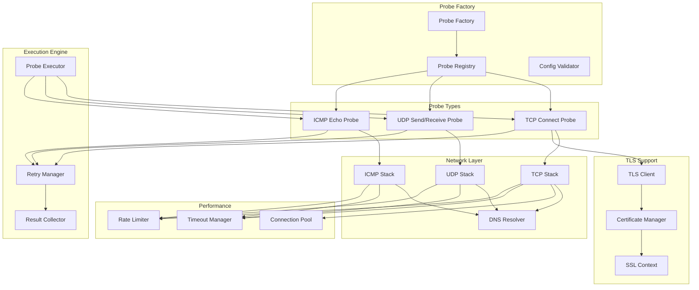
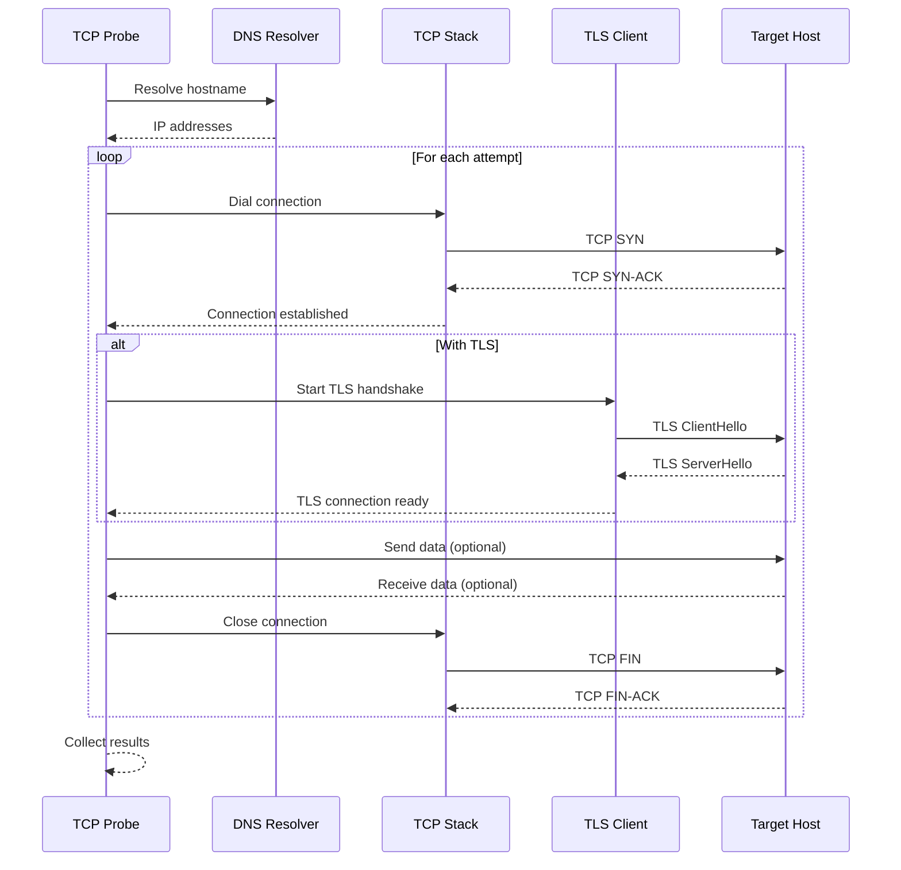
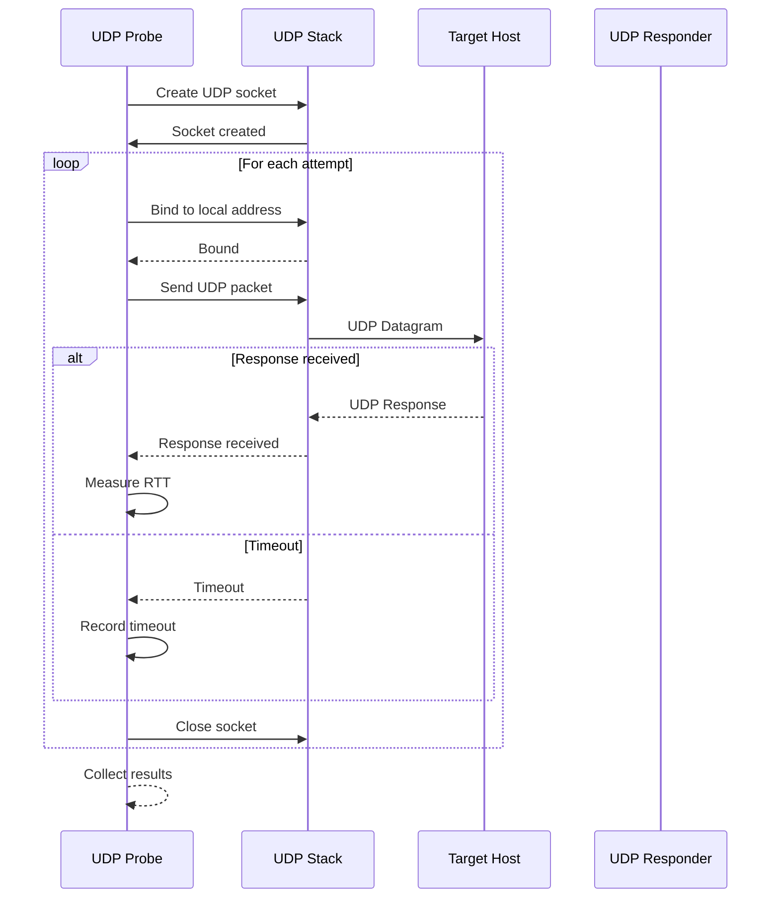
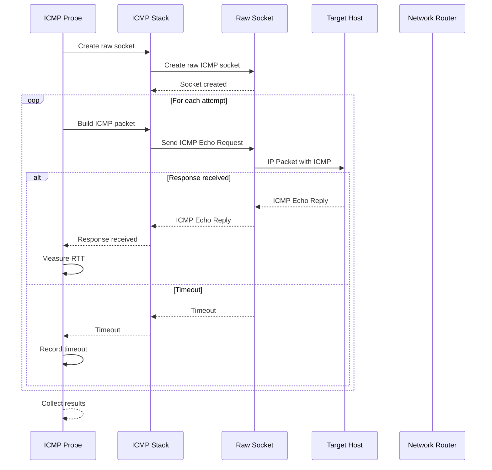

# VMProber Probe System

## Обзор системы проб

Система проб VMProber обеспечивает выполнение различных типов сетевых проверок для мониторинга доступности хостов. Система спроектирована как расширяемая архитектура с поддержкой TCP, UDP и ICMP проб, а также возможностью добавления новых типов проб без изменения ядра.

## Архитектура системы проб



## Основные компоненты

### 1. Probe Factory
Фабрика для создания экземпляров проб различных типов.

### 2. Probe Registry
Реестр зарегистрированных типов проб с возможностью расширения.

### 3. Probe Executor
Исполнитель проб с управлением таймаутами и ретраями.

### 4. Connection Pool
Пул соединений для оптимизации производительности TCP проб.

### 5. DNS Resolver
Кэширующий DNS резолвер для оптимизации разрешения имен.

### 6. TLS Client
Клиент для безопасных TLS соединений.

## Интерфейсы

### Probe Interface
```go
type Probe interface {
    // Execute выполняет пробу
    Execute(ctx context.Context, target Target) (*ProbeResult, error)
    
    // Type возвращает тип пробы
    Type() ProbeType
    
    // Validate проверяет конфигурацию пробы
    Validate(config interface{}) error
    
    // Close освобождает ресурсы
    Close() error
    
    // GetStats возвращает статистику пробы
    GetStats() ProbeStats
}
```

### ProbeFactory Interface
```go
type ProbeFactory interface {
    // CreateProbe создает экземпляр пробы
    CreateProbe(probeType ProbeType, config interface{}) (Probe, error)
    
    // GetSupportedTypes возвращает поддерживаемые типы
    GetSupportedTypes() []ProbeType
    
    // RegisterProbe регистрирует новый тип пробы
    RegisterProbe(probeType ProbeType, creator ProbeCreator) error
    
    // UnregisterProbe отменяет регистрацию типа пробы
    UnregisterProbe(probeType ProbeType) error
}

// ProbeCreator функция создания пробы
type ProbeCreator func(config interface{}) (Probe, error)
```

## TCP Connect Probe

### Обзор
TCP Connect Probe выполняет проверку доступности TCP портов с поддержкой TLS и различных сетевых настроек.

### Архитектура TCP Probe


### Реализация TCP Probe
```go
type TCPProbe struct {
    config     *TCPConfig
    connPool   *ConnectionPool
    dnsCache   *DNSCache
    tlsClient  *TLSClient
    stats      *ProbeStats
    mu         sync.RWMutex
}

type TCPConfig struct {
    ConnectTimeout time.Duration `yaml:"connect_timeout"`
    ReadTimeout    time.Duration `yaml:"read_timeout"`
    WriteTimeout   time.Duration `yaml:"write_timeout"`
    KeepAlive      KeepAliveConfig `yaml:"keep_alive"`
    TLS            TLSConfig `yaml:"tls"`
    NetworkFamily  NetworkFamily `yaml:"network_family"`
    BindAddress    string `yaml:"bind_address"`
    BufferSize     int `yaml:"buffer_size"`
}

type KeepAliveConfig struct {
    Enabled     bool          `yaml:"enabled"`
    Period      time.Duration `yaml:"period"`
    IdleTime    time.Duration `yaml:"idle_time"`
    Count       int `yaml:"count"`
}

func (p *TCPProbe) Execute(ctx context.Context, target Target) (*ProbeResult, error) {
    start := time.Now()
    result := &ProbeResult{
        Protocol:  ProbeTypeTCP,
        Timestamp: start,
        Attempt:   1,
    }
    
    // Разрешение DNS
    resolvedIPs, lookupTime, err := p.resolveDNS(ctx, target.Host, target.NetworkFamily)
    if err != nil {
        result.Error = fmt.Sprintf("DNS resolution failed: %v", err)
        return result, err
    }
    result.DNSResult = &DNSResult{
        ResolvedIPs: resolvedIPs,
        LookupTime:  lookupTime,
    }
    
    // Попытки подключения к каждому IP
    var lastErr error
    for _, ip := range resolvedIPs {
        select {
        case <-ctx.Done():
            return nil, ctx.Err()
        default:
        }
        
        result.TargetIP = ip
        result.TargetPort = target.Port
        
        // Создание TCP соединения
        dialer := &net.Dialer{
            Timeout:   target.Timeout,
            LocalAddr: p.getLocalAddr(target.NetworkFamily, target.TLS),
        }
        
        // Настройка keep-alive
        if p.config.KeepAlive.Enabled {
            dialer.KeepAlive = p.config.KeepAlive.Period
        }
        
        conn, err := dialer.DialContext(ctx, "tcp", 
            net.JoinHostPort(ip, strconv.Itoa(target.Port)))
        if err != nil {
            lastErr = err
            result.Error = err.Error()
            continue
        }
        
        // TLS handshake если требуется
        if target.TLS != nil && target.TLS.Enabled {
            tlsConn, err := p.performTLSHandshake(ctx, conn, target.TLS)
            if err != nil {
                conn.Close()
                lastErr = err
                result.Error = fmt.Sprintf("TLS handshake failed: %v", err)
                continue
            }
            result.TLS = true
            result.Role = "client"
            result.SocketFamily = getSocketFamily(ip)
            
            // Отправка данных если указано
            if target.TLS.Data != nil {
                err = p.sendReceiveData(ctx, tlsConn, target.TLS.Data)
                if err != nil {
                    tlsConn.Close()
                    lastErr = err
                    result.Error = fmt.Sprintf("Data exchange failed: %v", err)
                    continue
                }
            }
            
            tlsConn.Close()
        } else {
            result.Role = "client"
            result.SocketFamily = getSocketFamily(ip)
            
            // Отправка данных если указано
            if target.TLS != nil && target.TLS.Data != nil {
                err = p.sendReceiveData(ctx, conn, target.TLS.Data)
                if err != nil {
                    conn.Close()
                    lastErr = err
                    result.Error = fmt.Sprintf("Data exchange failed: %v", err)
                    continue
                }
            }
            
            conn.Close()
        }
        
        // Успешное подключение
        result.Success = true
        result.RTT = time.Since(start)
        result.SourceIP = conn.LocalAddr().(*net.TCPAddr).IP.String()
        
        return result, nil
    }
    
    // Все попытки неудачны
    result.RTT = time.Since(start)
    return result, lastErr
}

func (p *TCPProbe) performTLSHandshake(ctx context.Context, conn net.Conn, tlsConfig *TLSConfig) (net.Conn, error) {
    // Создание TLS конфигурации
    tlsCfg := &tls.Config{
        InsecureSkipVerify: tlsConfig.InsecureSkipVerify,
        ServerName:         tlsConfig.ServerName,
        MinVersion:         p.parseTLSVersion(tlsConfig.MinVersion),
        MaxVersion:         p.parseTLSVersion(tlsConfig.MaxVersion),
        CipherSuites:       p.parseCipherSuites(tlsConfig.CipherSuites),
    }
    
    // Загрузка корневых сертификатов
    if tlsConfig.RootCAs != "" {
        rootCAs, err := x509.SystemCertPool()
        if err != nil {
            return nil, fmt.Errorf("failed to load system cert pool: %w", err)
        }
        
        certBytes, err := ioutil.ReadFile(tlsConfig.RootCAs)
        if err != nil {
            return nil, fmt.Errorf("failed to read root CA file: %w", err)
        }
        
        if !rootCAs.AppendCertsFromPEM(certBytes) {
            return nil, fmt.Errorf("failed to parse root CA certificates")
        }
        
        tlsCfg.RootCAs = rootCAs
    }
    
    // Загрузка клиентского сертификата
    if tlsConfig.ClientCert != "" && tlsConfig.ClientKey != "" {
        cert, err := tls.LoadX509KeyPair(tlsConfig.ClientCert, tlsConfig.ClientKey)
        if err != nil {
            return nil, fmt.Errorf("failed to load client certificate: %w", err)
        }
        tlsCfg.Certificates = []tls.Certificate{cert}
    }
    
    // Выполнение TLS handshake
    tlsConn := tls.Client(conn, tlsCfg)
    
    handshakeCtx, cancel := context.WithTimeout(ctx, p.config.ConnectTimeout)
    defer cancel()
    
    err := tlsConn.HandshakeContext(handshakeCtx)
    if err != nil {
        return nil, fmt.Errorf("TLS handshake failed: %w", err)
    }
    
    return tlsConn, nil
}

func (p *TCPProbe) sendReceiveData(ctx context.Context, conn net.Conn, data []byte) error {
    // Отправка данных
    writeCtx, cancel := context.WithTimeout(ctx, p.config.WriteTimeout)
    defer cancel()
    
    err := conn.SetWriteDeadline(time.Now().Add(p.config.WriteTimeout))
    if err != nil {
        return fmt.Errorf("failed to set write deadline: %w", err)
    }
    
    _, err = conn.Write(data)
    if err != nil {
        return fmt.Errorf("failed to write data: %w", err)
    }
    
    // Получение ответа
    readCtx, cancel := context.WithTimeout(ctx, p.config.ReadTimeout)
    defer cancel()
    
    err = conn.SetReadDeadline(time.Now().Add(p.config.ReadTimeout))
    if err != nil {
        return fmt.Errorf("failed to set read deadline: %w", err)
    }
    
    buffer := make([]byte, p.config.BufferSize)
    n, err := conn.Read(buffer)
    if err != nil && err != io.EOF {
        return fmt.Errorf("failed to read response: %w", err)
    }
    
    if n > 0 {
        // Сохранение ответа для анализа
        // Можно добавить логику анализа ответа
    }
    
    return nil
}
```

### Оптимизации TCP Probe

#### Connection Pooling
```go
type ConnectionPool struct {
    pools     map[string]*sync.Pool
    maxSize   int
    maxAge    time.Duration
    mu        sync.RWMutex
}

func (p *ConnectionPool) Get(ctx context.Context, key string) (net.Conn, error) {
    p.mu.RLock()
    pool := p.pools[key]
    p.mu.RUnlock()
    
    if pool == nil {
        return nil, fmt.Errorf("no pool for key: %s", key)
    }
    
    conn := pool.Get()
    if conn == nil {
        return nil, fmt.Errorf("no connection available")
    }
    
    // Проверка состояния соединения
    if !p.isConnectionValid(conn) {
        conn.Close()
        return nil, fmt.Errorf("connection is not valid")
    }
    
    return conn, nil
}

func (p *ConnectionPool) Put(ctx context.Context, key string, conn net.Conn) error {
    p.mu.Lock()
    pool := p.pools[key]
    if pool == nil {
        pool = &sync.Pool{}
        p.pools[key] = pool
    }
    p.mu.Unlock()
    
    // Проверка состояния перед возвратом в пул
    if !p.isConnectionValid(conn) {
        conn.Close()
        return nil
    }
    
    pool.Put(conn)
    return nil
}
```

#### DNS Caching
```go
type DNSCache struct {
    entries map[string]*DNSEntry
    mu      sync.RWMutex
    ttl     time.Duration
}

type DNSEntry struct {
    IPs       []string
    Timestamp time.Time
    TTL       time.Duration
}

func (c *DNSCache) Resolve(ctx context.Context, hostname string, family NetworkFamily) ([]string, error) {
    c.mu.RLock()
    entry := c.entries[hostname]
    c.mu.RUnlock()
    
    // Проверка кэша
    if entry != nil && time.Since(entry.Timestamp) < entry.TTL {
        return c.filterByFamily(entry.IPs, family), nil
    }
    
    // DNS запрос
    addrs, err := net.LookupHost(hostname)
    if err != nil {
        return nil, err
    }
    
    // Обновление кэша
    c.mu.Lock()
    c.entries[hostname] = &DNSEntry{
        IPs:       addrs,
        Timestamp: time.Now(),
        TTL:       c.ttl,
    }
    c.mu.Unlock()
    
    return c.filterByFamily(addrs, family), nil
}
```

## UDP Send/Receive Probe

### Обзор
UDP Probe отправляет UDP пакеты и ожидает ответы с поддержкой различных типов payload и настроек.

### Архитектура UDP Probe


### Реализация UDP Probe
```go
type UDPProbe struct {
    config     *UDPConfig
    socketPool *SocketPool
    stats      *ProbeStats
    mu         sync.RWMutex
}

type UDPConfig struct {
    PayloadType     string        `yaml:"payload_type"`
    PayloadSize     int           `yaml:"payload_size"`
    ResponseTimeout time.Duration `yaml:"response_timeout"`
    MaxPacketSize   int           `yaml:"max_packet_size"`
    BindAddress     string        `yaml:"bind_address"`
    NetworkFamily   NetworkFamily `yaml:"network_family"`
}

func (p *UDPProbe) Execute(ctx context.Context, target Target) (*ProbeResult, error) {
    start := time.Now()
    result := &ProbeResult{
        Protocol:  ProbeTypeUDP,
        Timestamp: start,
        Attempt:   1,
    }
    
    // Создание UDP соединения
    conn, err := p.createUDPConnection(ctx, target)
    if err != nil {
        result.Error = fmt.Sprintf("failed to create UDP connection: %v", err)
        return result, err
    }
    defer conn.Close()
    
    // Разрешение DNS если нужно
    if isHostname(target.Host) {
        resolvedIPs, lookupTime, err := p.resolveDNS(ctx, target.Host, target.NetworkFamily)
        if err != nil {
            result.Error = fmt.Sprintf("DNS resolution failed: %v", err)
            return result, err
        }
        result.DNSResult = &DNSResult{
            ResolvedIPs: resolvedIPs,
            LookupTime:  lookupTime,
        }
        target.Host = resolvedIPs[0] // Используем первый IP
    }
    
    result.TargetIP = target.Host
    result.TargetPort = target.Port
    
    // Создание payload
    payload, err := p.generatePayload(target.UDP)
    if err != nil {
        result.Error = fmt.Sprintf("failed to generate payload: %v", err)
        return result, err
    }
    result.Payload = payload
    
    // Отправка UDP пакета
    targetAddr := &net.UDPAddr{
        IP:   net.ParseIP(target.Host),
        Port: target.Port,
    }
    
    // Настройка таймаута
    if err := conn.SetReadDeadline(time.Now().Add(target.Timeout)); err != nil {
        result.Error = fmt.Sprintf("failed to set read deadline: %v", err)
        return result, err
    }
    
    // Отправка данных
    n, err := conn.WriteToUDP(payload, targetAddr)
    if err != nil {
        result.Error = fmt.Sprintf("failed to send UDP packet: %v", err)
        return result, err
    }
    
    // Получение ответа
    buffer := make([]byte, target.UDP.MaxPacketSize)
    m, addr, err := conn.ReadFromUDP(buffer)
    if err != nil {
        if netErr, ok := err.(net.Error); ok && netErr.Timeout() {
            result.Error = "UDP response timeout"
            result.RTT = time.Since(start)
            return result, nil
        }
        result.Error = fmt.Sprintf("failed to receive UDP response: %v", err)
        result.RTT = time.Since(start)
        return result, err
    }
    
    // Успешный ответ
    result.Success = true
    result.RTT = time.Since(start)
    result.Response = buffer[:m]
    result.SourceIP = conn.LocalAddr().(*net.UDPAddr).IP.String()
    result.Role = "client"
    result.SocketFamily = getSocketFamily(target.Host)
    
    return result, nil
}

func (p *UDPProbe) generatePayload(config *UDPConfig) ([]byte, error) {
    switch config.PayloadType {
    case "echo":
        // Эхо payload - повторяем паттерн
        payload := make([]byte, config.PayloadSize)
        pattern := []byte("VMProberUDPProbe")
        for i := 0; i < len(payload); i++ {
            payload[i] = pattern[i%len(pattern)]
        }
        return payload, nil
        
    case "random":
        // Случайный payload
        payload := make([]byte, config.PayloadSize)
        if _, err := rand.Read(payload); err != nil {
            return nil, fmt.Errorf("failed to generate random payload: %w", err)
        }
        return payload, nil
        
    case "timestamp":
        // Payload с временной меткой
        timestamp := time.Now().UnixNano()
        payload := make([]byte, config.PayloadSize)
        binary.BigEndian.PutUint64(payload, uint64(timestamp))
        // Заполняем остальное случайными данными
        if _, err := rand.Read(payload[8:]); err != nil {
            return nil, fmt.Errorf("failed to generate timestamp payload: %w", err)
        }
        return payload, nil
        
    default:
        return nil, fmt.Errorf("unsupported payload type: %s", config.PayloadType)
    }
}

func (p *UDPProbe) createUDPConnection(ctx context.Context, target Target) (*net.UDPConn, error) {
    var localAddr *net.UDPAddr
    
    // Определение локального адреса
    if target.UDP.BindAddress != "" {
        localAddr = &net.UDPAddr{
            IP: net.ParseIP(target.UDP.BindAddress),
        }
    } else {
        // Автоматический выбор локального адреса
        localAddr = p.getBestLocalAddress(target.NetworkFamily)
    }
    
    // Создание UDP соединения
    conn, err := net.ListenUDP("udp", localAddr)
    if err != nil {
        return nil, fmt.Errorf("failed to create UDP connection: %w", err)
    }
    
    // Настройка буферов
    if err := conn.SetReadBuffer(target.UDP.MaxPacketSize); err != nil {
        conn.Close()
        return nil, fmt.Errorf("failed to set read buffer: %w", err)
    }
    
    if err := conn.SetWriteBuffer(target.UDP.MaxPacketSize); err != nil {
        conn.Close()
        return nil, fmt.Errorf("failed to set write buffer: %w", err)
    }
    
    return conn, nil
}
```

## ICMP Echo Probe

### Обзор
ICMP Probe выполняет ping-подобные проверки с использованием ICMP Echo Request пакетов.

### Архитектура ICMP Probe


### Реализация ICMP Probe
```go
type ICMPProbe struct {
    config     *ICMPConfig
    socket     net.PacketConn
    sequence   uint16
    stats      *ProbeStats
    mu         sync.RWMutex
}

type ICMPConfig struct {
    Library       string `yaml:"library"`
    SequenceStart int    `yaml:"sequence_start"`
    TTL           int    `yaml:"ttl"`
    Data          []byte `yaml:"data,omitempty"`
}

func (p *ICMPProbe) Execute(ctx context.Context, target Target) (*ProbeResult, error) {
    start := time.Now()
    result := &ProbeResult{
        Protocol:  ProbeTypeICMP,
        Timestamp: start,
        Attempt:   1,
    }
    
    // Разрешение DNS если нужно
    if isHostname(target.Host) {
        resolvedIPs, lookupTime, err := p.resolveDNS(ctx, target.Host, target.NetworkFamily)
        if err != nil {
            result.Error = fmt.Sprintf("DNS resolution failed: %v", err)
            return result, err
        }
        result.DNSResult = &DNSResult{
            ResolvedIPs: resolvedIPs,
            LookupTime:  lookupTime,
        }
        target.Host = resolvedIPs[0] // Используем первый IP
    }
    
    result.TargetIP = target.Host
    
    // Создание ICMP пакета
    packet, err := p.buildICMPPacket(target)
    if err != nil {
        result.Error = fmt.Sprintf("failed to build ICMP packet: %v", err)
        return result, err
    }
    result.Payload = packet
    
    // Отправка ICMP пакета
    targetAddr := &net.IPAddr{IP: net.ParseIP(target.Host)}
    
    // Настройка таймаута
    if err := p.socket.SetReadDeadline(time.Now().Add(target.Timeout)); err != nil {
        result.Error = fmt.Sprintf("failed to set read deadline: %v", err)
        return result, err
    }
    
    // Отправка пакета
    n, err := p.socket.WriteTo(packet, targetAddr)
    if err != nil {
        result.Error = fmt.Sprintf("failed to send ICMP packet: %v", err)
        return result, err
    }
    
    // Получение ответа
    buffer := make([]byte, 1500) // Стандартный MTU
    m, addr, err := p.socket.ReadFrom(buffer)
    if err != nil {
        if netErr, ok := err.(net.Error); ok && netErr.Timeout() {
            result.Error = "ICMP response timeout"
            result.RTT = time.Since(start)
            return result, nil
        }
        result.Error = fmt.Sprintf("failed to receive ICMP response: %v", err)
        result.RTT = time.Since(start)
        return result, err
    }
    
    // Парсинг ответа
    response, err := p.parseICMPResponse(buffer[:m])
    if err != nil {
        result.Error = fmt.Sprintf("failed to parse ICMP response: %v", err)
        result.RTT = time.Since(start)
        return result, err
    }
    
    // Проверка соответствия запроса и ответа
    if !p.isMatchingResponse(response, target) {
        result.Error = "ICMP response does not match request"
        result.RTT = time.Since(start)
        return result, nil
    }
    
    // Успешный ответ
    result.Success = true
    result.RTT = time.Since(start)
    result.Response = buffer[:m]
    result.SourceIP = addr.String()
    result.Role = "client"
    result.SocketFamily = getSocketFamily(target.Host)
    
    return result, nil
}

func (p *ICMPProbe) buildICMPPacket(target Target) ([]byte, error) {
    // Создание ICMP Echo Request пакета
    icmpType := uint8(8) // Echo Request
    icmpCode := uint8(0)
    icmpChecksum := uint16(0)
    icmpID := uint16(os.Getpid() & 0xFFFF)
    
    // Увеличение sequence number
    p.mu.Lock()
    p.sequence++
    if p.sequence == 0 {
        p.sequence = uint16(p.config.SequenceStart)
    }
    icmpSeq := p.sequence
    p.mu.Unlock()
    
    // Создание ICMP данных
    data := p.config.Data
    if data == nil {
        data = make([]byte, 56) // Стандартный размер для ping
        for i := range data {
            data[i] = byte(i)
        }
    }
    
    // Создание ICMP пакета
    icmpHeader := struct {
        Type        uint8
        Code        uint8
        Checksum    uint16
        ID          uint16
        Sequence    uint16
        Data        []byte
    }{
        Type:     icmpType,
        Code:     icmpCode,
        Checksum: icmpChecksum,
        ID:       icmpID,
        Sequence: icmpSeq,
        Data:     data,
    }
    
    // Вычисление контрольной суммы
    packet := p.encodeICMPHeader(&icmpHeader)
    icmpHeader.Checksum = p.calculateChecksum(packet)
    
    // Пересоздание пакета с правильной контрольной суммой
    packet = p.encodeICMPHeader(&icmpHeader)
    
    return packet, nil
}

func (p *ICMPProbe) parseICMPResponse(data []byte) (*ICMPResponse, error) {
    if len(data) < 20 {
        return nil, fmt.Errorf("packet too short")
    }
    
    // Парсинг IP заголовка
    ipHeader := data[:20]
    version := ipHeader[0] >> 4
    if version != 4 {
        return nil, fmt.Errorf("unsupported IP version: %d", version)
    }
    
    headerLength := (ipHeader[0] & 0x0F) * 4
    if len(data) < headerLength+8 {
        return nil, fmt.Errorf("packet too short for ICMP")
    }
    
    // Парсинг ICMP заголовка
    icmpData := data[headerLength:]
    icmpType := icmpData[0]
    icmpCode := icmpData[1]
    icmpChecksum := binary.BigEndian.Uint16(icmpData[2:4])
    icmpID := binary.BigEndian.Uint16(icmpData[4:6])
    icmpSeq := binary.BigEndian.Uint16(icmpData[6:8])
    
    // Проверка типа ICMP сообщения
    if icmpType != 0 { // Echo Reply
        return nil, fmt.Errorf("unexpected ICMP type: %d", icmpType)
    }
    
    return &ICMPResponse{
        Type:     icmpType,
        Code:     icmpCode,
        Checksum: icmpChecksum,
        ID:       icmpID,
        Sequence: icmpSeq,
        Data:     icmpData[8:],
    }, nil
}

type ICMPResponse struct {
    Type     uint8
    Code     uint8
    Checksum uint16
    ID       uint16
    Sequence uint16
    Data     []byte
}

func (p *ICMPProbe) calculateChecksum(data []byte) uint16 {
    sum := uint32(0)
    
    // Суммирование 16-битных слов
    for i := 0; i < len(data)-1; i += 2 {
        sum += uint32(data[i])<<8 + uint32(data[i+1])
    }
    
    // Добавление последнего байта если длина нечетная
    if len(data)%2 == 1 {
        sum += uint32(data[len(data)-1]) << 8
    }
    
    // Сворачивание 32-битной суммы в 16-битную
    for (sum >> 16) > 0 {
        sum = (sum & 0xFFFF) + (sum >> 16)
    }
    
    // Инвертирование
    return uint16(^sum)
}

func (p *ICMPProbe) encodeICMPHeader(header *struct {
    Type        uint8
    Code        uint8
    Checksum    uint16
    ID          uint16
    Sequence    uint16
    Data        []byte
}) []byte {
    packet := make([]byte, 8+len(header.Data))
    packet[0] = header.Type
    packet[1] = header.Code
    binary.BigEndian.PutUint16(packet[2:4], header.Checksum)
    binary.BigEndian.PutUint16(packet[4:6], header.ID)
    binary.BigEndian.PutUint16(packet[6:8], header.Sequence)
    copy(packet[8:], header.Data)
    return packet
}
```

## Probe Factory

### Реализация фабрики проб
```go
type DefaultProbeFactory struct {
    creators map[ProbeType]ProbeCreator
    configs  map[ProbeType]interface{}
    mu       sync.RWMutex
}

func NewDefaultProbeFactory() *DefaultProbeFactory {
    factory := &DefaultProbeFactory{
        creators: make(map[ProbeType]ProbeCreator),
        configs:  make(map[ProbeType]interface{}),
    }
    
    // Регистрация стандартных типов проб
    factory.RegisterProbe(ProbeTypeTCP, func(config interface{}) (Probe, error) {
        return NewTCPProbe(config.(*TCPConfig))
    })
    
    factory.RegisterProbe(ProbeTypeUDP, func(config interface{}) (Probe, error) {
        return NewUDPProbe(config.(*UDPConfig))
    })
    
    factory.RegisterProbe(ProbeTypeICMP, func(config interface{}) (Probe, error) {
        return NewICMPProbe(config.(*ICMPConfig))
    })
    
    return factory
}

func (f *DefaultProbeFactory) CreateProbe(probeType ProbeType, config interface{}) (Probe, error) {
    f.mu.RLock()
    creator := f.creators[probeType]
    f.mu.RUnlock()
    
    if creator == nil {
        return nil, fmt.Errorf("unsupported probe type: %s", probeType)
    }
    
    probe, err := creator(config)
    if err != nil {
        return nil, fmt.Errorf("failed to create probe %s: %w", probeType, err)
    }
    
    // Валидация конфигурации
    if err := probe.Validate(config); err != nil {
        return nil, fmt.Errorf("probe validation failed: %w", err)
    }
    
    return probe, nil
}

func (f *DefaultProbeFactory) RegisterProbe(probeType ProbeType, creator ProbeCreator) error {
    f.mu.Lock()
    defer f.mu.Unlock()
    
    if creator == nil {
        return fmt.Errorf("creator cannot be nil")
    }
    
    f.creators[probeType] = creator
    return nil
}

func (f *DefaultProbeFactory) GetSupportedTypes() []ProbeType {
    f.mu.RLock()
    defer f.mu.RUnlock()
    
    types := make([]ProbeType, 0, len(f.creators))
    for probeType := range f.creators {
        types = append(types, probeType)
    }
    
    return types
}
```

## Обработка ошибок

### Типы ошибок проб
```go
type ProbeError struct {
    Type        ProbeErrorType `json:"type"`
    Code        string         `json:"code"`
    Message     string         `json:"message"`
    Cause       error          `json:"cause,omitempty"`
    Target      string         `json:"target"`
    ProbeType   ProbeType      `json:"probe_type"`
    Attempt     int            `json:"attempt"`
    Timestamp   time.Time      `json:"timestamp"`
    Recoverable bool           `json:"recoverable"`
}

type ProbeErrorType string

const (
    ErrorTypeDNS        ProbeErrorType = "dns_error"
    ErrorTypeConnection ProbeErrorType = "connection_error"
    ErrorTypeTimeout    ProbeErrorType = "timeout_error"
    ErrorTypeTLS        ProbeErrorType = "tls_error"
    ErrorTypeProtocol   ProbeErrorType = "protocol_error"
    ErrorTypeNetwork    ProbeErrorType = "network_error"
    ErrorTypePermission ProbeErrorType = "permission_error"
    ErrorTypeResource   ProbeErrorType = "resource_error"
)

func (e *ProbeError) Error() string {
    return fmt.Sprintf("[%s] %s: %s (target: %s, attempt: %d)", 
        e.Type, e.Code, e.Message, e.Target, e.Attempt)
}

func (e *ProbeError) Unwrap() error {
    return e.Cause
}
```

### Retry логика
```go
type RetryManager struct {
    maxAttempts int
    backoff     BackoffStrategy
    jitter      float64
}

type BackoffStrategy interface {
    NextDelay(attempt int) time.Duration
}

type ExponentialBackoff struct {
    InitialDelay time.Duration
    MaxDelay     time.Duration
    Multiplier   float64
}

func (b *ExponentialBackoff) NextDelay(attempt int) time.Duration {
    delay := time.Duration(float64(b.InitialDelay) * math.Pow(b.Multiplier, float64(attempt-1)))
    if delay > b.MaxDelay {
        delay = b.MaxDelay
    }
    return delay
}

func (r *RetryManager) ExecuteWithRetry(ctx context.Context, fn func() error) error {
    var lastErr error
    
    for attempt := 1; attempt <= r.maxAttempts; attempt++ {
        select {
        case <-ctx.Done():
            return ctx.Err()
        default:
        }
        
        err := fn()
        if err == nil {
            return nil
        }
        
        lastErr = err
        
        // Проверка, является ли ошибка восстанавливаемой
        if !r.isRecoverableError(err) {
            return err
        }
        
        // Последняя попытка
        if attempt == r.maxAttempts {
            break
        }
        
        // Вычисление задержки
        delay := r.backoff.NextDelay(attempt)
        
        // Добавление jitter
        if r.jitter > 0 {
            jitter := time.Duration(rand.Float64() * r.jitter * float64(delay))
            delay += jitter
        }
        
        // Ожидание перед следующей попыткой
        select {
        case <-ctx.Done():
            return ctx.Err()
        case <-time.After(delay):
        }
    }
    
    return lastErr
}
```

## Производительность и оптимизации

### 1. Connection Pooling
- Повторное использование TCP соединений
- Проверка состояния соединений
- Ограничение размера пула

### 2. DNS Caching
- Кэширование результатов DNS разрешения
- TTL-based expiration
- Асинхронное обновление кэша

### 3. Rate Limiting
- Ограничение RPS per host
- Token bucket алгоритм
- Graceful degradation

### 4. Timeout Management
- Настраиваемые таймауты
- Контекстная отмена
- Graceful timeout handling

### 5. Resource Management
- Ограничение количества открытых файлов
- Контроль использования памяти
- Cleanup неиспользуемых ресурсов

## Безопасность

### 1. Input Validation
- Валидация входных данных
- Проверка размеров пакетов
- Санитизация строковых параметров

### 2. Network Security
- Поддержка IPv4/IPv6
- Контроль исходных адресов
- Защита от spoofing

### 3. TLS Security
- Проверка сертификатов
- Поддержка различных версий TLS
- Настраиваемые cipher suites

### 4. Permission Control
- Проверка прав доступа
- Graceful degradation при отсутствии прав
- Логирование security events

## Мониторинг и метрики

### 1. Probe Metrics
- probe_success_total
- probe_failure_total
- probe_rtt_ms
- probe_attempts_total

### 2. System Metrics
- active_connections
- dns_cache_hits
- dns_cache_misses
- rate_limiter_rejections

### 3. Error Metrics
- error_rate_by_type
- timeout_rate
- retry_rate
- connection_pool_utilization

## Тестирование

### 1. Unit Tests
- Тестирование каждого типа пробы
- Мокирование сетевых операций
- Тестирование обработки ошибок

### 2. Integration Tests
- Тестирование взаимодействия компонентов
- End-to-end тестирование
- Performance тестирование

### 3. Network Tests
- Тестирование в различных сетевых условиях
- Load testing
- Failure injection testing