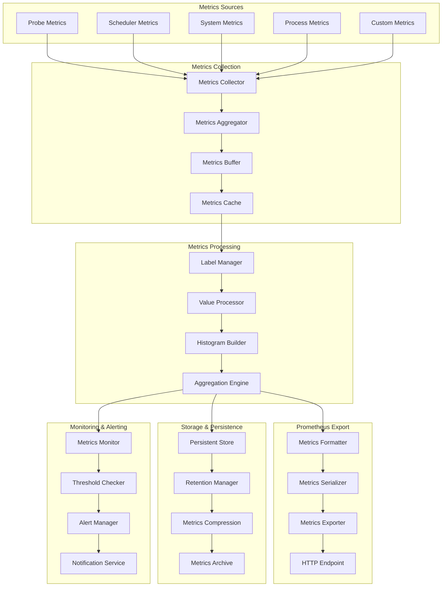

# VMProber Prometheus Metrics System

## Обзор системы метрик

Система метрик VMProber обеспечивает сбор, агрегацию и экспорт метрик в формате Prometheus. Система поддерживает как встроенные метрики процесса, так и пользовательские метрики, связанные с мониторингом хостов и производительностью системы.

## Архитектура системы метрик



## Основные компоненты

### 1. Metrics Collector
Центральный сборщик метрик от всех источников.

### 2. Metrics Aggregator
Агрегатор для объединения и обработки метрик.

### 3. Label Manager
Менеджер меток для группировки и фильтрации метрик.

### 4. Metrics Formatter
Форматировщик для приведения метрик к формату Prometheus.

### 5. Metrics Exporter
Экспортер для предоставления метрик по HTTP endpoint.

## Интерфейсы

### MetricsCollector Interface
```go
type MetricsCollector interface {
    // Collect собирает метрики от всех источников
    Collect(ctx context.Context) error
    
    // Register регистрирует источник метрик
    Register(ctx context.Context, source MetricsSource) error
    
    // Unregister отменяет регистрацию источника
    Unregister(ctx context.Context, sourceID string) error
    
    // GetMetrics возвращает собранные метрики
    GetMetrics(ctx context.Context) ([]Metric, error)
    
    // GetStats возвращает статистику сборщика
    GetStats() CollectorStats
    
    // Close закрывает сборщик
    Close(ctx context.Context) error
}
```

### MetricsSource Interface
```go
type MetricsSource interface {
    // ID возвращает уникальный идентификатор источника
    ID() string
    
    // Type возвращает тип источника
    Type() string
    
    // Collect собирает метрики от источника
    Collect(ctx context.Context) ([]Metric, error)
    
    // GetLabels возвращает метки источника
    GetLabels() map[string]string
    
    // GetStats возвращает статистику источника
    GetStats() SourceStats
}
```

### MetricsProcessor Interface
```go
type MetricsProcessor interface {
    // Process обрабатывает метрики
    Process(ctx context.Context, metrics []Metric) ([]Metric, error)
    
    // AddProcessor добавляет процессор в цепочку
    AddProcessor(ctx context.Context, processor MetricsProcessor) error
    
    // RemoveProcessor удаляет процессор из цепочки
    RemoveProcessor(ctx context.Context, processorID string) error
    
    // GetProcessors возвращает список процессоров
    GetProcessors(ctx context.Context) ([]MetricsProcessor, error)
}
```

## Core Data Structures

### Metric
```go
type Metric struct {
    Name        string            `json:"name"`
    Value       float64           `json:"value"`
    Timestamp   time.Time         `json:"timestamp"`
    Labels      map[string]string `json:"labels"`
    Type        MetricType        `json:"type"`
    Help        string            `json:"help"`
    
    // Дополнительные поля для histogram и summary
    Buckets     []Bucket          `json:"buckets,omitempty"`
    Sum         float64           `json:"sum,omitempty"`
    Count       uint64            `json:"count,omitempty"`
    Quantiles   map[float64]float64 `json:"quantiles,omitempty"`
    
    // Внутренние поля
    fingerprint uint64            `json:"-"`
    hash        string            `json:"-"`
}

type Bucket struct {
    UpperBound float64 `json:"upper_bound"`
    Count      uint64  `json:"count"`
}

type MetricType string

const (
    MetricTypeCounter   MetricType = "counter"
    MetricTypeGauge     MetricType = "gauge"
    MetricTypeHistogram MetricType = "histogram"
    MetricTypeSummary   MetricType = "summary"
)
```

### MetricsConfig
```go
type MetricsConfig struct {
    Namespace            string            `yaml:"namespace" json:"namespace"`
    Subsystem            string            `yaml:"subsystem" json:"subsystem"`
    IncludeLabels        []string          `yaml:"include_labels" json:"include_labels"`
    ExcludeLabels        []string          `yaml:"exclude_labels" json:"exclude_labels"`
    CustomLabels         map[string]string `yaml:"custom_labels" json:"custom_labels"`
    Buckets              []float64         `yaml:"buckets" json:"buckets"`
    Quantiles            []float64         `yaml:"quantiles" json:"quantiles"`
    EnableProcessMetrics bool              `yaml:"enable_process_metrics" json:"enable_process_metrics"`
    EnableGoMetrics      bool              `yaml:"enable_go_metrics" json:"enable_go_metrics"`
    EnableCustomMetrics  bool              `yaml:"enable_custom_metrics" json:"enable_custom_metrics"`
    Retention            time.Duration     `yaml:"retention" json:"retention"`
    AggregationInterval  time.Duration     `yaml:"aggregation_interval" json:"aggregation_interval"`
    ExportInterval       time.Duration     `yaml:"export_interval" json:"export_interval"`
    MaxMetrics           int               `yaml:"max_metrics" json:"max_metrics"`
    Compression          bool              `yaml:"compression" json:"compression"`
}
```

## Metrics Collection

### Default Metrics Collector
```go
type DefaultMetricsCollector struct {
    config     *MetricsConfig
    sources    map[string]MetricsSource
    processors []MetricsProcessor
    buffer     *MetricsBuffer
    cache      *MetricsCache
    stats      *CollectorStats
    mu         sync.RWMutex
    ctx        context.Context
    cancel     context.CancelFunc
}

type MetricsBuffer struct {
    metrics    []Metric
    maxSize    int
    mu         sync.Mutex
    cond       *sync.Cond
}

type MetricsCache struct {
    entries    map[string]*CacheEntry
    ttl        time.Duration
    maxSize    int
    mu         sync.RWMutex
}

type CacheEntry struct {
    Metric     Metric
    Timestamp  time.Time
    Hits       int64
}

func NewDefaultMetricsCollector(config *MetricsConfig) *DefaultMetricsCollector {
    ctx, cancel := context.WithCancel(context.Background())
    
    collector := &DefaultMetricsCollector{
        config:   config,
        sources:  make(map[string]MetricsSource),
        buffer:   NewMetricsBuffer(config.MaxMetrics),
        cache:    NewMetricsCache(config.Retention, config.MaxMetrics),
        stats: &CollectorStats{
            TotalCollected: 0,
            TotalExported:  0,
            CacheHits:      0,
            CacheMisses:    0,
        },
        ctx:    ctx,
        cancel: cancel,
    }
    
    // Регистрация стандартных источников
    collector.registerDefaultSources()
    
    return collector
}

func (c *DefaultMetricsCollector) registerDefaultSources() {
    // Process metrics
    if c.config.EnableProcessMetrics {
        c.Register(context.Background(), NewProcessMetricsSource(c.config))
    }
    
    // Go runtime metrics
    if c.config.EnableGoMetrics {
        c.Register(context.Background(), NewGoMetricsSource(c.config))
    }
    
    // Custom metrics
    if c.config.EnableCustomMetrics {
        c.Register(context.Background(), NewCustomMetricsSource(c.config))
    }
}

func (c *DefaultMetricsCollector) Collect(ctx context.Context) error {
    var allMetrics []Metric
    
    c.mu.RLock()
    sources := make([]MetricsSource, 0, len(c.sources))
    for _, source := range c.sources {
        sources = append(sources, source)
    }
    c.mu.RUnlock()
    
    // Сбор метрик от всех источников
    for _, source := range sources {
        select {
        case <-ctx.Done():
            return ctx.Err()
        default:
        }
        
        metrics, err := source.Collect(ctx)
        if err != nil {
            log.Error("failed to collect metrics from source",
                "source_id", source.ID(),
                "error", err)
            continue
        }
        
        allMetrics = append(allMetrics, metrics...)
    }
    
    // Обработка метрик через процессоры
    processedMetrics, err := c.processMetrics(ctx, allMetrics)
    if err != nil {
        return fmt.Errorf("failed to process metrics: %w", err)
    }
    
    // Добавление в буфер
    c.buffer.Add(processedMetrics)
    
    // Обновление статистики
    c.mu.Lock()
    c.stats.TotalCollected += int64(len(processedMetrics))
    c.mu.Unlock()
    
    return nil
}

func (c *DefaultMetricsCollector) processMetrics(ctx context.Context, metrics []Metric) ([]Metric, error) {
    var processedMetrics = metrics
    
    // Применение процессоров в цепочке
    for _, processor := range c.processors {
        select {
        case <-ctx.Done():
            return nil, ctx.Err()
        default:
        }
        
        processedMetrics, err := processor.Process(ctx, processedMetrics)
        if err != nil {
            log.Error("metrics processor failed",
                "processor", reflect.TypeOf(processor).Elem().Name(),
                "error", err)
            continue
        }
        
        processedMetrics = processedMetrics
    }
    
    return processedMetrics, nil
}

func (c *DefaultMetricsCollector) Register(ctx context.Context, source MetricsSource) error {
    c.mu.Lock()
    defer c.mu.Unlock()
    
    if _, exists := c.sources[source.ID()]; exists {
        return fmt.Errorf("source %s already registered", source.ID())
    }
    
    c.sources[source.ID()] = source
    log.Info("metrics source registered",
        "source_id", source.ID(),
        "source_type", source.Type())
    
    return nil
}

func (c *DefaultMetricsCollector) GetMetrics(ctx context.Context) ([]Metric, error) {
    return c.buffer.GetAll(ctx)
}

func (c *DefaultMetricsCollector) Start(ctx context.Context) error {
    // Запуск фоновых задач
    go c.collectionLoop(ctx)
    go c.cleanupLoop(ctx)
    
    return nil
}

func (c *DefaultMetricsCollector) collectionLoop(ctx context.Context) {
    ticker := time.NewTicker(c.config.AggregationInterval)
    defer ticker.Stop()
    
    for {
        select {
        case <-ticker.C:
            if err := c.Collect(ctx); err != nil {
                log.Error("metrics collection failed", "error", err)
            }
        case <-ctx.Done():
            return
        }
    }
}

func (c *DefaultMetricsCollector) cleanupLoop(ctx context.Context) {
    ticker := time.NewTicker(time.Hour)
    defer ticker.Stop()
    
    for {
        select {
        case <-ticker.C:
            c.cache.Cleanup(ctx)
        case <-ctx.Done():
            return
        }
    }
}
```

## Metrics Sources

### Process Metrics Source
```go
type ProcessMetricsSource struct {
    config     *MetricsConfig
    registry   prometheus.Registerer
    namespace  string
    subsystem  string
    stats      *SourceStats
    mu         sync.RWMutex
}

func NewProcessMetricsSource(config *MetricsConfig) *ProcessMetricsSource {
    namespace := config.Namespace
    if namespace == "" {
        namespace = "vmprober"
    }
    
    subsystem := config.Subsystem
    if subsystem == "" {
        subsystem = "process"
    }
    
    return &ProcessMetricsSource{
        config:    config,
        namespace: namespace,
        subsystem: subsystem,
        stats: &SourceStats{
            SourceID: "process_metrics",
            Type:     "process",
            Requests: 0,
            Errors:   0,
        },
    }
}

func (p *ProcessMetricsSource) ID() string {
    return "process_metrics"
}

func (p *ProcessMetricsSource) Type() string {
    return "process"
}

func (p *ProcessMetricsSource) Collect(ctx context.Context) ([]Metric, error) {
    p.mu.Lock()
    defer p.mu.Unlock()
    
    p.stats.Requests++
    
    var metrics []Metric
    
    // Сбор системных метрик
    processMetrics := p.collectProcessMetrics()
    metrics = append(metrics, processMetrics...)
    
    // Сбор сетевых метрик
    networkMetrics := p.collectNetworkMetrics()
    metrics = append(metrics, networkMetrics...)
    
    // Сбор дисковых метрик
    diskMetrics := p.collectDiskMetrics()
    metrics = append(metrics, diskMetrics...)
    
    return metrics, nil
}

func (p *ProcessMetricsSource) collectProcessMetrics() []Metric {
    var metrics []Metric
    
    // Использование памяти
    var ms runtime.MemStats
    runtime.ReadMemStats(&ms)
    
    metrics = append(metrics, Metric{
        Name:  fmt.Sprintf("%s_%s_memory_alloc_bytes", p.namespace, p.subsystem),
        Value: float64(ms.Alloc),
        Type:  MetricTypeGauge,
        Help:  "Number of bytes currently allocated",
        Labels: map[string]string{
            "type": "alloc",
        },
    })
    
    metrics = append(metrics, Metric{
        Name:  fmt.Sprintf("%s_%s_memory_sys_bytes", p.namespace, p.subsystem),
        Value: float64(ms.Sys),
        Type:  MetricTypeGauge,
        Help:  "Number of bytes obtained from system",
        Labels: map[string]string{
            "type": "sys",
        },
    })
    
    metrics = append(metrics, Metric{
        Name:  fmt.Sprintf("%s_%s_memory_heap_alloc_bytes", p.namespace, p.subsystem),
        Value: float64(ms.HeapAlloc),
        Type:  MetricTypeGauge,
        Help:  "Number of bytes allocated to heap",
        Labels: map[string]string{
            "type": "heap_alloc",
        },
    })
    
    metrics = append(metrics, Metric{
        Name:  fmt.Sprintf("%s_%s_memory_heap_sys_bytes", p.namespace, p.subsystem),
        Value: float64(ms.HeapSys),
        Type:  MetricTypeGauge,
        Help:  "Number of bytes obtained from heap",
        Labels: map[string]string{
            "type": "heap_sys",
        },
    })
    
    // Количество горутин
    metrics = append(metrics, Metric{
        Name:  fmt.Sprintf("%s_%s_goroutines", p.namespace, p.subsystem),
        Value: float64(runtime.NumGoroutine()),
        Type:  MetricTypeGauge,
        Help:  "Number of goroutines",
    })
    
    // GC статистика
    metrics = append(metrics, Metric{
        Name:  fmt.Sprintf("%s_%s_gc_pause_total_seconds", p.namespace, p.subsystem),
        Value: float64(ms.PauseTotalNs) / 1e9,
        Type:  MetricTypeCounter,
        Help:  "Total GC pause duration",
    })
    
    metrics = append(metrics, Metric{
        Name:  fmt.Sprintf("%s_%s_gc_runs_total", p.namespace, p.subsystem),
        Value: float64(ms.NumGC),
        Type:  MetricTypeCounter,
        Help:  "Number of GC runs",
    })
    
    return metrics
}

func (p *ProcessMetricsSource) collectNetworkMetrics() []Metric {
    var metrics []Metric
    
    // Получение сетевой статистики
    // Это упрощенная реализация - в реальности нужно использовать системные вызовы
    stats, err := p.getNetworkStats()
    if err != nil {
        log.Warn("failed to collect network stats", "error", err)
        return metrics
    }
    
    metrics = append(metrics, Metric{
        Name:  fmt.Sprintf("%s_%s_network_bytes_sent_total", p.namespace, p.subsystem),
        Value: float64(stats.BytesSent),
        Type:  MetricTypeCounter,
        Help:  "Total bytes sent",
    })
    
    metrics = append(metrics, Metric{
        Name:  fmt.Sprintf("%s_%s_network_bytes_recv_total", p.namespace, p.subsystem),
        Value: float64(stats.BytesRecv),
        Type:  MetricTypeCounter,
        Help:  "Total bytes received",
    })
    
    return metrics
}

func (p *ProcessMetricsSource) collectDiskMetrics() []Metric {
    var metrics []Metric
    
    // Получение дисковой статистики
    stats, err := p.getDiskStats()
    if err != nil {
        log.Warn("failed to collect disk stats", "error", err)
        return metrics
    }
    
    metrics = append(metrics, Metric{
        Name:  fmt.Sprintf("%s_%s_disk_read_bytes_total", p.namespace, p.subsystem),
        Value: float64(stats.ReadBytes),
        Type:  MetricTypeCounter,
        Help:  "Total bytes read from disk",
    })
    
    metrics = append(metrics, Metric{
        Name:  fmt.Sprintf("%s_%s_disk_write_bytes_total", p.namespace, p.subsystem),
        Value: float64(stats.WriteBytes),
        Type:  MetricTypeCounter,
        Help:  "Total bytes written to disk",
    })
    
    return metrics
}

func (p *ProcessMetricsSource) GetLabels() map[string]string {
    return map[string]string{
        "source": "process",
        "type":   "system",
    }
}

func (p *ProcessMetricsSource) GetStats() SourceStats {
    p.mu.RLock()
    defer p.mu.RUnlock()
    return *p.stats
}

// Вспомогательные методы для сбора системной статистики
func (p *ProcessMetricsSource) getNetworkStats() (*NetworkStats, error) {
    // Реализация сбора сетевой статистики
    // Можно использовать /proc/net/dev на Linux или системные вызовы
    return &NetworkStats{
        BytesSent: 0,
        BytesRecv: 0,
    }, nil
}

func (p *ProcessMetricsSource) getDiskStats() (*DiskStats, error) {
    // Реализация сбора дисковой статистики
    return &DiskStats{
        ReadBytes:  0,
        WriteBytes: 0,
    }, nil
}
```

### Probe Metrics Source
```go
type ProbeMetricsSource struct {
    config     *MetricsConfig
    probeStats map[string]*ProbeStats
    mu         sync.RWMutex
}

func NewProbeMetricsSource(config *MetricsConfig) *ProbeMetricsSource {
    return &ProbeMetricsSource{
        config:     config,
        probeStats: make(map[string]*ProbeStats),
    }
}

func (p *ProbeMetricsSource) ID() string {
    return "probe_metrics"
}

func (p *ProbeMetricsSource) Type() string {
    return "probe"
}

func (p *ProbeMetricsSource) Collect(ctx context.Context) ([]Metric, error) {
    p.mu.RLock()
    stats := make(map[string]*ProbeStats, len(p.probeStats))
    for k, v := range p.probeStats {
        stats[k] = v
    }
    p.mu.RUnlock()
    
    var metrics []Metric
    
    for probeID, stat := range stats {
        // Probe success metrics
        metrics = append(metrics, Metric{
            Name:  fmt.Sprintf("%s_probe_success_total", p.config.Namespace),
            Value: float64(stat.SuccessfulProbes),
            Type:  MetricTypeCounter,
            Help:  "Total number of successful probes",
            Labels: map[string]string{
                "probe_id": probeID,
                "type":     "success",
            },
        })
        
        metrics = append(metrics, Metric{
            Name:  fmt.Sprintf("%s_probe_failure_total", p.config.Namespace),
            Value: float64(stat.FailedProbes),
            Type:  MetricTypeCounter,
            Help:  "Total number of failed probes",
            Labels: map[string]string{
                "probe_id": probeID,
                "type":     "failure",
            },
        })
        
        // RTT metrics
        if stat.AvgRTT > 0 {
            metrics = append(metrics, Metric{
                Name:  fmt.Sprintf("%s_probe_rtt_seconds", p.config.Namespace),
                Value: stat.AvgRTT.Seconds(),
                Type:  MetricTypeGauge,
                Help:  "Average round-trip time",
                Labels: map[string]string{
                    "probe_id": probeID,
                    "stat":     "avg",
                },
            })
        }
        
        // Success rate
        if stat.TotalProbes > 0 {
            metrics = append(metrics, Metric{
                Name:  fmt.Sprintf("%s_probe_success_rate", p.config.Namespace),
                Value: stat.SuccessRate,
                Type:  MetricTypeGauge,
                Help:  "Success rate as a ratio",
                Labels: map[string]string{
                    "probe_id": probeID,
                },
            })
        }
        
        // RPS metrics
        metrics = append(metrics, Metric{
            Name:  fmt.Sprintf("%s_probe_rps", p.config.Namespace),
            Value: stat.CurrentRPS,
            Type:  MetricTypeGauge,
            Help:  "Current requests per second",
            Labels: map[string]string{
                "probe_id": probeID,
            },
        })
    }
    
    return metrics, nil
}

func (p *ProbeMetricsSource) UpdateProbeStats(probeID string, stats *ProbeStats) {
    p.mu.Lock()
    defer p.mu.Unlock()
    p.probeStats[probeID] = stats
}

func (p *ProbeMetricsSource) GetLabels() map[string]string {
    return map[string]string{
        "source": "probe",
        "type":   "application",
    }
}

func (p *ProbeMetricsSource) GetStats() SourceStats {
    p.mu.RLock()
    defer p.mu.RUnlock()
    
    return SourceStats{
        SourceID:   p.ID(),
        Type:       p.Type(),
        Requests:   0, // Будет обновляться при сборе
        Errors:     0,
        ActiveProbes: int64(len(p.probeStats)),
    }
}
```

### Custom Metrics Source
```go
type CustomMetricsSource struct {
    config     *MetricsConfig
    customMetrics map[string]CustomMetric
    mu         sync.RWMutex
}

type CustomMetric struct {
    Name        string
    Value       float64
    Type        MetricType
    Help        string
    Labels      map[string]string
    Timestamp   time.Time
}

func NewCustomMetricsSource(config *MetricsConfig) *CustomMetricsSource {
    return &CustomMetricsSource{
        config:        config,
        customMetrics: make(map[string]CustomMetric),
    }
}

func (c *CustomMetricsSource) ID() string {
    return "custom_metrics"
}

func (c *CustomMetricsSource) Type() string {
    return "custom"
}

func (c *CustomMetricsSource) Collect(ctx context.Context) ([]Metric, error) {
    c.mu.RLock()
    metrics := make([]Metric, 0, len(c.customMetrics))
    for _, customMetric := range c.customMetrics {
        metrics = append(metrics, Metric{
            Name:      customMetric.Name,
            Value:     customMetric.Value,
            Type:      customMetric.Type,
            Help:      customMetric.Help,
            Labels:    customMetric.Labels,
            Timestamp: customMetric.Timestamp,
        })
    }
    c.mu.RUnlock()
    
    return metrics, nil
}

func (c *CustomMetricsSource) AddMetric(ctx context.Context, metric CustomMetric) error {
    c.mu.Lock()
    defer c.mu.Unlock()
    
    c.customMetrics[metric.Name] = metric
    return nil
}

func (c *CustomMetricsSource) RemoveMetric(ctx context.Context, name string) error {
    c.mu.Lock()
    defer c.mu.Unlock()
    
    delete(c.customMetrics, name)
    return nil
}

func (c *CustomMetricsSource) GetLabels() map[string]string {
    return map[string]string{
        "source": "custom",
        "type":   "user_defined",
    }
}

func (c *CustomMetricsSource) GetStats() SourceStats {
    c.mu.RLock()
    defer c.mu.RUnlock()
    
    return SourceStats{
        SourceID:     c.ID(),
        Type:         c.Type(),
        Requests:     0,
        Errors:       0,
        CustomMetrics: int64(len(c.customMetrics)),
    }
}
```

## Metrics Processing

### Label Manager
```go
type LabelManager struct {
    config        *MetricsConfig
    labelMappings map[string]string
    labelFilters  map[string]bool
    mu            sync.RWMutex
}

func NewLabelManager(config *MetricsConfig) *LabelManager {
    return &LabelManager{
        config:        config,
        labelMappings: make(map[string]string),
        labelFilters:  make(map[string]bool),
    }
}

func (l *LabelManager) Process(ctx context.Context, metrics []Metric) ([]Metric, error) {
    var processedMetrics []Metric
    
    for _, metric := range metrics {
        processedMetric := l.processMetric(ctx, metric)
        processedMetrics = append(processedMetrics, processedMetric)
    }
    
    return processedMetrics, nil
}

func (l *LabelManager) processMetric(ctx context.Context, metric Metric) Metric {
    processedMetric := metric
    
    // Добавление namespace и subsystem
    if l.config.Namespace != "" {
        processedMetric.Name = fmt.Sprintf("%s_%s", l.config.Namespace, metric.Name)
    }
    
    // Добавление custom labels
    for key, value := range l.config.CustomLabels {
        processedMetric.Labels[key] = value
    }
    
    // Применение маппингов меток
    for sourceLabel, targetLabel := range l.labelMappings {
        if value, exists := processedMetric.Labels[sourceLabel]; exists {
            processedMetric.Labels[targetLabel] = value
            delete(processedMetric.Labels, sourceLabel)
        }
    }
    
    // Фильтрация меток
    if len(l.config.ExcludeLabels) > 0 {
        for _, excludeLabel := range l.config.ExcludeLabels {
            delete(processedMetric.Labels, excludeLabel)
        }
    }
    
    // Валидация меток
    l.validateLabels(processedMetric.Labels)
    
    return processedMetric
}

func (l *LabelManager) validateLabels(labels map[string]string) {
    // Валидация имен меток согласно Prometheus conventions
    for labelName := range labels {
        if !isValidLabelName(labelName) {
            log.Warn("invalid label name", "label", labelName)
            delete(labels, labelName)
        }
    }
}

func isValidLabelName(name string) bool {
    // Prometheus label name validation
    if len(name) == 0 {
        return false
    }
    
    // Первый символ должен быть буквой или _
    if !unicode.IsLetter(rune(name[0])) && name[0] != '_' {
        return false
    }
    
    // Остальные символы должны быть буквами, цифрами или _
    for _, r := range name[1:] {
        if !unicode.IsLetter(r) && !unicode.IsDigit(r) && r != '_' {
            return false
        }
    }
    
    return true
}
```

### Histogram Builder
```go
type HistogramBuilder struct {
    config *MetricsConfig
    mu     sync.RWMutex
}

func NewHistogramBuilder(config *MetricsConfig) *HistogramBuilder {
    return &HistogramBuilder{
        config: config,
    }
}

func (h *HistogramBuilder) Process(ctx context.Context, metrics []Metric) ([]Metric, error) {
    var processedMetrics []Metric
    
    // Группировка метрик по имени для создания histogram
    metricGroups := h.groupMetricsByName(metrics)
    
    for metricName, group := range metricGroups {
        // Создание histogram из group метрик
        histogramMetrics, err := h.buildHistogram(ctx, metricName, group)
        if err != nil {
            log.Error("failed to build histogram", "metric_name", metricName, "error", err)
            continue
        }
        
        processedMetrics = append(processedMetrics, histogramMetrics...)
    }
    
    return processedMetrics, nil
}

func (h *HistogramBuilder) groupMetricsByName(metrics []Metric) map[string][]Metric {
    groups := make(map[string][]Metric)
    
    for _, metric := range metrics {
        groups[metric.Name] = append(groups[metric.Name], metric)
    }
    
    return groups
}

func (h *HistogramBuilder) buildHistogram(ctx context.Context, metricName string, metrics []Metric) ([]Metric, error) {
    // Проверка, подходит ли метрика для histogram
    if !h.shouldBuildHistogram(metricName, metrics) {
        return metrics, nil
    }
    
    // Извлечение значений для histogram
    values := h.extractValues(metrics)
    if len(values) == 0 {
        return metrics, nil
    }
    
    // Создание buckets
    buckets := h.createBuckets(values)
    
    // Создание histogram метрик
    histogramMetrics := h.createHistogramMetrics(metricName, values, buckets)
    
    return histogramMetrics, nil
}

func (h *HistogramBuilder) shouldBuildHistogram(metricName string, metrics []Metric) bool {
    // Определяем, какие метрики должны быть histogram
    histogramPatterns := []string{
        "_rtt_",
        "_latency_",
        "_duration_",
        "_response_time_",
    }
    
    for _, pattern := range histogramPatterns {
        if strings.Contains(metricName, pattern) {
            return true
        }
    }
    
    return false
}

func (h *HistogramBuilder) extractValues(metrics []Metric) []float64 {
    var values []float64
    
    for _, metric := range metrics {
        if metric.Type == MetricTypeGauge || metric.Type == MetricTypeCounter {
            values = append(values, metric.Value)
        }
    }
    
    return values
}

func (h *HistogramBuilder) createBuckets(values []float64) []Bucket {
    if len(h.config.Buckets) == 0 {
        // Использование стандартных buckets
        h.config.Buckets = []float64{0.1, 0.3, 0.5, 0.7, 1.0, 3.0, 5.0, 7.0, 10.0}
    }
    
    buckets := make([]Bucket, len(h.config.Buckets))
    
    for i, upperBound := range h.config.Buckets {
        var count uint64
        
        for _, value := range values {
            if value <= upperBound {
                count++
            }
        }
        
        buckets[i] = Bucket{
            UpperBound: upperBound,
            Count:      count,
        }
    }
    
    return buckets
}

func (h *HistogramBuilder) createHistogramMetrics(metricName string, values []Bucket, buckets []Bucket) []Metric {
    var histogramMetrics []Metric
    
    // Сумма всех значений
    var sum float64
    for _, bucket := range buckets {
        sum += float64(bucket.Count) * bucket.UpperBound // Приблизительная сумма
    }
    
    // Bucket метрики
    for _, bucket := range buckets {
        histogramMetrics = append(histogramMetrics, Metric{
            Name:  fmt.Sprintf("%s_bucket", metricName),
            Value: float64(bucket.Count),
            Type:  MetricTypeGauge,
            Help:  fmt.Sprintf("Bucket for %s", metricName),
            Labels: map[string]string{
                "le": fmt.Sprintf("%g", bucket.UpperBound),
            },
        })
    }
    
    // +Inf bucket
    totalCount := uint64(0)
    if len(buckets) > 0 {
        totalCount = buckets[len(buckets)-1].Count
    }
    
    histogramMetrics = append(histogramMetrics, Metric{
        Name:  fmt.Sprintf("%s_bucket", metricName),
        Value: float64(totalCount),
        Type:  MetricTypeGauge,
        Help:  fmt.Sprintf("Bucket for %s", metricName),
        Labels: map[string]string{
            "le": "+Inf",
        },
    })
    
    // Count метрика
    histogramMetrics = append(histogramMetrics, Metric{
        Name:  fmt.Sprintf("%s_count", metricName),
        Value: float64(totalCount),
        Type:  MetricTypeCounter,
        Help:  fmt.Sprintf("Count of %s", metricName),
    })
    
    // Sum метрика
    histogramMetrics = append(histogramMetrics, Metric{
        Name:  fmt.Sprintf("%s_sum", metricName),
        Value: sum,
        Type:  MetricTypeCounter,
        Help:  fmt.Sprintf("Sum of %s", metricName),
    })
    
    return histogramMetrics
}
```

## Metrics Export

### Prometheus Formatter
```go
type PrometheusFormatter struct {
    config *MetricsConfig
    mu     sync.RWMutex
}

func NewPrometheusFormatter(config *MetricsConfig) *PrometheusFormatter {
    return &PrometheusFormatter{
        config: config,
    }
}

func (f *PrometheusFormatter) Format(ctx context.Context, metrics []Metric) ([]byte, error) {
    f.mu.Lock()
    defer f.mu.Unlock()
    
    var buffer bytes.Buffer
    
    // Запись заголовка
    buffer.WriteString("# HELP vmprober_metrics VMProber metrics\n")
    buffer.WriteString("# TYPE vmprober_metrics counter\n")
    
    // Группировка метрик по типу
    groupedMetrics := f.groupMetricsByType(metrics)
    
    // Форматирование метрик по типам
    for metricType, typeMetrics := range groupedMetrics {
        buffer.WriteString(fmt.Sprintf("# TYPE %s %s\n", f.config.Namespace, metricType))
        
        for _, metric := range typeMetrics {
            formattedMetric, err := f.formatMetric(ctx, metric)
            if err != nil {
                log.Error("failed to format metric", "metric", metric.Name, "error", err)
                continue
            }
            
            buffer.WriteString(formattedMetric)
            buffer.WriteString("\n")
        }
    }
    
    return buffer.Bytes(), nil
}

func (f *PrometheusFormatter) groupMetricsByType(metrics []Metric) map[MetricType][]Metric {
    groups := make(map[MetricType][]Metric)
    
    for _, metric := range metrics {
        groups[metric.Type] = append(groups[metric.Type], metric)
    }
    
    return groups
}

func (f *PrometheusFormatter) formatMetric(ctx context.Context, metric Metric) (string, error) {
    // Экранирование имени метрики
    metricName := f.escapeMetricName(metric.Name)
    
    // Формирование строки метрики
    var line strings.Builder
    
    line.WriteString(metricName)
    
    // Добавление меток
    if len(metric.Labels) > 0 {
        line.WriteString("{")
        
        var labelParts []string
        for key, value := range metric.Labels {
            escapedValue := f.escapeLabelValue(value)
            labelParts = append(labelParts, fmt.Sprintf("%s=\"%s\"", key, escapedValue))
        }
        
        line.WriteString(strings.Join(labelParts, ","))
        line.WriteString("}")
    }
    
    // Добавление значения
    line.WriteString(fmt.Sprintf(" %g", metric.Value))
    
    // Добавление временной метки
    if !metric.Timestamp.IsZero() {
        line.WriteString(fmt.Sprintf(" %d", metric.Timestamp.UnixNano()/1e9))
    }
    
    return line.String(), nil
}

func (f *PrometheusFormatter) escapeMetricName(name string) string {
    // Экранирование имени метрики для Prometheus
    // Замена недопустимых символов на подчеркивания
    escaped := make([]rune, 0, len(name))
    
    for i, r := range name {
        if i == 0 {
            // Первый символ должен быть буквой или подчеркиванием
            if unicode.IsLetter(r) || r == '_' {
                escaped = append(escaped, r)
            } else {
                escaped = append(escaped, '_')
            }
        } else {
            // Остальные символы могут быть буквами, цифрами или подчеркиваниями
            if unicode.IsLetter(r) || unicode.IsDigit(r) || r == '_' {
                escaped = append(escaped, r)
            } else {
                escaped = append(escaped, '_')
            }
        }
    }
    
    return string(escaped)
}

func (f *PrometheusFormatter) escapeLabelValue(value string) string {
    // Экранирование значения метки
    escaped := strings.ReplaceAll(value, "\\", "\\\\")
    escaped = strings.ReplaceAll(escaped, "\"", "\\\"")
    escaped = strings.ReplaceAll(escaped, "\n", "\\n")
    escaped = strings.ReplaceAll(escaped, "\r", "\\r")
    escaped = strings.ReplaceAll(escaped, "\t", "\\t")
    
    return escaped
}
```

### Metrics Exporter
```go
type MetricsExporter struct {
    formatter  *PrometheusFormatter
    collector  MetricsCollector
    config     *MetricsConfig
    mu         sync.RWMutex
    lastExport time.Time
    exportCount int64
}

func NewMetricsExporter(config *MetricsConfig, collector MetricsCollector) *MetricsExporter {
    return &MetricsExporter{
        formatter:  NewPrometheusFormatter(config),
        collector:  collector,
        config:     config,
        lastExport: time.Now(),
    }
}

func (e *MetricsExporter) Export(ctx context.Context) ([]byte, error) {
    e.mu.Lock()
    defer e.mu.Unlock()
    
    // Сбор метрик
    metrics, err := e.collector.GetMetrics(ctx)
    if err != nil {
        return nil, fmt.Errorf("failed to get metrics: %w", err)
    }
    
    // Форматирование в Prometheus формат
    formattedMetrics, err := e.formatter.Format(ctx, metrics)
    if err != nil {
        return nil, fmt.Errorf("failed to format metrics: %w", err)
    }
    
    // Обновление статистики
    e.lastExport = time.Now()
    e.exportCount++
    
    log.Debug("metrics exported",
        "metrics_count", len(metrics),
        "formatted_size", len(formattedMetrics),
        "export_count", e.exportCount)
    
    return formattedMetrics, nil
}

func (e *MetricsExporter) GetStats() ExporterStats {
    e.mu.RLock()
    defer e.mu.RUnlock()
    
    return ExporterStats{
        LastExport:    e.lastExport,
        ExportCount:   e.exportCount,
        ExportInterval: e.config.ExportInterval,
    }
}
```

## Statistics and Monitoring

### Metrics Statistics
```go
type CollectorStats struct {
    TotalCollected int64         `json:"total_collected"`
    TotalExported  int64         `json:"total_exported"`
    CacheHits      int64         `json:"cache_hits"`
    CacheMisses    int64         `json:"cache_misses"`
    ProcessingTime time.Duration `json:"processing_time"`
    ErrorCount     int64         `json:"error_count"`
    ErrorRate      float64       `json:"error_rate"`
}

type SourceStats struct {
    SourceID       string        `json:"source_id"`
    Type           string        `json:"type"`
    Requests       int64         `json:"requests"`
    Errors         int64         `json:"errors"`
    LastRequest    time.Time     `json:"last_request"`
    AvgLatency     time.Duration `json:"avg_latency"`
    ActiveProbes   int64         `json:"active_probes,omitempty"`
    CustomMetrics  int64         `json:"custom_metrics,omitempty"`
}

type ExporterStats struct {
    LastExport    time.Time     `json:"last_export"`
    ExportCount   int64         `json:"export_count"`
    ExportInterval time.Duration `json:"export_interval"`
    AvgExportSize int64         `json:"avg_export_size"`
    CompressionRatio float64    `json:"compression_ratio"`
}
```

## Configuration Examples

### Basic Configuration
```yaml
metrics:
  namespace: "vmprober"
  include_labels:
    - "job"
    - "instance"
    - "probe"
    - "target"
    - "proto"
  enable_process_metrics: true
  enable_go_metrics: true
  buckets: [0.001, 0.005, 0.01, 0.025, 0.05, 0.1, 0.25, 0.5, 1.0, 2.5, 5.0, 10.0]
```

### Advanced Configuration
```yaml
metrics:
  namespace: "vmprober"
  subsystem: "monitoring"
  include_labels:
    - "job"
    - "instance"
    - "probe"
    - "target"
    - "proto"
    - "region"
    - "environment"
  exclude_labels:
    - "internal_id"
    - "debug_info"
  custom_labels:
    version: "1.0.0"
    team: "sre"
  buckets: [0.001, 0.005, 0.01, 0.025, 0.05, 0.1, 0.25, 0.5, 1.0, 2.5, 5.0, 10.0, 30.0]
  quantiles: [0.5, 0.95, 0.99]
  enable_process_metrics: true
  enable_go_metrics: true
  enable_custom_metrics: true
  retention: 24h
  aggregation_interval: 30s
  export_interval: 15s
  max_metrics: 10000
  compression: true
```

## Performance Optimizations

### 1. Batch Processing
- Сбор метрик пакетами для снижения накладных расходов
- Параллельная обработка независимых источников
- Оптимизация аллокаций памяти

### 2. Caching Strategy
- Кэширование часто используемых метрик
- TTL-based expiration
- Cache warming для критических метрик

### 3. Memory Management
- Object pooling для метрик
- Слайсы с предварительным выделением
- Cleanup устаревших метрик

### 4. Export Optimization
- Сжатие экспортируемых данных
- Incremental exports
- Compression для сетевой передачи

## Monitoring and Alerting

### 1. Metrics Health Monitoring
- Мониторинг количества собранных метрик
- Отслеживание ошибок сбора
- Проверка полноты метрик

### 2. Performance Monitoring
- Время сбора метрик
- Размер экспортируемых данных
- Использование памяти

### 3. Alerting Rules
```yaml
groups:
- name: vmprober_metrics
  rules:
  - alert: LowMetricsCount
    expr: vmprober_metrics_total < 100
    for: 5m
    labels:
      severity: warning
    annotations:
      summary: "VMProber metrics count is low"
      
  - alert: HighMetricsErrorRate
    expr: rate(vmprober_metrics_errors_total[5m]) > 0.1
    for: 2m
    labels:
      severity: critical
    annotations:
      summary: "VMProber metrics error rate is high"
```

## Testing Strategy

### 1. Unit Tests
- Тестирование каждого компонента отдельно
- Мокирование источников метрик
- Тестирование форматирования

### 2. Integration Tests
- End-to-end тестирование pipeline
- Тестирование экспорта метрик
- Performance тестирование

### 3. Load Testing
- Тестирование под высокой нагрузкой метрик
- Memory leak testing
- Scalability testing