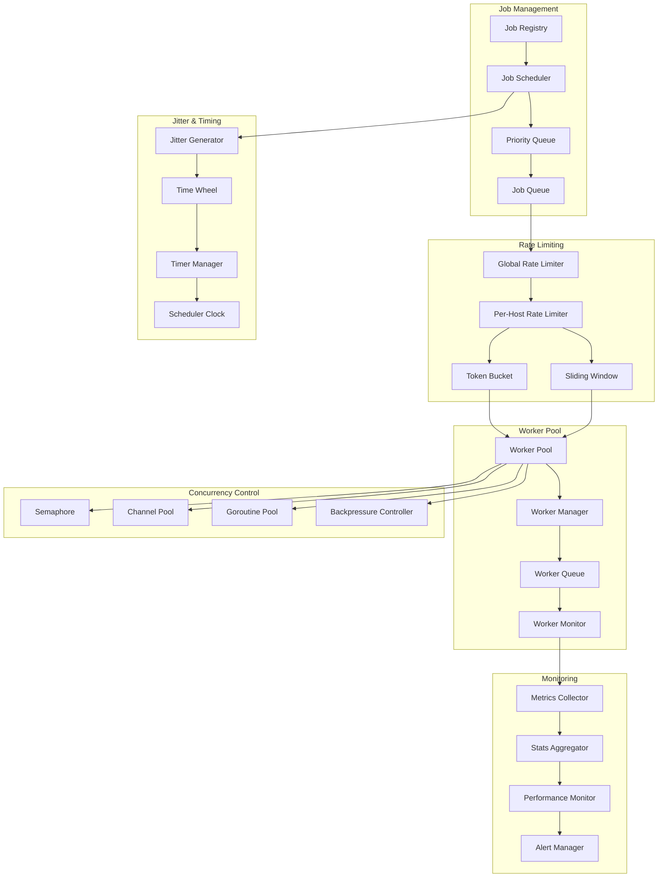

# VMProber Scheduler System

## Обзор системы планирования

Планировщик VMProber отвечает за координацию выполнения проб с поддержкой ограниченной конкурентности, rate limiting, jitter и приоритизации задач. Система обеспечивает эффективное распределение нагрузки и соблюдение лимитов производительности.

## Архитектура планировщика



## Основные компоненты

### 1. Job Scheduler
Центральный планировщик, управляющий добавлением и выполнением задач.

### 2. Priority Queue
Очередь с приоритетами для эффективного управления задачами.

### 3. Rate Limiter
Система ограничения скорости выполнения задач.

### 4. Worker Pool
Пул воркеров для параллельного выполнения задач.

### 5. Jitter Generator
Генератор случайных отклонений для избежания синхронизации.

### 6. Backpressure Controller
Контроллер обратного давления для предотвращения перегрузки.

## Интерфейсы

### Scheduler Interface
```go
type Scheduler interface {
    // Schedule добавляет задачу в планировщик
    Schedule(ctx context.Context, job Job) error
    
    // Unschedule удаляет задачу из планировщика
    Unschedule(ctx context.Context, jobID string) error
    
    // Reschedule перепланирует задачу
    Reschedule(ctx context.Context, jobID string, newInterval time.Duration) error
    
    // Start запускает планировщик
    Start(ctx context.Context) error
    
    // Stop останавливает планировщик
    Stop(ctx context.Context) error
    
    // GetStats возвращает статистику планировщика
    GetStats() SchedulerStats
    
    // GetJob возвращает информацию о задаче
    GetJob(ctx context.Context, jobID string) (*Job, error)
    
    // ListJobs возвращает список всех задач
    ListJobs(ctx context.Context) ([]*Job, error)
}
```

### WorkerPool Interface
```go
type WorkerPool interface {
    // Submit отправляет задачу на выполнение
    Submit(ctx context.Context, job Job, handler JobHandler) error
    
    // Start запускает воркер пул
    Start(ctx context.Context) error
    
    // Stop останавливает воркер пул
    Stop(ctx context.Context) error
    
    // GetStats возвращает статистику воркер пула
    GetStats() WorkerPoolStats
    
    // GetWorkerInfo возвращает информацию о воркере
    GetWorkerInfo(ctx context.Context, workerID string) (*WorkerInfo, error)
    
    // Scale изменяет количество воркеров
    Scale(ctx context.Context, targetSize int) error
}
```

### RateLimiter Interface
```go
type RateLimiter interface {
    // Allow проверяет разрешено ли выполнение
    Allow(ctx context.Context, key string) (bool, time.Duration)
    
    // SetRate устанавливает лимит rate
    SetRate(ctx context.Context, key string, rate float64, burst int) error
    
    // Remove удаляет ключ из rate limiter
    Remove(ctx context.Context, key string) error
    
    // GetStats возвращает статистику rate limiter
    GetStats(ctx context.Context, key string) (*RateLimitStats, error)
    
    // Reset сбрасывает счетчики для ключа
    Reset(ctx context.Context, key string) error
}
```

## Job Management

### Job Structure
```go
type Job struct {
    ID          string        `json:"id"`
    Target      Target        `json:"target"`
    NextRun     time.Time     `json:"next_run"`
    Interval    time.Duration `json:"interval"`
    Jitter      float64       `json:"jitter"`
    RetryCount  int           `json:"retry_count"`
    MaxRetries  int           `json:"max_retries"`
    Priority    int           `json:"priority"`
    CreatedAt   time.Time     `json:"created_at"`
    Attempt     int           `json:"attempt"`
    
    // Дополнительные поля
    Metadata    map[string]interface{} `json:"metadata,omitempty"`
    Tags        []string               `json:"tags,omitempty"`
    Dependencies []string              `json:"dependencies,omitempty"`
    Timeout     time.Duration          `json:"timeout,omitempty"`
    RetryPolicy *RetryPolicy           `json:"retry_policy,omitempty"`
}

type RetryPolicy struct {
    MaxAttempts  int           `json:"max_attempts"`
    Backoff      BackoffType   `json:"backoff"`
    InitialDelay time.Duration `json:"initial_delay"`
    MaxDelay     time.Duration `json:"max_delay"`
    Multiplier   float64       `json:"multiplier"`
    Jitter       float64       `json:"jitter"`
}

type BackoffType string

const (
    BackoffLinear     BackoffType = "linear"
    BackoffExponential BackoffType = "exponential"
    BackoffFixed      BackoffType = "fixed"
    BackoffFibonacci  BackoffType = "fibonacci"
)
```

### Job Registry
```go
type JobRegistry struct {
    jobs     map[string]*Job
    index    map[string][]string // Индекс по тегам
    mu       sync.RWMutex
    stats    *JobStats
}

func (r *JobRegistry) Register(ctx context.Context, job *Job) error {
    r.mu.Lock()
    defer r.mu.Unlock()
    
    if _, exists := r.jobs[job.ID]; exists {
        return fmt.Errorf("job %s already registered", job.ID)
    }
    
    r.jobs[job.ID] = job
    
    // Обновление индекса
    for _, tag := range job.Tags {
        r.index[tag] = append(r.index[tag], job.ID)
    }
    
    r.stats.TotalJobs++
    return nil
}

func (r *JobRegistry) Unregister(ctx context.Context, jobID string) error {
    r.mu.Lock()
    defer r.mu.Unlock()
    
    job, exists := r.jobs[jobID]
    if !exists {
        return fmt.Errorf("job %s not found", jobID)
    }
    
    // Удаление из индекса
    for _, tag := range job.Tags {
        ids := r.index[tag]
        for i, id := range ids {
            if id == jobID {
                r.index[tag] = append(ids[:i], ids[i+1:]...)
                break
            }
        }
    }
    
    delete(r.jobs, jobID)
    r.stats.TotalJobs--
    return nil
}

func (r *JobRegistry) Get(ctx context.Context, jobID string) (*Job, error) {
    r.mu.RLock()
    defer r.mu.RUnlock()
    
    job, exists := r.jobs[jobID]
    if !exists {
        return nil, fmt.Errorf("job %s not found", jobID)
    }
    
    return job, nil
}

func (r *JobRegistry) ListByTag(ctx context.Context, tag string) ([]*Job, error) {
    r.mu.RLock()
    defer r.mu.RUnlock()
    
    jobIDs, exists := r.index[tag]
    if !exists {
        return nil, nil
    }
    
    jobs := make([]*Job, 0, len(jobIDs))
    for _, jobID := range jobIDs {
        if job, exists := r.jobs[jobID]; exists {
            jobs = append(jobs, job)
        }
    }
    
    return jobs, nil
}
```

## Priority Queue Implementation

### Heap-based Priority Queue
```go
type JobPriorityQueue struct {
    jobs    []*Job
    compare func(a, b *Job) bool
    mu      sync.Mutex
}

func NewJobPriorityQueue(compare func(a, b *Job) bool) *JobPriorityQueue {
    return &JobPriorityQueue{
        jobs:    make([]*Job, 0),
        compare: compare,
    }
}

func (q *JobPriorityQueue) Push(job *Job) {
    q.mu.Lock()
    defer q.mu.Unlock()
    
    heap.Push(&jobHeap{
        jobs:    q.jobs,
        compare: q.compare,
    }, job)
}

func (q *JobPriorityQueue) Pop() *Job {
    q.mu.Lock()
    defer q.mu.Unlock()
    
    if len(q.jobs) == 0 {
        return nil
    }
    
    job := heap.Pop(&jobHeap{
        jobs:    q.jobs,
        compare: q.compare,
    }).(*Job)
    
    return job
}

func (q *JobPriorityQueue) Peek() *Job {
    q.mu.Lock()
    defer q.mu.Unlock()
    
    if len(q.jobs) == 0 {
        return nil
    }
    
    return q.jobs[0]
}

func (q *JobPriorityQueue) Len() int {
    q.mu.Lock()
    defer q.mu.Unlock()
    return len(q.jobs)
}

func (q *JobPriorityQueue) Remove(jobID string) bool {
    q.mu.Lock()
    defer q.mu.Unlock()
    
    for i, job := range q.jobs {
        if job.ID == jobID {
            // Удаление элемента из слайса
            q.jobs = append(q.jobs[:i], q.jobs[i+1:]...)
            
            // Восстановление свойств кучи
            heap.Init(&jobHeap{
                jobs:    q.jobs,
                compare: q.compare,
            })
            
            return true
        }
    }
    
    return false
}

type jobHeap struct {
    jobs    []*Job
    compare func(a, b *Job) bool
}

func (h jobHeap) Len() int { return len(h.jobs) }

func (h jobHeap) Less(i, j int) bool {
    return h.compare(h.jobs[i], h.jobs[j])
}

func (h jobHeap) Swap(i, j int) {
    h.jobs[i], h.jobs[j] = h.jobs[j], h.jobs[i]
}

func (h *jobHeap) Push(x interface{}) {
    h.jobs = append(h.jobs, x.(*Job))
}

func (h *jobHeap) Pop() interface{} {
    old := h.jobs
    n := len(old)
    job := old[n-1]
    h.jobs = old[0 : n-1]
    return job
}

// Функция сравнения для приоритизации
func DefaultJobCompare(a, b *Job) bool {
    // Высший приоритет = большее значение
    if a.Priority != b.Priority {
        return a.Priority > b.Priority
    }
    
    // Раннее время выполнения = высший приоритет
    if !a.NextRun.Equal(b.NextRun) {
        return a.NextRun.Before(b.NextRun)
    }
    
    // Меньшее количество попыток = высший приоритет
    return a.Attempt < b.Attempt
}
```

## Rate Limiting

### Token Bucket Implementation
```go
type TokenBucket struct {
    capacity    int           // Максимальное количество токенов
    tokens      float64       // Текущее количество токенов
    rate        float64       // Скорость добавления токенов (токенов в секунду)
    lastRefill  time.Time     // Время последнего пополнения
    mu          sync.Mutex    // Мьютекс для безопасности
}

func NewTokenBucket(capacity int, rate float64) *TokenBucket {
    return &TokenBucket{
        capacity:   capacity,
        tokens:     float64(capacity),
        rate:       rate,
        lastRefill: time.Now(),
    }
}

func (b *TokenBucket) Allow(ctx context.Context) (bool, time.Duration) {
    b.mu.Lock()
    defer b.mu.Unlock()
    
    now := time.Now()
    elapsed := now.Sub(b.lastRefill)
    
    // Пополнение токенов
    tokensToAdd := elapsed.Seconds() * b.rate
    b.tokens = math.Min(float64(b.capacity), b.tokens+tokensToAdd)
    b.lastRefill = now
    
    // Проверка доступности токена
    if b.tokens >= 1.0 {
        b.tokens -= 1.0
        return true, 0
    }
    
    // Вычисление времени ожидания
    tokensNeeded := 1.0 - b.tokens
    waitTime := time.Duration(tokensNeeded/b.rate * float64(time.Second))
    
    return false, waitTime
}

func (b *TokenBucket) SetRate(rate float64) {
    b.mu.Lock()
    defer b.mu.Unlock()
    b.rate = rate
}

func (b *TokenBucket) SetCapacity(capacity int) {
    b.mu.Lock()
    defer b.mu.Unlock()
    b.capacity = capacity
    b.tokens = math.Min(float64(capacity), b.tokens)
}
```

### Sliding Window Rate Limiter
```go
type SlidingWindowLimiter struct {
    windowSize  time.Duration
    maxRequests int
    requests    []time.Time // Временные метки запросов
    mu          sync.Mutex
}

func NewSlidingWindowLimiter(windowSize time.Duration, maxRequests int) *SlidingWindowLimiter {
    return &SlidingWindowLimiter{
        windowSize:  windowSize,
        maxRequests: maxRequests,
        requests:    make([]time.Time, 0),
    }
}

func (l *SlidingWindowLimiter) Allow(ctx context.Context) (bool, time.Duration) {
    l.mu.Lock()
    defer l.mu.Unlock()
    
    now := time.Now()
    cutoff := now.Add(-l.windowSize)
    
    // Удаление старых запросов
    var validRequests []time.Time
    for _, reqTime := range l.requests {
        if reqTime.After(cutoff) {
            validRequests = append(validRequests, reqTime)
        }
    }
    l.requests = validRequests
    
    // Проверка лимита
    if len(l.requests) < l.maxRequests {
        l.requests = append(l.requests, now)
        return true, 0
    }
    
    // Вычисление времени ожидания
    oldestRequest := l.requests[0]
    waitTime := oldestRequest.Add(l.windowSize).Sub(now)
    
    return false, waitTime
}

func (l *SlidingWindowLimiter) GetStats() *RateLimitStats {
    l.mu.Lock()
    defer l.mu.Unlock()
    
    now := time.Now()
    cutoff := now.Add(-l.windowSize)
    
    var recentRequests int
    for _, reqTime := range l.requests {
        if reqTime.After(cutoff) {
            recentRequests++
        }
    }
    
    return &RateLimitStats{
        WindowSize:     l.windowSize,
        MaxRequests:    l.maxRequests,
        CurrentRequests: recentRequests,
        Remaining:      l.maxRequests - recentRequests,
        ResetTime:      now.Add(l.windowSize),
    }
}
```

### Global Rate Limiter
```go
type GlobalRateLimiter struct {
    limiters map[string]RateLimiter // Ключ -> RateLimiter
    defaultLimiter RateLimiter
    mu           sync.RWMutex
}

func NewGlobalRateLimiter(defaultRate float64, defaultBurst int) *GlobalRateLimiter {
    return &GlobalRateLimiter{
        limiters: make(map[string]RateLimiter),
        defaultLimiter: NewTokenBucket(defaultBurst, defaultRate),
    }
}

func (l *GlobalRateLimiter) Allow(ctx context.Context, key string) (bool, time.Duration) {
    l.mu.RLock()
    limiter := l.limiters[key]
    l.mu.RUnlock()
    
    if limiter == nil {
        limiter = l.defaultLimiter
    }
    
    return limiter.Allow(ctx)
}

func (l *GlobalRateLimiter) SetRate(ctx context.Context, key string, rate float64, burst int) error {
    l.mu.Lock()
    defer l.mu.Unlock()
    
    limiter := NewTokenBucket(burst, rate)
    l.limiters[key] = limiter
    
    return nil
}

func (l *GlobalRateLimiter) Remove(ctx context.Context, key string) error {
    l.mu.Lock()
    defer l.mu.Unlock()
    
    delete(l.limiters, key)
    return nil
}
```

## Worker Pool

### Worker Implementation
```go
type Worker struct {
    ID         string        `json:"id"`
    Status     WorkerStatus  `json:"status"`
    CurrentJob string        `json:"current_job,omitempty"`
    StartTime  time.Time     `json:"start_time"`
    JobsDone   int64         `json:"jobs_done"`
    JobsFailed int64         `json:"jobs_failed"`
    AvgTime    time.Duration `json:"avg_time"`
    Memory     int64         `json:"memory,omitempty"`
    CPU        float64       `json:"cpu,omitempty"`
    
    // Внутренние поля
    jobQueue   chan Job
    handler    JobHandler
    ctx        context.Context
    cancel     context.CancelFunc
    mu         sync.RWMutex
}

func NewWorker(id string, handler JobHandler, jobQueueSize int) *Worker {
    ctx, cancel := context.WithCancel(context.Background())
    
    return &Worker{
        ID:        id,
        Status:    WorkerStatusIdle,
        StartTime: time.Now(),
        jobQueue:  make(chan Job, jobQueueSize),
        handler:   handler,
        ctx:       ctx,
        cancel:    cancel,
    }
}

func (w *Worker) Start(ctx context.Context) error {
    go w.run(ctx)
    return nil
}

func (w *Worker) Stop(ctx context.Context) error {
    w.mu.Lock()
    w.Status = WorkerStatusStopped
    w.mu.Unlock()
    
    w.cancel()
    close(w.jobQueue)
    
    return nil
}

func (w *Worker) Submit(ctx context.Context, job Job) error {
    select {
    case w.jobQueue <- job:
        return nil
    case <-ctx.Done():
        return ctx.Err()
    default:
        return fmt.Errorf("worker queue is full")
    }
}

func (w *Worker) run(ctx context.Context) {
    for {
        select {
        case job := <-w.jobQueue:
            w.executeJob(ctx, job)
        case <-ctx.Done():
            return
        }
    }
}

func (w *Worker) executeJob(ctx context.Context, job Job) {
    start := time.Now()
    
    w.mu.Lock()
    w.Status = WorkerStatusRunning
    w.CurrentJob = job.ID
    w.mu.Unlock()
    
    // Выполнение задачи
    err := w.handler.Handle(ctx, job)
    
    duration := time.Since(start)
    
    w.mu.Lock()
    defer w.mu.Unlock()
    
    w.JobsDone++
    w.AvgTime = time.Duration(float64(w.AvgTime)*float64(w.JobsDone-1)+float64(duration)) / float64(w.JobsDone)
    
    if err != nil {
        w.JobsFailed++
        log.Error("job execution failed", 
            "worker_id", w.ID,
            "job_id", job.ID,
            "error", err)
    } else {
        log.Debug("job executed successfully",
            "worker_id", w.ID,
            "job_id", job.ID,
            "duration", duration)
    }
    
    w.Status = WorkerStatusIdle
    w.CurrentJob = ""
}
```

### Worker Pool Manager
```go
type WorkerPool struct {
    workers     map[string]*Worker
    jobQueue    chan Job
    handler     JobHandler
    config      *WorkerPoolConfig
    stats       *WorkerPoolStats
    mu          sync.RWMutex
    ctx         context.Context
    cancel      context.CancelFunc
}

type WorkerPoolConfig struct {
    MinWorkers     int           `json:"min_workers"`
    MaxWorkers     int           `json:"max_workers"`
    JobQueueSize   int           `json:"job_queue_size"`
    WorkerTimeout  time.Duration `json:"worker_timeout"`
    ScaleUpDelay   time.Duration `json:"scale_up_delay"`
    ScaleDownDelay time.Duration `json:"scale_down_delay"`
    IdleTimeout    time.Duration `json:"idle_timeout"`
}

func NewWorkerPool(config *WorkerPoolConfig, handler JobHandler) *WorkerPool {
    ctx, cancel := context.WithCancel(context.Background())
    
    pool := &WorkerPool{
        workers:  make(map[string]*Worker),
        jobQueue: make(chan Job, config.JobQueueSize),
        handler:  handler,
        config:   config,
        stats: &WorkerPoolStats{
            TotalWorkers:  config.MinWorkers,
            ActiveWorkers: 0,
            IdleWorkers:   config.MinWorkers,
        },
        ctx:    ctx,
        cancel: cancel,
    }
    
    // Создание начальных воркеров
    for i := 0; i < config.MinWorkers; i++ {
        pool.addWorker()
    }
    
    return pool
}

func (p *WorkerPool) Start(ctx context.Context) error {
    // Запуск всех воркеров
    p.mu.RLock()
    workers := make([]*Worker, 0, len(p.workers))
    for _, worker := range p.workers {
        workers = append(workers, worker)
    }
    p.mu.RUnlock()
    
    for _, worker := range workers {
        if err := worker.Start(ctx); err != nil {
            return fmt.Errorf("failed to start worker %s: %w", worker.ID, err)
        }
    }
    
    // Запуск мониторинга
    go p.monitor(ctx)
    
    return nil
}

func (p *WorkerPool) Submit(ctx context.Context, job Job) error {
    select {
    case p.jobQueue <- job:
        return nil
    case <-ctx.Done():
        return ctx.Err()
    default:
        return fmt.Errorf("job queue is full")
    }
}

func (p *WorkerPool) addWorker() string {
    p.mu.Lock()
    defer p.mu.Unlock()
    
    workerID := fmt.Sprintf("worker-%d", len(p.workers))
    worker := NewWorker(workerID, p.handler, p.config.JobQueueSize)
    
    p.workers[workerID] = worker
    p.stats.TotalWorkers++
    p.stats.IdleWorkers++
    
    return workerID
}

func (p *WorkerPool) removeWorker(workerID string) error {
    p.mu.Lock()
    defer p.mu.Unlock()
    
    worker, exists := p.workers[workerID]
    if !exists {
        return fmt.Errorf("worker %s not found", workerID)
    }
    
    if err := worker.Stop(p.ctx); err != nil {
        return fmt.Errorf("failed to stop worker %s: %w", workerID, err)
    }
    
    delete(p.workers, workerID)
    p.stats.TotalWorkers--
    p.stats.IdleWorkers--
    
    return nil
}

func (p *WorkerPool) monitor(ctx context.Context) {
    ticker := time.NewTicker(10 * time.Second)
    defer ticker.Stop()
    
    for {
        select {
        case <-ticker.C:
            p.checkScaling(ctx)
            p.updateStats()
        case <-ctx.Done():
            return
        }
    }
}

func (p *WorkerPool) checkScaling(ctx context.Context) {
    p.mu.RLock()
    queueLen := len(p.jobQueue)
    activeWorkers := p.stats.ActiveWorkers
    idleWorkers := p.stats.IdleWorkers
    p.mu.RUnlock()
    
    // Масштабирование вверх
    if queueLen > p.config.JobQueueSize/2 && activeWorkers < p.config.MaxWorkers {
        workerID := p.addWorker()
        worker := p.workers[workerID]
        worker.Start(ctx)
        
        log.Info("scaled up worker pool",
            "worker_id", workerID,
            "total_workers", p.stats.TotalWorkers)
    }
    
    // Масштабирование вниз
    if queueLen == 0 && idleWorkers > p.config.MinWorkers {
        // Находим простаивающего воркера для удаления
        p.mu.RLock()
        var idleWorkerID string
        for workerID, worker := range p.workers {
            if worker.Status == WorkerStatusIdle {
                idleWorkerID = workerID
                break
            }
        }
        p.mu.RUnlock()
        
        if idleWorkerID != "" {
            p.removeWorker(idleWorkerID)
            
            log.Info("scaled down worker pool",
                "worker_id", idleWorkerID,
                "total_workers", p.stats.TotalWorkers)
        }
    }
}

func (p *WorkerPool) updateStats() {
    p.mu.RLock()
    defer p.mu.RUnlock()
    
    var activeWorkers, idleWorkers int64
    var totalJobsDone, totalJobsFailed int64
    
    for _, worker := range p.workers {
        switch worker.Status {
        case WorkerStatusRunning:
            activeWorkers++
        case WorkerStatusIdle:
            idleWorkers++
        }
        
        totalJobsDone += worker.JobsDone
        totalJobsFailed += worker.JobsFailed
    }
    
    p.stats.ActiveWorkers = int(activeWorkers)
    p.stats.IdleWorkers = int(idleWorkers)
    p.stats.CompletedJobs = totalJobsDone
    p.stats.FailedJobs = totalJobsFailed
    p.stats.QueueSize = len(p.jobQueue)
    
    // Вычисление RPS
    if p.stats.LastUpdateTime.IsZero() {
        p.stats.RPS = 0
    } else {
        elapsed := time.Since(p.stats.LastUpdateTime)
        jobsDelta := totalJobsDone - p.stats.LastCompletedJobs
        p.stats.RPS = float64(jobsDelta) / elapsed.Seconds()
    }
    
    p.stats.LastUpdateTime = time.Now()
    p.stats.LastCompletedJobs = totalJobsDone
}
```

## Jitter Implementation

### Jitter Generator
```go
type JitterGenerator struct {
    mu      sync.Mutex
    rand    *rand.Rand
    source  rand.Source
}

func NewJitterGenerator() *JitterGenerator {
    return &JitterGenerator{
        rand:   rand.New(rand.NewSource(time.Now().UnixNano())),
        source: rand.NewSource(time.Now().UnixNano()),
    }
}

// Uniform jitter: ±jitter%
func (g *JitterGenerator) Uniform(interval time.Duration, jitterPercent float64) time.Duration {
    g.mu.Lock()
    defer g.mu.Unlock()
    
    if jitterPercent <= 0 {
        return interval
    }
    
    jitterRange := interval.Seconds() * jitterPercent
    randomOffset := (g.rand.Float64()*2 - 1) * jitterRange
    
    newInterval := interval.Seconds() + randomOffset
    if newInterval < 0 {
        newInterval = 0
    }
    
    return time.Duration(newInterval * float64(time.Second))
}

// Exponential jitter: с экспоненциальным распределением
func (g *JitterGenerator) Exponential(interval time.Duration, jitterPercent float64) time.Duration {
    g.mu.Lock()
    defer g.mu.Unlock()
    
    if jitterPercent <= 0 {
        return interval
    }
    
    // Генерация экспоненциально распределенной случайной величины
    u := g.rand.Float64()
    exponentialValue := -math.Log(1-u) * jitterPercent
    
    newInterval := interval.Seconds() * (1 + exponentialValue)
    
    return time.Duration(newInterval * float64(time.Second))
}

// Decorrelated jitter: с корреляцией между интервалами
func (g *JitterGenerator) Decorrelated(baseInterval time.Duration, previousJitter time.Duration, jitterPercent float64) time.Duration {
    g.mu.Lock()
    defer g.mu.Unlock()
    
    if jitterPercent <= 0 {
        return baseInterval
    }
    
    jitterRange := baseInterval.Seconds() * jitterPercent
    
    // Коррелированная случайная величина
    correlation := 0.5 // Коэффициент корреляции
    randomComponent := (g.rand.Float64()*2 - 1) * jitterRange
    correlatedComponent := correlation * previousJitter.Seconds()
    
    totalJitter := randomComponent + correlatedComponent
    
    newInterval := baseInterval.Seconds() + totalJitter
    if newInterval < 0 {
        newInterval = 0
    }
    
    return time.Duration(newInterval * float64(time.Second))
}
```

## Time Wheel Scheduler

### Time Wheel Implementation
```go
type TimeWheel struct {
    tickDuration time.Duration
    wheelSize    int
    currentTime  time.Duration
    buckets      []*Bucket
    mu           sync.RWMutex
}

type Bucket struct {
    jobs     map[string]*TimedJob
    next     *Bucket
    prev     *Bucket
}

type TimedJob struct {
    job         Job
    executeTime time.Duration
    round       int // Количество полных оборотов колеса
}

func NewTimeWheel(tickDuration time.Duration, wheelSize int) *TimeWheel {
    buckets := make([]*Bucket, wheelSize)
    for i := 0; i < wheelSize; i++ {
        buckets[i] = &Bucket{
            jobs: make(map[string]*TimedJob),
        }
    }
    
    // Связывание buckets в кольцо
    for i := 0; i < wheelSize; i++ {
        buckets[i].next = buckets[(i+1)%wheelSize]
        buckets[i].prev = buckets[(i-1+wheelSize)%wheelSize]
    }
    
    return &TimeWheel{
        tickDuration: tickDuration,
        wheelSize:    wheelSize,
        buckets:      buckets,
        currentTime:  0,
    }
}

func (tw *TimeWheel) AddJob(ctx context.Context, job Job, delay time.Duration) error {
    tw.mu.Lock()
    defer tw.mu.Unlock()
    
    executeTime := tw.currentTime + delay
    bucketIndex := int(executeTime/tw.tickDuration) % tw.wheelSize
    round := int(executeTime / (time.Duration(tw.wheelSize) * tw.tickDuration))
    
    timedJob := &TimedJob{
        job:         job,
        executeTime: executeTime,
        round:       round,
    }
    
    tw.buckets[bucketIndex].jobs[job.ID] = timedJob
    
    return nil
}

func (tw *TimeWheel) RemoveJob(ctx context.Context, jobID string) error {
    tw.mu.Lock()
    defer tw.mu.Unlock()
    
    // Поиск job во всех buckets
    for _, bucket := range tw.buckets {
        if _, exists := bucket.jobs[jobID]; exists {
            delete(bucket.jobs, jobID)
            return nil
        }
    }
    
    return fmt.Errorf("job %s not found", jobID)
}

func (tw *TimeWheel) Tick(ctx context.Context) ([]Job, error) {
    tw.mu.Lock()
    defer tw.mu.Unlock()
    
    currentBucket := tw.buckets[int(tw.currentTime/tw.tickDuration)%tw.wheelSize]
    readyJobs := make([]Job, 0)
    
    // Обработка jobs в текущем bucket
    for jobID, timedJob := range currentBucket.jobs {
        if timedJob.round == 0 {
            readyJobs = append(readyJobs, timedJob.job)
            delete(currentBucket.jobs, jobID)
        } else {
            timedJob.round--
        }
    }
    
    // Переход к следующему tick
    tw.currentTime += tw.tickDuration
    
    return readyJobs, nil
}

func (tw *TimeWheel) Start(ctx context.Context) error {
    ticker := time.NewTicker(tw.tickDuration)
    
    go func() {
        defer ticker.Stop()
        
        for {
            select {
            case <-ticker.C:
                jobs, err := tw.Tick(ctx)
                if err != nil {
                    log.Error("time wheel tick error", "error", err)
                    continue
                }
                
                // Обработка готовых jobs
                for _, job := range jobs {
                    // Отправка job в планировщик
                    // Это должно быть реализовано в соответствии с архитектурой
                }
                
            case <-ctx.Done():
                return
            }
        }
    }()
    
    return nil
}
```

## Backpressure Control

### Backpressure Controller
```go
type BackpressureController struct {
    maxQueueSize    int
    currentQueueSize int
    dropStrategy    DropStrategy
    metrics         *BackpressureMetrics
    mu              sync.Mutex
}

type DropStrategy string

const (
    DropStrategyOldest DropStrategy = "oldest"
    DropStrategyNewest DropStrategy = "newest"
    DropStrategyRandom DropStrategy = "random"
)

type BackpressureMetrics struct {
    TotalDropped   int64         `json:"total_dropped"`
    DropRate       float64       `json:"drop_rate"`
    QueuePressure  float64       `json:"queue_pressure"`
    LastDropTime   time.Time     `json:"last_drop_time"`
}

func NewBackpressureController(maxQueueSize int, strategy DropStrategy) *BackpressureController {
    return &BackpressureController{
        maxQueueSize: maxQueueSize,
        dropStrategy: strategy,
        metrics: &BackpressureMetrics{
            DropRate:      0,
            QueuePressure: 0,
        },
    }
}

func (c *BackpressureController) Allow(ctx context.Context) (bool, error) {
    c.mu.Lock()
    defer c.mu.Unlock()
    
    if c.currentQueueSize < c.maxQueueSize {
        c.currentQueueSize++
        return true, nil
    }
    
    // Превышен лимит - применяем стратегию drop
    dropped, err := c.drop(ctx)
    if err != nil {
        return false, err
    }
    
    if !dropped {
        return false, fmt.Errorf("backpressure: queue full and drop failed")
    }
    
    return true, nil
}

func (c *BackpressureController) Release(ctx context.Context) {
    c.mu.Lock()
    defer c.mu.Unlock()
    
    if c.currentQueueSize > 0 {
        c.currentQueueSize--
    }
}

func (c *BackpressureController) drop(ctx context.Context) (bool, error) {
    // Обновление метрик
    c.metrics.TotalDropped++
    c.metrics.LastDropTime = time.Now()
    c.metrics.QueuePressure = float64(c.currentQueueSize) / float64(c.maxQueueSize)
    
    // Вычисление drop rate
    // Это упрощенная реализация - в реальности нужно использовать sliding window
    c.metrics.DropRate = float64(c.metrics.TotalDropped) / time.Since(time.Now().Add(-time.Minute)).Seconds()
    
    switch c.dropStrategy {
    case DropStrategyOldest:
        return c.dropOldest(ctx)
    case DropStrategyNewest:
        return c.dropNewest(ctx)
    case DropStrategyRandom:
        return c.dropRandom(ctx)
    default:
        return false, fmt.Errorf("unknown drop strategy: %s", c.dropStrategy)
    }
}

func (c *BackpressureController) dropOldest(ctx context.Context) (bool, error) {
    // Логика удаления самой старой задачи
    // Это требует доступа к очереди задач
    return true, nil
}

func (c *BackpressureController) dropNewest(ctx context.Context) (bool, error) {
    // Логика удаления самой новой задачи
    return true, nil
}

func (c *BackpressureController) dropRandom(ctx context.Context) (bool, error) {
    // Логика случайного удаления задачи
    return true, nil
}

func (c *BackpressureController) GetMetrics() *BackpressureMetrics {
    c.mu.Lock()
    defer c.mu.Unlock()
    
    metrics := *c.metrics
    return &metrics
}
```

## Statistics and Monitoring

### Scheduler Statistics
```go
type SchedulerStats struct {
    TotalJobs      int           `json:"total_jobs"`
    RunningJobs    int           `json:"running_jobs"`
    QueuedJobs     int           `json:"queued_jobs"`
    CompletedJobs  int64         `json:"completed_jobs"`
    FailedJobs     int64         `json:"failed_jobs"`
    AvgExecutionTime time.Duration `json:"avg_execution_time"`
    RPS            float64       `json:"rps"`
    QueueSize      int           `json:"queue_size"`
    Throughput     float64       `json:"throughput"`
    Latency        time.Duration `json:"latency"`
    ErrorRate      float64       `json:"error_rate"`
    Uptime         time.Duration `json:"uptime"`
}

type WorkerPoolStats struct {
    TotalWorkers    int           `json:"total_workers"`
    ActiveWorkers   int           `json:"active_workers"`
    IdleWorkers     int           `json:"idle_workers"`
    CompletedJobs   int64         `json:"completed_jobs"`
    FailedJobs      int64         `json:"failed_jobs"`
    AvgJobTime      time.Duration `json:"avg_job_time"`
    QueueSize       int           `json:"queue_size"`
    RPS             float64       `json:"rps"`
    CPUUsage        float64       `json:"cpu_usage"`
    MemoryUsage     int64         `json:"memory_usage"`
    ScaleEvents     int64         `json:"scale_events"`
}

type RateLimitStats struct {
    WindowSize     time.Duration `json:"window_size"`
    MaxRequests    int           `json:"max_requests"`
    CurrentRequests int          `json:"current_requests"`
    Remaining      int           `json:"remaining"`
    ResetTime      time.Time     `json:"reset_time"`
    RejectionRate  float64       `json:"rejection_rate"`
}
```

### Metrics Collection
```go
type SchedulerMetrics struct {
    // Prometheus метрики
    jobsScheduled    prometheus.Counter
    jobsCompleted    prometheus.Counter
    jobsFailed       prometheus.Counter
    jobDuration      prometheus.Histogram
    queueSize        prometheus.Gauge
    activeWorkers    prometheus.Gauge
    rps              prometheus.Gauge
    errorRate        prometheus.Gauge
    
    // Внутренние метрики
    mu               sync.RWMutex
    startTime        time.Time
    jobTimes         []time.Duration
    maxJobTimes      int
}

func NewSchedulerMetrics(namespace string) *SchedulerMetrics {
    return &SchedulerMetrics{
        jobsScheduled: prometheus.NewCounter(prometheus.CounterOpts{
            Namespace: namespace,
            Subsystem: "scheduler",
            Name:      "jobs_scheduled_total",
            Help:      "Total number of jobs scheduled",
        }),
        jobsCompleted: prometheus.NewCounter(prometheus.CounterOpts{
            Namespace: namespace,
            Subsystem: "scheduler",
            Name:      "jobs_completed_total",
            Help:      "Total number of jobs completed",
        }),
        jobsFailed: prometheus.NewCounter(prometheus.CounterOpts{
            Namespace: namespace,
            Subsystem: "scheduler",
            Name:      "jobs_failed_total",
            Help:      "Total number of jobs failed",
        }),
        jobDuration: prometheus.NewHistogram(prometheus.HistogramOpts{
            Namespace: namespace,
            Subsystem: "scheduler",
            Name:      "job_duration_seconds",
            Help:      "Duration of job execution",
            Buckets:   prometheus.DefBuckets,
        }),
        queueSize: prometheus.NewGauge(prometheus.GaugeOpts{
            Namespace: namespace,
            Subsystem: "scheduler",
            Name:      "queue_size",
            Help:      "Current size of job queue",
        }),
        activeWorkers: prometheus.NewGauge(prometheus.GaugeOpts{
            Namespace: namespace,
            Subsystem: "scheduler",
            Name:      "active_workers",
            Help:      "Number of active workers",
        }),
        rps: prometheus.NewGauge(prometheus.GaugeOpts{
            Namespace: namespace,
            Subsystem: "scheduler",
            Name:      "jobs_per_second",
            Help:      "Jobs processed per second",
        }),
        errorRate: prometheus.NewGauge(prometheus.GaugeOpts{
            Namespace: namespace,
            Subsystem: "scheduler",
            Name:      "error_rate",
            Help:      "Current error rate",
        }),
        startTime:   time.Now(),
        jobTimes:    make([]time.Duration, 0, 1000),
        maxJobTimes: 1000,
    }
}

func (m *SchedulerMetrics) RecordJobScheduled() {
    m.jobsScheduled.Inc()
}

func (m *SchedulerMetrics) RecordJobCompleted(duration time.Duration) {
    m.mu.Lock()
    defer m.mu.Unlock()
    
    m.jobsCompleted.Inc()
    m.jobDuration.Observe(duration.Seconds())
    
    // Обновление внутренних метрик
    m.jobTimes = append(m.jobTimes, duration)
    if len(m.jobTimes) > m.maxJobTimes {
        m.jobTimes = m.jobTimes[1:]
    }
}

func (m *SchedulerMetrics) RecordJobFailed() {
    m.jobsFailed.Inc()
}

func (m *SchedulerMetrics) UpdateQueueSize(size int) {
    m.queueSize.Set(float64(size))
}

func (m *SchedulerMetrics) UpdateActiveWorkers(count int) {
    m.activeWorkers.Set(float64(count))
}

func (m *SchedulerMetrics) UpdateRPS(rps float64) {
    m.rps.Set(rps)
}

func (m *SchedulerMetrics) UpdateErrorRate(rate float64) {
    m.errorRate.Set(rate)
}

func (m *SchedulerMetrics) GetAverageJobTime() time.Duration {
    m.mu.RLock()
    defer m.mu.RUnlock()
    
    if len(m.jobTimes) == 0 {
        return 0
    }
    
    var total time.Duration
    for _, duration := range m.jobTimes {
        total += duration
    }
    
    return total / time.Duration(len(m.jobTimes))
}
```

## Configuration

### Scheduler Configuration
```go
type SchedulerConfig struct {
    Concurrent     int                    `yaml:"concurrent" json:"concurrent"`
    RPSLimit       int                    `yaml:"rps_limit" json:"rps_limit"`
    PerHostCap     int                    `yaml:"per_host_cap" json:"per_host_cap"`
    Jitter         float64                `yaml:"jitter" json:"jitter"`
    Timeouts       map[string]time.Duration `yaml:"timeouts" json:"timeouts"`
    QueueSize      int                    `yaml:"queue_size" json:"queue_size"`
    WorkerTimeout  time.Duration          `yaml:"worker_timeout" json:"worker_timeout"`
    
    // Дополнительные настройки
    Backpressure   BackpressureConfig     `yaml:"backpressure" json:"backpressure"`
    Scaling        ScalingConfig          `yaml:"scaling" json:"scaling"`
    Monitoring     MonitoringConfig       `yaml:"monitoring" json:"monitoring"`
}

type BackpressureConfig struct {
    Enabled      bool          `yaml:"enabled" json:"enabled"`
    MaxQueueSize int           `yaml:"max_queue_size" json:"max_queue_size"`
    DropStrategy DropStrategy  `yaml:"drop_strategy" json:"drop_strategy"`
    AlertThreshold float64     `yaml:"alert_threshold" json:"alert_threshold"`
}

type ScalingConfig struct {
    Enabled       bool          `yaml:"enabled" json:"enabled"`
    MinWorkers    int           `yaml:"min_workers" json:"min_workers"`
    MaxWorkers    int           `yaml:"max_workers" json:"max_workers"`
    ScaleUpDelay  time.Duration `yaml:"scale_up_delay" json:"scale_up_delay"`
    ScaleDownDelay time.Duration `yaml:"scale_down_delay" json:"scale_down_delay"`
    IdleTimeout   time.Duration `yaml:"idle_timeout" json:"idle_timeout"`
}

type MonitoringConfig struct {
    Enabled      bool          `yaml:"enabled" json:"enabled"`
    MetricsInterval time.Duration `yaml:"metrics_interval" json:"metrics_interval"`
    Alerting     AlertingConfig `yaml:"alerting" json:"alerting"`
}

type AlertingConfig struct {
    Enabled      bool          `yaml:"enabled" json:"enabled"`
    QueueThreshold int         `yaml:"queue_threshold" json:"queue_threshold"`
    ErrorThreshold float64     `yaml:"error_threshold" json:"error_threshold"`
    LatencyThreshold time.Duration `yaml:"latency_threshold" json:"latency_threshold"`
}
```

## Graceful Shutdown

### Shutdown Manager
```go
type ShutdownManager struct {
    scheduler    Scheduler
    workerPool   WorkerPool
    rateLimiter  RateLimiter
    ctx          context.Context
    cancel       context.CancelFunc
    shutdownChan chan struct{}
    wg           sync.WaitGroup
}

func NewShutdownManager(scheduler Scheduler, workerPool WorkerPool, rateLimiter RateLimiter) *ShutdownManager {
    ctx, cancel := context.WithCancel(context.Background())
    
    return &ShutdownManager{
        scheduler:    scheduler,
        workerPool:   workerPool,
        rateLimiter:  rateLimiter,
        ctx:          ctx,
        cancel:       cancel,
        shutdownChan: make(chan struct{}),
    }
}

func (sm *ShutdownManager) Shutdown(ctx context.Context) error {
    log.Info("starting graceful shutdown")
    
    // 1. Прекращение приема новых задач
    sm.cancel()
    
    // 2. Ожидание завершения текущих задач
    shutdownCtx, cancel := context.WithTimeout(ctx, 30*time.Second)
    defer cancel()
    
    if err := sm.waitForJobsCompletion(shutdownCtx); err != nil {
        log.Warn("timeout waiting for jobs completion", "error", err)
    }
    
    // 3. Остановка компонентов
    if err := sm.stopComponents(ctx); err != nil {
        log.Error("error stopping components", "error", err)
        return err
    }
    
    log.Info("graceful shutdown completed")
    return nil
}

func (sm *ShutdownManager) waitForJobsCompletion(ctx context.Context) error {
    ticker := time.NewTicker(1 * time.Second)
    defer ticker.Stop()
    
    for {
        select {
        case <-ticker.C:
            stats := sm.scheduler.GetStats()
            if stats.RunningJobs == 0 && stats.QueuedJobs == 0 {
                log.Info("all jobs completed")
                return nil
            }
            
            log.Info("waiting for jobs completion",
                "running", stats.RunningJobs,
                "queued", stats.QueuedJobs)
            
        case <-ctx.Done():
            return ctx.Err()
        }
    }
}

func (sm *ShutdownManager) stopComponents(ctx context.Context) error {
    var errs []error
    
    // Остановка планировщика
    if err := sm.scheduler.Stop(ctx); err != nil {
        errs = append(errs, fmt.Errorf("scheduler stop error: %w", err))
    }
    
    // Остановка воркер пула
    if err := sm.workerPool.Stop(ctx); err != nil {
        errs = append(errs, fmt.Errorf("worker pool stop error: %w", err))
    }
    
    if len(errs) > 0 {
        return fmt.Errorf("component shutdown errors: %v", errs)
    }
    
    return nil
}
```

## Производительность и оптимизации

### 1. Memory Optimization
- Использование слайсов вместо карт для частых операций
- Предварительное выделение памяти для известных размеров
- Cleanup неиспользуемых структур данных

### 2. CPU Optimization
- Избежание блокирующих операций в горячих путях
- Использование sync.Pool для повторного использования объектов
- Batch обработка задач где возможно

### 3. Network Optimization
- Эффективное управление соединениями
- Batch отправка метрик
- Сжатие данных где возможно

### 4. Scalability
- Горизонтальное масштабирование воркеров
- Распределенное планирование для больших нагрузок
- Адаптивное управление ресурсами

## Безопасность

### 1. Resource Limits
- Ограничение количества одновременных задач
- Контроль использования памяти
- Лимиты на размер очередей

### 2. Input Validation
- Валидация job конфигураций
- Проверка размеров данных
- Санитизация пользовательского ввода

### 3. Access Control
- Аутентификация для administrative операций
- Авторизация для изменения конфигурации
- Audit logging для всех операций

## Тестирование

### 1. Unit Tests
- Тестирование каждого компонента отдельно
- Мокирование внешних зависимостей
- Тестирование edge cases

### 2. Integration Tests
- Тестирование взаимодействия компонентов
- End-to-end тестирование планировщика
- Performance тестирование

### 3. Load Testing
- Тестирование под высокой нагрузкой
- Stress testing для выявления пределов
- Long-running тесты для проверки стабильности