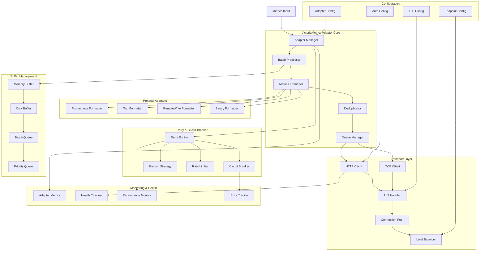

# VMProber VictoriaMetrics Adapter

## Обзор push-адаптера

Push-адаптер VMProber обеспечивает надежную отправку метрик в VictoriaMetrics через различные протоколы. Адаптер поддерживает как текстовый формат Prometheus, так и бинарный RemoteWrite протокол, с автоматическим переключением между методами и comprehensive retry логикой.

## Архитектура push-адаптера



## Основные компоненты

### 1. Adapter Manager
Центральный менеджер для координации всех операций адаптера.

### 2. Batch Processor
Обработка и группировка метрик в батчи для эффективной отправки.

### 3. Metrics Formatter
Форматирование метрик в различные протоколы VictoriaMetrics.

### 4. Transport Layer
Управление сетевыми соединениями и отправкой данных.

### 5. Retry Engine
Система ретраев с circuit breaker и backoff стратегиями.

## Интерфейсы

### VictoriaMetricsAdapter Interface
```go
type VictoriaMetricsAdapter interface {
    // Start запускает адаптер
    Start(ctx context.Context) error
    
    // Stop останавливает адаптер
    Stop(ctx context.Context) error
    
    // Push отправляет метрики
    Push(ctx context.Context, metrics []Metric) error
    
    // GetStats возвращает статистику адаптера
    GetStats() *AdapterStats
    
    // GetHealth возвращает состояние здоровья
    GetHealth() *HealthStatus
    
    // Configure настраивает адаптер
    Configure(ctx context.Context, config *AdapterConfig) error
    
    // RegisterEndpoint регистрирует endpoint
    RegisterEndpoint(ctx context.Context, endpoint *EndpointConfig) error
    
    // UnregisterEndpoint отменяет регистрацию endpoint
    UnregisterEndpoint(ctx context.Context, endpointID string) error
}
```

### Transport Interface
```go
type Transport interface {
    // Connect устанавливает соединение
    Connect(ctx context.Context) error
    
    // Send отправляет данные
    Send(ctx context.Context, data []byte) error
    
    // Receive получает данные
    Receive(ctx context.Context) ([]byte, error)
    
    // Close закрывает соединение
    Close(ctx context.Context) error
    
    // IsConnected проверяет состояние соединения
    IsConnected() bool
    
    // GetStats возвращает статистику транспорта
    GetStats() *TransportStats
}
```

### Formatter Interface
```go
type Formatter interface {
    // Format форматирует метрики
    Format(ctx context.Context, metrics []Metric) ([]byte, error)
    
    // Parse парсит ответ
    Parse(ctx context.Context, response []byte) (*ParseResult, error)
    
    // GetContentType возвращает Content-Type
    GetContentType() string
    
    // GetFormat возвращает формат
    GetFormat() string
    
    // Validate проверяет корректность данных
    Validate(ctx context.Context, data []byte) error
}
```

## Core Data Structures

### AdapterConfig
```go
type AdapterConfig struct {
    // Основные настройки
    Enabled           bool              `yaml:"enabled" json:"enabled"`
    Mode              string            `yaml:"mode" json:"mode"` // "push", "pull", "both"
    
    // Endpoints
    Endpoints         []EndpointConfig  `yaml:"endpoints" json:"endpoints"`
    LoadBalancing     string            `yaml:"load_balancing" json:"load_balancing"` // "round_robin", "least_conn", "random"
    HealthCheck       HealthCheckConfig `yaml:"health_check" json:"health_check"`
    
    // Batch настройки
    Batch             BatchConfig       `yaml:"batch" json:"batch"`
    
    // Buffer настройки
    Buffer            BufferConfig      `yaml:"buffer" json:"buffer"`
    
    // Retry настройки
    Retry             RetryConfig       `yaml:"retry" json:"retry"`
    
    // Circuit Breaker
    CircuitBreaker    CircuitBreakerConfig `yaml:"circuit_breaker" json:"circuit_breaker"`
    
    // Rate Limiting
    RateLimit         RateLimitConfig   `yaml:"rate_limit" json:"rate_limit"`
    
    // Timeout настройки
    Timeout           TimeoutConfig     `yaml:"timeout" json:"timeout"`
    
    // TLS настройки
    TLS               TLSConfig         `yaml:"tls" json:"tls"`
    
    // Authentication
    Auth              AuthConfig        `yaml:"auth" json:"auth"`
    
    // Headers
    Headers           map[string]string `yaml:"headers" json:"headers"`
    
    // Compression
    Compression       CompressionConfig `yaml:"compression" json:"compression"`
    
    // Monitoring
    Monitoring        MonitoringConfig  `yaml:"monitoring" json:"monitoring"`
}

type EndpointConfig struct {
    ID          string            `yaml:"id" json:"id"`
    URL         string            `yaml:"url" json:"url"`
    Priority    int               `yaml:"priority" json:"priority"`
    Weight      float64           `yaml:"weight" json:"weight"`
    Enabled     bool              `yaml:"enabled" json:"enabled"`
    Timeout     time.Duration     `yaml:"timeout" json:"timeout"`
    Headers     map[string]string `yaml:"headers" json:"headers"`
    Auth        AuthConfig        `yaml:"auth" json:"auth"`
    TLS         TLSConfig         `yaml:"tls" json:"tls"`
    Metadata    map[string]string `yaml:"metadata" json:"metadata"`
}

type BatchConfig struct {
    // Размер батча
    MaxSize          int           `yaml:"max_size" json:"max_size"`
    
    // Временные лимиты
    MaxWaitTime      time.Duration `yaml:"max_wait_time" json:"max_wait_time"`
    MinWaitTime      time.Duration `yaml:"min_wait_time" json:"min_wait_time"`
    
    // Размер в байтах
    MaxBytes         int64         `yaml:"max_bytes" json:"max_bytes"`
    
    // Приоритеты
    PriorityEnabled  bool          `yaml:"priority_enabled" json:"priority_enabled"`
    
    // Дедепликация
    Deduplication    DeduplicationConfig `yaml:"deduplication" json:"deduplication"`
    
    // Сортировка
    SortBy           string        `yaml:"sort_by" json:"sort_by"`
    SortOrder        string        `yaml:"sort_order" json:"sort_order"`
}

type BufferConfig struct {
    // Memory buffer
    MemoryEnabled    bool          `yaml:"memory_enabled" json:"memory_enabled"`
    MemoryMaxSize    int           `yaml:"memory_max_size" json:"memory_max_size"`
    MemoryMaxAge     time.Duration `yaml:"memory_max_age" json:"memory_max_age"`
    
    // Disk buffer
    DiskEnabled      bool          `yaml:"disk_enabled" json:"disk_enabled"`
    DiskMaxSize      int64         `yaml:"disk_max_size" json:"disk_max_size"`
    DiskMaxAge       time.Duration `yaml:"disk_max_age" json:"disk_max_age"`
    DiskDirectory    string        `yaml:"disk_directory" json:"disk_directory"`
    
    // Queue настройки
    QueueMaxSize     int           `yaml:"queue_max_size" json:"queue_max_size"`
    QueueOverflow    string        `yaml:"queue_overflow" json:"queue_overflow"` // "drop", "block", "spill"
}

type RetryConfig struct {
    // Основные настройки
    MaxAttempts      int           `yaml:"max_attempts" json:"max_attempts"`
    InitialDelay     time.Duration `yaml:"initial_delay" json:"initial_delay"`
    MaxDelay         time.Duration `yaml:"max_delay" json:"max_delay"`
    BackoffMultiplier float64      `yaml:"backoff_multiplier" json:"backoff_multiplier"`
    Jitter           bool          `yaml:"jitter" json:"jitter"`
    MaxJitter        time.Duration `yaml:"max_jitter" json:"max_jitter"`
    
    // Стратегии
    Strategy         string        `yaml:"strategy" json:"strategy"` // "exponential", "linear", "fixed"
    
    // Условия ретрая
    RetryableErrors  []string      `yaml:"retryable_errors" json:"retryable_errors"`
    NonRetryableErrors []string    `yaml:"non_retryable_errors" json:"non_retryable_errors"`
    
    // Dead letter queue
    DeadLetterQueue  bool          `yaml:"dead_letter_queue" json:"dead_letter_queue"`
    DLQMaxSize       int           `yaml:"dlq_max_size" json:"dlq_max_size"`
}

type CircuitBreakerConfig struct {
    // Основные настройки
    Enabled          bool          `yaml:"enabled" json:"enabled"`
    FailureThreshold float64       `yaml:"failure_threshold" json:"failure_threshold"`
    SuccessThreshold int           `yaml:"success_threshold" json:"success_threshold"`
    Timeout          time.Duration `yaml:"timeout" json:"timeout"`
    
    // Состояния
    InitialState     string        `yaml:"initial_state" json:"initial_state"` // "closed", "open", "half_open"`
    
    // Мониторинг
    MonitorPeriod    time.Duration `yaml:"monitor_period" json:"monitor_period"`
    MetricsWindow    time.Duration `yaml:"metrics_window" json:"metrics_window"`
}

type RateLimitConfig struct {
    // Основные настройки
    Enabled          bool          `yaml:"enabled" json:"enabled"`
    Rate             float64       `yaml:"rate" json:"rate"` // requests per second
    Burst            int           `yaml:"burst" json:"burst"`
    
    // Per-endpoint limits
    PerEndpoint      bool          `yaml:"per_endpoint" json:"per_endpoint"`
    
    // Token bucket
    TokenBucket      bool          `yaml:"token_bucket" json:"token_bucket"`
    TokenCapacity    int           `yaml:"token_capacity" json:"token_capacity"`
    TokenRefillRate  float64       `yaml:"token_refill_rate" json:"token_refill_rate"`
    
    // Sliding window
    SlidingWindow    bool          `yaml:"sliding_window" json:"sliding_window"`
    WindowSize       time.Duration `yaml:"window_size" json:"window_size"`
}
```

### AdapterStats
```go
type AdapterStats struct {
    // Общая статистика
    TotalMetrics     int64         `json:"total_metrics"`
    TotalBatches     int64         `json:"total_batches"`
    TotalRequests    int64         `json:"total_requests"`
    TotalErrors      int64         `json:"total_errors"`
    SuccessRate      float64       `json:"success_rate"`
    
    // Производительность
    AvgBatchSize     float64       `json:"avg_batch_size"`
    AvgRequestSize   float64       `json:"avg_request_size"`
    AvgLatency       time.Duration `json:"avg_latency"`
    P50Latency       time.Duration `json:"p50_latency"`
    P95Latency       time.Duration `json:"p95_latency"`
    P99Latency       time.Duration `json:"p99_latency"`
    
    // Throughput
    MetricsPerSecond float64       `json:"metrics_per_second"`
    BytesPerSecond   float64       `json:"bytes_per_second"`
    
    // Buffer статистика
    MemoryBufferSize int64         `json:"memory_buffer_size"`
    DiskBufferSize   int64         `json:"disk_buffer_size"`
    QueueSize        int           `json:"queue_size"`
    
    // Retry статистика
    RetryStats       *RetryStats   `json:"retry_stats"`
    
    // Circuit Breaker статистика
    CircuitBreakerStats *CircuitBreakerStats `json:"circuit_breaker_stats"`
    
    // Endpoint статистика
    EndpointStats    map[string]*EndpointStats `json:"endpoint_stats"`
    
    // Состояние системы
    Uptime           time.Duration `json:"uptime"`
    LastActivity     time.Time     `json:"last_activity"`
    HealthStatus     string        `json:"health_status"`
}

type EndpointStats struct {
    Requests         int64         `json:"requests"`
    Errors           int64         `json:"errors"`
    SuccessRate      float64       `json:"success_rate"`
    AvgLatency       time.Duration `json:"avg_latency"`
    CurrentState     string        `json:"current_state"`
    LastRequest      time.Time     `json:"last_request"`
    BytesSent        int64         `json:"bytes_sent"`
    BytesReceived    int64         `json:"bytes_received"`
}

type RetryStats struct {
    TotalRetries     int64         `json:"total_retries"`
    SuccessfulRetries int64        `json:"successful_retries"`
    FailedRetries    int64         `json:"failed_retries"`
    AvgRetryDelay    time.Duration `json:"avg_retry_delay"`
    MaxRetryDelay    time.Duration `json:"max_retry_delay"`
    QueueSize        int           `json:"queue_size"`
    DLQSize          int           `json:"dlq_size"`
}

type CircuitBreakerStats struct {
    State            string        `json:"state"`
    FailureCount     int64         `json:"failure_count"`
    SuccessCount     int64         `json:"success_count"`
    LastFailureTime  time.Time     `json:"last_failure_time"`
    LastSuccessTime  time.Time     `json:"last_success_time"`
    NextRetryTime    time.Time     `json:"next_retry_time"`
}
```

## Adapter Implementation

### DefaultVictoriaMetricsAdapter
```go
type DefaultVictoriaMetricsAdapter struct {
    config     *AdapterConfig
    endpoints  map[string]*Endpoint
    transport  Transport
    formatter  Formatter
    batcher    *BatchProcessor
    buffer     *BufferManager
    retry      *RetryEngine
    circuit    *CircuitBreaker
    rateLimit  *RateLimiter
    stats      *AdapterStats
    mu         sync.RWMutex
    ctx        context.Context
    cancel     context.CancelFunc
    logger     *zap.Logger
    metrics    *AdapterMetrics
    health     *HealthMonitor
}

func NewDefaultVictoriaMetricsAdapter(config *AdapterConfig, logger *zap.Logger) (*DefaultVictoriaMetricsAdapter, error) {
    ctx, cancel := context.WithCancel(context.Background())
    
    adapter := &DefaultVictoriaMetricsAdapter{
        config:    config,
        endpoints: make(map[string]*Endpoint),
        transport: NewHTTPTransport(config),
        formatter: NewPrometheusFormatter(config),
        batcher:   NewBatchProcessor(config.Batch, logger),
        buffer:    NewBufferManager(config.Buffer, logger),
        retry:     NewRetryEngine(config.Retry, logger),
        circuit:   NewCircuitBreaker(config.CircuitBreaker, logger),
        rateLimit: NewRateLimiter(config.RateLimit, logger),
        stats: &AdapterStats{
            EndpointStats: make(map[string]*EndpointStats),
        },
        ctx:     ctx,
        cancel:  cancel,
        logger:  logger,
        metrics: NewAdapterMetrics(),
        health:  NewHealthMonitor(config.HealthCheck, logger),
    }
    
    // Инициализация endpoints
    if err := adapter.initializeEndpoints(ctx); err != nil {
        return nil, fmt.Errorf("failed to initialize endpoints: %w", err)
    }
    
    // Запуск health checker
    go adapter.healthCheckLoop(ctx)
    
    return adapter, nil
}

func (a *DefaultVictoriaMetricsAdapter) Start(ctx context.Context) error {
    a.logger.Info("starting VictoriaMetrics adapter",
        "mode", a.config.Mode,
        "endpoints", len(a.config.Endpoints))
    
    // Запуск компонентов
    if err := a.transport.Connect(ctx); err != nil {
        return fmt.Errorf("failed to connect transport: %w", err)
    }
    
    if err := a.buffer.Start(ctx); err != nil {
        return fmt.Errorf("failed to start buffer: %w", err)
    }
    
    if err := a.retry.Start(ctx); err != nil {
        return fmt.Errorf("failed to start retry engine: %w", err)
    }
    
    // Запуск фоновых задач
    go a.batchProcessingLoop(ctx)
    go a.flushLoop(ctx)
    go a.statsCollectionLoop(ctx)
    
    a.logger.Info("VictoriaMetrics adapter started successfully")
    return nil
}

func (a *DefaultVictoriaMetricsAdapter) Push(ctx context.Context, metrics []Metric) error {
    // Проверка circuit breaker
    if !a.circuit.Allow() {
        a.logger.Warn("circuit breaker is open, buffering metrics")
        return a.buffer.Add(ctx, metrics)
    }
    
    // Применение rate limiting
    if !a.rateLimit.Allow() {
        a.logger.Warn("rate limit exceeded, buffering metrics")
        return a.buffer.Add(ctx, metrics)
    }
    
    // Добавление в batch processor
    if err := a.batcher.Add(ctx, metrics); err != nil {
        return fmt.Errorf("failed to add metrics to batch: %w", err)
    }
    
    return nil
}

func (a *DefaultVictoriaMetricsAdapter) batchProcessingLoop(ctx context.Context) {
    ticker := time.NewTicker(100 * time.Millisecond)
    defer ticker.Stop()
    
    for {
        select {
        case <-ticker.C:
            // Получение готовых батчей
            batches := a.batcher.GetReadyBatches(ctx)
            
            for _, batch := range batches {
                if err := a.processBatch(ctx, batch); err != nil {
                    a.logger.Error("failed to process batch", "error", err)
                    
                    // Отправка в retry или buffer
                    if a.config.Retry.MaxAttempts > 0 {
                        a.retry.Schedule(ctx, batch, 1)
                    } else {
                        a.buffer.Add(ctx, batch.Metrics)
                    }
                }
            }
            
        case <-ctx.Done():
            return
        }
    }
}

func (a *DefaultVictoriaMetricsAdapter) processBatch(ctx context.Context, batch *Batch) error {
    start := time.Now()
    
    // Выбор endpoint
    endpoint, err := a.selectEndpoint(ctx)
    if err != nil {
        return fmt.Errorf("failed to select endpoint: %w", err)
    }
    
    // Форматирование метрик
    formattedData, err := a.formatter.Format(ctx, batch.Metrics)
    if err != nil {
        return fmt.Errorf("failed to format metrics: %w", err)
    }
    
    // Отправка данных
    response, err := a.sendToEndpoint(ctx, endpoint, formattedData)
    if err != nil {
        // Обновление circuit breaker
        a.circuit.RecordFailure()
        
        // Логирование ошибки
        a.logger.Error("failed to send metrics to endpoint",
            "endpoint", endpoint.ID(),
            "error", err)
        
        return err
    }
    
    // Обновление circuit breaker
    a.circuit.RecordSuccess()
    
    // Парсинг ответа
    if err := a.parseResponse(ctx, response); err != nil {
        a.logger.Warn("failed to parse response", "error", err)
    }
    
    // Обновление статистики
    a.updateStats(start, len(batch.Metrics), len(formattedData), true)
    
    a.logger.Debug("batch processed successfully",
        "metrics_count", len(batch.Metrics),
        "bytes_sent", len(formattedData),
        "latency", time.Since(start))
    
    return nil
}

func (a *DefaultVictoriaMetricsAdapter) selectEndpoint(ctx context.Context) (*Endpoint, error) {
    a.mu.RLock()
    defer a.mu.RUnlock()
    
    var availableEndpoints []*Endpoint
    
    // Фильтрация доступных endpoints
    for _, endpoint := range a.endpoints {
        if endpoint.IsHealthy() && endpoint.IsEnabled() {
            availableEndpoints = append(availableEndpoints, endpoint)
        }
    }
    
    if len(availableEndpoints) == 0 {
        return nil, fmt.Errorf("no healthy endpoints available")
    }
    
    // Выбор endpoint по стратегии load balancing
    switch a.config.LoadBalancing {
    case "round_robin":
        return a.selectRoundRobin(availableEndpoints), nil
    case "least_conn":
        return a.selectLeastConnections(availableEndpoints), nil
    case "random":
        return a.selectRandom(availableEndpoints), nil
    case "priority":
        return a.selectPriority(availableEndpoints), nil
    default:
        return availableEndpoints[0], nil
    }
}

func (a *DefaultVictoriaMetricsAdapter) sendToEndpoint(ctx context.Context, endpoint *Endpoint, data []byte) ([]byte, error) {
    // Создание HTTP запроса
    req, err := http.NewRequestWithContext(ctx, "POST", endpoint.URL(), bytes.NewReader(data))
    if err != nil {
        return nil, fmt.Errorf("failed to create request: %w", err)
    }
    
    // Установка заголовков
    req.Header.Set("Content-Type", a.formatter.GetContentType())
    req.Header.Set("User-Agent", "VMProber/1.0")
    
    // Добавление custom headers
    for key, value := range a.config.Headers {
        req.Header.Set(key, value)
    }
    
    for key, value := range endpoint.Headers() {
        req.Header.Set(key, value)
    }
    
    // Аутентификация
    if err := a.applyAuthentication(req, endpoint); err != nil {
        return nil, fmt.Errorf("failed to apply authentication: %w", err)
    }
    
    // Отправка запроса
    response, err := a.transport.Send(ctx, data)
    if err != nil {
        return nil, fmt.Errorf("transport send failed: %w", err)
    }
    
    return response, nil
}

func (a *DefaultVictoriaMetricsAdapter) parseResponse(ctx context.Context, response []byte) error {
    // Парсинг ответа VictoriaMetrics
    result, err := a.formatter.Parse(ctx, response)
    if err != nil {
        return fmt.Errorf("failed to parse response: %w", err)
    }
    
    // Проверка статуса ответа
    if !result.Success {
        return fmt.Errorf("VictoriaMetrics returned error: %s", result.Error)
    }
    
    // Логирование успешного ответа
    a.logger.Debug("VictoriaMetrics response parsed successfully",
        "metrics_ingested", result.MetricsIngested,
        "bytes_processed", result.BytesProcessed)
    
    return nil
}

func (a *DefaultVictoriaMetricsAdapter) Stop(ctx context.Context) error {
    a.logger.Info("stopping VictoriaMetrics adapter")
    
    // Отмена контекста
    a.cancel()
    
    // Сброс буферов
    if err := a.buffer.Flush(ctx); err != nil {
        a.logger.Error("failed to flush buffer", "error", err)
    }
    
    // Остановка компонентов
    if err := a.transport.Close(ctx); err != nil {
        a.logger.Error("failed to close transport", "error", err)
    }
    
    if err := a.buffer.Stop(ctx); err != nil {
        a.logger.Error("failed to stop buffer", "error", err)
    }
    
    if err := a.retry.Stop(ctx); err != nil {
        a.logger.Error("failed to stop retry engine", "error", err)
    }
    
    a.logger.Info("VictoriaMetrics adapter stopped successfully")
    return nil
}
```

## Transport Implementations

### HTTP Transport
```go
type HTTPTransport struct {
    config     *AdapterConfig
    client     *http.Client
    endpoints  []string
    current    int
    mu         sync.RWMutex
    stats      *TransportStats
    logger     *zap.Logger
}

func NewHTTPTransport(config *AdapterConfig) *HTTPTransport {
    // Создание HTTP клиента с настройками
    client := &http.Client{
        Transport: &http.Transport{
            MaxIdleConns:        100,
            MaxIdleConnsPerHost: 10,
            IdleConnTimeout:     90 * time.Second,
            DisableCompression:  false,
        },
        Timeout: config.Timeout.Request,
    }
    
    // Настройка TLS если требуется
    if config.TLS.Enabled {
        client.Transport = &http.Transport{
            TLSClientConfig: &tls.Config{
                InsecureSkipVerify: config.TLS.InsecureSkipVerify,
                ServerName:         config.TLS.ServerName,
            },
        }
    }
    
    return &HTTPTransport{
        config:    config,
        client:    client,
        endpoints: extractEndpoints(config),
        stats: &TransportStats{
            Requests:    0,
            Errors:      0,
            AvgLatency:  0,
        },
        logger: zap.L(),
    }
}

func (t *HTTPTransport) Connect(ctx context.Context) error {
    // Проверка соединения с endpoints
    for _, endpoint := range t.endpoints {
        if err := t.pingEndpoint(ctx, endpoint); err != nil {
            t.logger.Warn("endpoint ping failed", "endpoint", endpoint, "error", err)
        } else {
            t.logger.Info("endpoint ping successful", "endpoint", endpoint)
        }
    }
    
    return nil
}

func (t *HTTPTransport) Send(ctx context.Context, data []byte) ([]byte, error) {
    t.mu.Lock()
    defer t.mu.Unlock()
    
    start := time.Now()
    
    // Выбор endpoint
    endpoint := t.selectEndpoint()
    
    // Создание запроса
    req, err := http.NewRequestWithContext(ctx, "POST", endpoint, bytes.NewReader(data))
    if err != nil {
        t.stats.Errors++
        return nil, fmt.Errorf("failed to create request: %w", err)
    }
    
    // Установка заголовков
    req.Header.Set("Content-Type", "text/plain")
    req.Header.Set("Content-Length", strconv.Itoa(len(data)))
    
    // Отправка запроса
    resp, err := t.client.Do(req)
    if err != nil {
        t.stats.Errors++
        return nil, fmt.Errorf("HTTP request failed: %w", err)
    }
    defer resp.Body.Close()
    
    // Чтение ответа
    responseData, err := io.ReadAll(resp.Body)
    if err != nil {
        t.stats.Errors++
        return nil, fmt.Errorf("failed to read response: %w", err)
    }
    
    // Проверка статуса ответа
    if resp.StatusCode >= 400 {
        t.stats.Errors++
        return nil, fmt.Errorf("HTTP error %d: %s", resp.StatusCode, string(responseData))
    }
    
    // Обновление статистики
    t.stats.Requests++
    t.stats.AvgLatency = time.Since(start)
    
    return responseData, nil
}

func (t *HTTPTransport) selectEndpoint() string {
    if len(t.endpoints) == 0 {
        return ""
    }
    
    endpoint := t.endpoints[t.current]
    t.current = (t.current + 1) % len(t.endpoints)
    
    return endpoint
}

func (t *HTTPTransport) pingEndpoint(ctx context.Context, endpoint string) error {
    req, err := http.NewRequestWithContext(ctx, "GET", endpoint+"/health")
    if err != nil {
        return err
    }
    
    resp, err := t.client.Do(req)
    if err != nil {
        return err
    }
    defer resp.Body.Close()
    
    return nil
}
```

## Formatter Implementations

### Prometheus Formatter
```go
type PrometheusFormatter struct {
    config     *AdapterConfig
    namespace  string
    mu         sync.RWMutex
}

func NewPrometheusFormatter(config *AdapterConfig) *PrometheusFormatter {
    return &PrometheusFormatter{
        config:    config,
        namespace: config.Namespace,
    }
}

func (f *PrometheusFormatter) Format(ctx context.Context, metrics []Metric) ([]byte, error) {
    f.mu.Lock()
    defer f.mu.Unlock()
    
    var buffer bytes.Buffer
    
    // Группировка метрик по имени
    groupedMetrics := f.groupMetricsByName(metrics)
    
    // Форматирование каждой группы
    for metricName, group := range groupedMetrics {
        // Запись HELP и TYPE
        buffer.WriteString(fmt.Sprintf("# HELP %s %s\n", metricName, f.getHelpText(metricName)))
        buffer.WriteString(fmt.Sprintf("# TYPE %s %s\n", metricName, f.getTypeString(group[0])))
        
        // Запись метрик
        for _, metric := range group {
            line, err := f.formatMetric(metric)
            if err != nil {
                f.logger.Warn("failed to format metric", "metric", metric.Name, "error", err)
                continue
            }
            buffer.WriteString(line)
            buffer.WriteString("\n")
        }
    }
    
    return buffer.Bytes(), nil
}

func (f *PrometheusFormatter) formatMetric(metric Metric) (string, error) {
    // Экранирование имени метрики
    metricName := f.escapeMetricName(metric.Name)
    
    // Формирование строки метрики
    var line strings.Builder
    
    line.WriteString(metricName)
    
    // Добавление меток
    if len(metric.Labels) > 0 {
        line.WriteString("{")
        
        var labelParts []string
        for key, value := range metric.Labels {
            escapedValue := f.escapeLabelValue(value)
            labelParts = append(labelParts, fmt.Sprintf("%s=\"%s\"", key, escapedValue))
        }
        
        line.WriteString(strings.Join(labelParts, ","))
        line.WriteString("}")
    }
    
    // Добавление значения
    line.WriteString(fmt.Sprintf(" %g", metric.Value))
    
    // Добавление временной метки
    if !metric.Timestamp.IsZero() {
        line.WriteString(fmt.Sprintf(" %d", metric.Timestamp.UnixNano()/1e9))
    }
    
    return line.String(), nil
}

func (f *PrometheusFormatter) Parse(ctx context.Context, response []byte) (*ParseResult, error) {
    // Парсинг ответа VictoriaMetrics
    responseStr := strings.TrimSpace(string(response))
    
    // Проверка успешности ответа
    if strings.Contains(responseStr, "success") || strings.Contains(responseStr, "ok") {
        return &ParseResult{
            Success:         true,
            MetricsIngested: f.extractMetricsCount(response),
            BytesProcessed:  int64(len(response)),
        }, nil
    }
    
    return &ParseResult{
        Success: false,
        Error:   responseStr,
    }, nil
}

func (f *PrometheusFormatter) GetContentType() string {
    return "text/plain; version=0.0.4; charset=utf-8"
}

func (f *PrometheusFormatter) GetFormat() string {
    return "prometheus_text"
}
```

### RemoteWrite Formatter
```go
type RemoteWriteFormatter struct {
    config     *AdapterConfig
    mu         sync.RWMutex
}

func NewRemoteWriteFormatter(config *AdapterConfig) *RemoteWriteFormatter {
    return &RemoteWriteFormatter{
        config: config,
    }
}

func (f *RemoteWriteFormatter) Format(ctx context.Context, metrics []Metric) ([]byte, error) {
    f.mu.Lock()
    defer f.mu.Unlock()
    
    // Создание WriteRequest
    writeRequest := &prompb.WriteRequest{
        Timeseries: make([]prompb.TimeSeries, 0, len(metrics)),
    }
    
    // Конвертация метрик в TimeSeries
    for _, metric := range metrics {
        timeSeries := f.convertMetricToTimeSeries(metric)
        writeRequest.Timeseries = append(writeRequest.Timeseries, timeSeries)
    }
    
    // Сериализация в protobuf
    data, err := proto.Marshal(writeRequest)
    if err != nil {
        return nil, fmt.Errorf("failed to marshal WriteRequest: %w", err)
    }
    
    return data, nil
}

func (f *RemoteWriteFormatter) convertMetricToTimeSeries(metric Metric) prompb.TimeSeries {
    // Создание labels
    labels := make([]prompb.Label, 0, len(metric.Labels)+1)
    
    // Добавление имени метрики
    labels = append(labels, prompb.Label{
        Name:  "__name__",
        Value: metric.Name,
    })
    
    // Добавление остальных меток
    for key, value := range metric.Labels {
        labels = append(labels, prompb.Label{
            Name:  key,
            Value: value,
        })
    }
    
    // Создание samples
    samples := []prompb.Sample{{
        Value:     metric.Value,
        Timestamp: metric.Timestamp.UnixNano() / 1e9,
    }}
    
    return prompb.TimeSeries{
        Labels:  labels,
        Samples: samples,
    }
}

func (f *RemoteWriteFormatter) Parse(ctx context.Context, response []byte) (*ParseResult, error) {
    // RemoteWrite обычно возвращает 204 No Content при успехе
    return &ParseResult{
        Success:         true,
        MetricsIngested: len(response), // Приблизительная оценка
        BytesProcessed:  int64(len(response)),
    }, nil
}

func (f *RemoteWriteFormatter) GetContentType() string {
    return "application/x-protobuf"
}

func (f *RemoteWriteFormatter) GetFormat() string {
    return "remote_write"
}
```

## Batch Processing

### BatchProcessor
```go
type BatchProcessor struct {
    config     *BatchConfig
    batches    []*Batch
    current    *Batch
    mu         sync.RWMutex
    ctx        context.Context
    cancel     context.CancelFunc
    logger     *zap.Logger
    metrics    *BatchMetrics
}

type Batch struct {
    ID          string
    Metrics     []Metric
    Size        int
    Bytes       int64
    CreatedAt   time.Time
    Priority    int
    DeduplicationKey string
}

func NewBatchProcessor(config BatchConfig, logger *zap.Logger) *BatchProcessor {
    ctx, cancel := context.WithCancel(context.Background())
    
    return &BatchProcessor{
        config:  &config,
        batches: make([]*Batch, 0),
        current: &Batch{
            ID:        generateBatchID(),
            Metrics:   make([]Metric, 0),
            CreatedAt: time.Now(),
        },
        ctx:     ctx,
        cancel:  cancel,
        logger:  logger,
        metrics: NewBatchMetrics(),
    }
}

func (b *BatchProcessor) Add(ctx context.Context, metrics []Metric) error {
    b.mu.Lock()
    defer b.mu.Unlock()
    
    for _, metric := range metrics {
        // Проверка дедупликации
        if b.config.Deduplication.Enabled {
            if b.isDuplicate(metric) {
                b.metrics.RecordDuplicate()
                continue
            }
        }
        
        // Добавление метрики в текущий batch
        if err := b.addMetricToCurrentBatch(metric); err != nil {
            return fmt.Errorf("failed to add metric to batch: %w", err)
        }
        
        // Проверка готовности batch
        if b.isBatchReady() {
            b.finalizeCurrentBatch()
        }
    }
    
    return nil
}

func (b *BatchProcessor) GetReadyBatches(ctx context.Context) []*Batch {
    b.mu.Lock()
    defer b.mu.Unlock()
    
    readyBatches := b.batches
    b.batches = make([]*Batch, 0)
    
    return readyBatches
}

func (b *BatchProcessor) addMetricToCurrentBatch(metric Metric) error {
    // Проверка лимитов
    if len(b.current.Metrics) >= b.config.MaxSize {
        return fmt.Errorf("batch size limit exceeded")
    }
    
    // Проверка размера в байтах
    metricBytes := b.estimateMetricSize(metric)
    if b.current.Bytes+metricBytes > b.config.MaxBytes {
        return fmt.Errorf("batch byte limit exceeded")
    }
    
    // Добавление метрики
    b.current.Metrics = append(b.current.Metrics, metric)
    b.current.Size++
    b.current.Bytes += metricBytes
    
    return nil
}

func (b *BatchProcessor) isBatchReady() bool {
    // Проверка размера
    if len(b.current.Metrics) >= b.config.MaxSize {
        return true
    }
    
    // Проверка размера в байтах
    if b.current.Bytes >= b.config.MaxBytes {
        return true
    }
    
    // Проверка времени ожидания
    if time.Since(b.current.CreatedAt) >= b.config.MaxWaitTime {
        return true
    }
    
    return false
}

func (b *BatchProcessor) finalizeCurrentBatch() {
    // Добавление в список готовых batch'ей
    b.batches = append(b.batches, b.current)
    
    // Создание нового текущего batch
    b.current = &Batch{
        ID:        generateBatchID(),
        Metrics:   make([]Metric, 0),
        CreatedAt: time.Now(),
    }
    
    // Обновление метрик
    b.metrics.RecordBatch(len(b.batches))
}
```

## Buffer Management

### BufferManager
```go
type BufferManager struct {
    config     *BufferConfig
    memory     *MemoryBuffer
    disk       *DiskBuffer
    queue      *PriorityQueue
    mu         sync.RWMutex
    ctx        context.Context
    cancel     context.CancelFunc
    logger     *zap.Logger
    metrics    *BufferMetrics
}

type MemoryBuffer struct {
    metrics    []Metric
    maxSize    int
    maxAge     time.Duration
    mu         sync.Mutex
    cond       *sync.Cond
}

type DiskBuffer struct {
    directory  string
    maxSize    int64
    maxAge     time.Duration
    files      []string
    mu         sync.RWMutex
    logger     *zap.Logger
}

func NewBufferManager(config BufferConfig, logger *zap.Logger) *BufferManager {
    ctx, cancel := context.WithCancel(context.Background())
    
    buffer := &BufferManager{
        config: &config,
        memory: &MemoryBuffer{
            metrics: make([]Metric, 0),
            maxSize: config.MemoryMaxSize,
            maxAge:  config.MemoryMaxAge,
        },
        disk: &DiskBuffer{
            directory: config.DiskDirectory,
            maxSize:   config.DiskMaxSize,
            maxAge:    config.DiskMaxAge,
            logger:    logger,
        },
        queue:   NewPriorityQueue(),
        ctx:     ctx,
        cancel:  cancel,
        logger:  logger,
        metrics: NewBufferMetrics(),
    }
    
    // Инициализация дискового буфера
    if config.DiskEnabled {
        buffer.initializeDiskBuffer()
    }
    
    return buffer
}

func (b *BufferManager) Add(ctx context.Context, metrics []Metric) error {
    b.mu.Lock()
    defer b.mu.Unlock()
    
    // Добавление в memory buffer
    if b.config.MemoryEnabled {
        if err := b.addToMemoryBuffer(metrics); err != nil {
            b.logger.Warn("failed to add to memory buffer", "error", err)
        }
    }
    
    // Добавление в disk buffer если memory buffer переполнен
    if b.memory.metrics != nil && len(b.memory.metrics) >= b.memory.maxSize {
        if b.config.DiskEnabled {
            if err := b.addToDiskBuffer(metrics); err != nil {
                b.logger.Warn("failed to add to disk buffer", "error", err)
            }
        }
    }
    
    return nil
}

func (b *BufferManager) Flush(ctx context.Context) error {
    b.mu.Lock()
    defer b.mu.Unlock()
    
    // Сброс memory buffer
    if b.memory != nil {
        b.flushMemoryBuffer()
    }
    
    // Сброс disk buffer
    if b.disk != nil {
        b.flushDiskBuffer()
    }
    
    return nil
}

func (b *BufferManager) GetMetrics(ctx context.Context) ([]Metric, error) {
    b.mu.RLock()
    defer b.mu.RUnlock()
    
    var allMetrics []Metric
    
    // Получение из memory buffer
    if b.memory != nil {
        b.memory.mu.Lock()
        allMetrics = append(allMetrics, b.memory.metrics...)
        b.memory.metrics = make([]Metric, 0)
        b.memory.mu.Unlock()
    }
    
    // Получение из disk buffer
    if b.disk != nil {
        diskMetrics, err := b.disk.Read(ctx)
        if err != nil {
            b.logger.Warn("failed to read from disk buffer", "error", err)
        } else {
            allMetrics = append(allMetrics, diskMetrics...)
        }
    }
    
    return allMetrics, nil
}
```

## Configuration Examples

### Basic Configuration
```yaml
push:
  enabled: true
  mode: "push"
  
  endpoints:
    - url: "http://victoriametrics:8428/api/v1/import/prometheus"
      priority: 1
      weight: 1.0
      enabled: true
  
  batch:
    max_size: 1000
    max_wait_time: 10s
    max_bytes: 1048576  # 1MB
  
  retry:
    max_attempts: 3
    initial_delay: 1s
    max_delay: 30s
    backoff_multiplier: 2.0
```

### Advanced Configuration
```yaml
push:
  enabled: true
  mode: "both"
  
  # Load Balancing
  load_balancing: "round_robin"
  health_check:
    enabled: true
    interval: 30s
    timeout: 5s
    path: "/health"
  
  # Batch Configuration
  batch:
    max_size: 5000
    max_wait_time: 5s
    min_wait_time: 100ms
    max_bytes: 10485760  # 10MB
    priority_enabled: true
    deduplication:
      enabled: true
      window: 60s
      max_keys: 10000
    sort_by: "timestamp"
    sort_order: "asc"
  
  # Buffer Configuration
  buffer:
    memory_enabled: true
    memory_max_size: 10000
    memory_max_age: 300s
    disk_enabled: true
    disk_max_size: 1073741824  # 1GB
    disk_max_age: 3600s
    disk_directory: "/var/lib/vmprober/buffer"
    queue_max_size: 50000
    queue_overflow: "spill"
  
  # Retry Configuration
  retry:
    max_attempts: 5
    initial_delay: 500ms
    max_delay: 300s
    backoff_multiplier: 2.0
    jitter: true
    max_jitter: 5s
    strategy: "exponential"
    retryable_errors:
      - "timeout"
      - "connection refused"
      - "temporary failure"
    non_retryable_errors:
      - "unauthorized"
      - "forbidden"
    dead_letter_queue: true
    dlq_max_size: 1000
  
  # Circuit Breaker
  circuit_breaker:
    enabled: true
    failure_threshold: 0.5
    success_threshold: 3
    timeout: 60s
    initial_state: "closed"
    monitor_period: 10s
    metrics_window: 300s
  
  # Rate Limiting
  rate_limit:
    enabled: true
    rate: 1000.0  # requests per second
    burst: 2000
    per_endpoint: true
    token_bucket: true
    token_capacity: 2000
    token_refill_rate: 1000.0
    sliding_window: true
    window_size: 60s
  
  # Timeouts
  timeout:
    connect: 10s
    request: 30s
    response: 60s
  
  # TLS Configuration
  tls:
    enabled: false
    insecure_skip_verify: false
    server_name: "victoriametrics.example.com"
    ca_file: "/path/to/ca.pem"
    cert_file: "/path/to/cert.pem"
    key_file: "/path/to/key.pem"
  
  # Authentication
  auth:
    type: "bearer"
    token: "your-auth-token"
    username: "admin"
    password: "password"
  
  # Headers
  headers:
    X-Client-ID: "vmprober"
    X-Version: "1.0.0"
  
  # Compression
  compression:
    enabled: true
    algorithm: "gzip"
    level: 6
  
  # Monitoring
  monitoring:
    enabled: true
    collection_interval: 30s
    metrics_namespace: "vmprober_adapter"
```

## Performance Optimizations

### 1. Connection Management
- Connection pooling для HTTP клиентов
- Keep-alive соединения
- Health checking endpoints
- Automatic failover

### 2. Batch Optimization
- Dynamic batch sizing
- Priority-based batching
- Intelligent deduplication
- Memory-efficient processing

### 3. Buffer Management
- Multi-level buffering (memory + disk)
- Automatic buffer rotation
- Compression for disk storage
- Queue overflow strategies

### 4. Network Optimization
- HTTP/2 support
- Compression for data transfer
- Request pipelining
- Adaptive timeouts

## Monitoring and Alerting

### 1. Adapter Metrics
- Request rate and latency
- Success/error rates
- Batch processing metrics
- Buffer utilization

### 2. Endpoint Health
- Endpoint availability
- Response times
- Error rates
- Load balancing distribution

### 3. Retry Metrics
- Retry attempts and success rates
- Circuit breaker state
- Dead letter queue size
- Backoff timing

### 4. Alerting Rules
```yaml
groups:
- name: vmprober_adapter
  rules:
  - alert: AdapterHighErrorRate
    expr: rate(vmprober_adapter_errors_total[5m]) > 0.1
    for: 2m
    labels:
      severity: critical
    annotations:
      summary: "VictoriaMetrics adapter error rate is high"
      
  - alert: AdapterCircuitBreakerOpen
    expr: vmprober_adapter_circuit_breaker_state == 1
    for: 1m
    labels:
      severity: warning
    annotations:
      summary: "VictoriaMetrics adapter circuit breaker is open"
      
  - alert: AdapterBufferOverflow
    expr: vmprober_adapter_buffer_usage_percent > 90
    for: 5m
    labels:
      severity: warning
    annotations:
      summary: "VictoriaMetrics adapter buffer is near capacity"
      
  - alert: AdapterEndpointDown
    expr: vmprober_adapter_endpoint_healthy == 0
    for: 1m
    labels:
      severity: critical
    annotations:
      summary: "VictoriaMetrics endpoint is down"
```

## Testing Strategy

### 1. Unit Tests
- Formatter testing
- Transport testing
- Batch processing testing
- Buffer management testing

### 2. Integration Tests
- End-to-end adapter testing
- VictoriaMetrics integration testing
- Retry mechanism testing
- Circuit breaker testing

### 3. Load Tests
- High throughput testing
- Buffer overflow testing
- Network failure simulation
- Long-running stability tests

### 4. Chaos Engineering
- Network partition testing
- Endpoint failure simulation
- Resource exhaustion testing
- Recovery testing