# VMProber WAL (Write-Ahead Log) System

## Обзор WAL системы

WAL (Write-Ahead Log) система VMProber обеспечивает надежное хранение метрик перед их отправкой в VictoriaMetrics. Система реализует отказоустойчивую запись с поддержкой ретраев, сегментированного хранения, компрессии и автоматической ротации.

## Архитектура WAL системы

```mermaid
graph TB
    subgraph "WAL Core"
        WAL_MANAGER[WAL Manager]
        SEGMENT_WRITER[Segment Writer]
        SEGMENT_READER[Segment Reader]
        INDEX_MANAGER[Index Manager]
        COMPACTION_ENGINE[Compaction Engine]
    end
    
    subgraph "Storage Layer"
        ACTIVE_SEGMENT[Active Segment]
        READONLY_SEGMENTS[Readonly Segments]
        COMPACTED_SEGMENTS[Compacted Segments]
        ARCHIVED_SEGMENTS[Archived Segments]
    end
    
    subgraph "Index System"
        PRIMARY_INDEX[Primary Index]
        SECONDARY_INDEX[Secondary Index]
        BLOOM_FILTER[Bloom Filter]
        METADATA_CACHE[Metadata Cache]
    end
    
    subgraph "Compression & Encoding"
        COMPRESSION_ENGINE[Compression Engine]
        ENCODER[Data Encoder]
        DECODER[Data Decoder]
        CHECKSUM_VALIDATOR[Checksum Validator]
    end
    
    subgraph "Retry & Recovery"
        RETRY_MANAGER[Retry Manager]
        BACKOFF_STRATEGY[Backoff Strategy]
        RECOVERY_ENGINE[Recovery Engine]
        CONSISTENCY_CHECKER[Consistency Checker]
    end
    
    subgraph "Monitoring & Metrics"
        WAL_METRICS[WAL Metrics]
        PERFORMANCE_MONITOR[Performance Monitor]
        HEALTH_CHECKER[Health Checker]
        ALERT_MANAGER[Alert Manager]
    end
    
    subgraph "Configuration"
        WAL_CONFIG[WAL Config]
        RETRY_CONFIG[Retry Config]
        COMPACTION_CONFIG[Compaction Config]
        RETENTION_CONFIG[Retention Config]
    end
    
    %% Core Flow
    METRICS_INPUT[Metrics Input] --> WAL_MANAGER
    WAL_MANAGER --> SEGMENT_WRITER
    SEGMENT_WRITER --> ACTIVE_SEGMENT
    
    %% Reading Flow
    SEGMENT_READER --> READONLY_SEGMENTS
    SEGMENT_READER --> COMPACTED_SEGMENTS
    SEGMENT_READER --> ARCHIVED_SEGMENTS
    
    %% Index Flow
    SEGMENT_WRITER --> INDEX_MANAGER
    INDEX_MANAGER --> PRIMARY_INDEX
    INDEX_MANAGER --> SECONDARY_INDEX
    INDEX_MANAGER --> BLOOM_FILTER
    INDEX_MANAGER --> METADATA_CACHE
    
    %% Compression Flow
    SEGMENT_WRITER --> COMPRESSION_ENGINE
    COMPRESSION_ENGINE --> ENCODER
    ENCODER --> ACTIVE_SEGMENT
    
    SEGMENT_READER --> DECODER
    DECODER --> COMPRESSION_ENGINE
    
    %% Retry Flow
    WAL_MANAGER --> RETRY_MANAGER
    RETRY_MANAGER --> BACKOFF_STRATEGY
    RETRY_MANAGER --> RECOVERY_ENGINE
    
    %% Compaction Flow
    COMPACTION_ENGINE --> READONLY_SEGMENTS
    COMPACTION_ENGINE --> COMPACTED_SEGMENTS
    COMPACTION_ENGINE --> ARCHIVED_SEGMENTS
    
    %% Monitoring Flow
    WAL_MANAGER --> WAL_METRICS
    SEGMENT_WRITER --> PERFORMANCE_MONITOR
    INDEX_MANAGER --> HEALTH_CHECKER
    RETRY_MANAGER --> ALERT_MANAGER
    
    %% Configuration Flow
    WAL_CONFIG --> WAL_MANAGER
    RETRY_CONFIG --> RETRY_MANAGER
    COMPACTION_CONFIG --> COMPACTION_ENGINE
    RETENTION_CONFIG --> ARCHIVED_SEGMENTS
```



## Основные компоненты

### 1. WAL Manager
Центральный менеджер для координации всех операций WAL.

### 2. Segment Writer
Запись данных в активные сегменты с компрессией и индексацией.

### 3. Segment Reader
Чтение данных из сегментов с поддержкой поиска и фильтрации.

### 4. Index Manager
Управление индексами для быстрого поиска записей.

### 5. Retry Manager
Управление ретраями с экспоненциальной задержкой.

### 6. Compaction Engine
Сжатие и объединение сегментов для оптимизации хранения.

## Интерфейсы

### WALManager Interface
```go
type WALManager interface {
    // Write записывает запись в WAL
    Write(ctx context.Context, record *WALRecord) error
    
    // Read читает записи из WAL
    Read(ctx context.Context, filter WALFilter) ([]*WALRecord, error)
    
    // Flush принудительно сбрасывает буферы
    Flush(ctx context.Context) error
    
    // Close закрывает WAL
    Close(ctx context.Context) error
    
    // GetStats возвращает статистику WAL
    GetStats() *WALStats
    
    // Rotate выполняет ротацию сегментов
    Rotate(ctx context.Context) error
    
    // Compact выполняет сжатие сегментов
    Compact(ctx context.Context) error
    
    // Recover восстанавливает WAL после сбоя
    Recover(ctx context.Context) error
}
```

### WALRecord Interface
```go
type WALRecord interface {
    // ID возвращает уникальный идентификатор записи
    ID() string
    
    // Timestamp возвращает временную метку записи
    Timestamp() time.Time
    
    // Data возвращает данные записи
    Data() []byte
    
    // Metadata возвращает метаданные записи
    Metadata() map[string]string
    
    // Checksum возвращает контрольную сумму
    Checksum() uint64
    
    // Validate проверяет целостность записи
    Validate() error
}
```

### RetryManager Interface
```go
type RetryManager interface {
    // Schedule планирует ретрай
    Schedule(ctx context.Context, record *WALRecord, attempt int) error
    
    // Process обрабатывает запланированные ретраи
    Process(ctx context.Context) error
    
    // Cancel отменяет запланированный ретрай
    Cancel(ctx context.Context, recordID string) error
    
    // GetStats возвращает статистику ретраев
    GetStats() *RetryStats
}
```

## Core Data Structures

### WALConfig
```go
type WALConfig struct {
    // Directory для хранения WAL файлов
    Directory string `yaml:"directory" json:"directory"`
    
    // Максимальный размер сегмента
    MaxSegmentSize int64 `yaml:"max_segment_size" json:"max_segment_size"`
    
    // Максимальный возраст сегмента
    MaxSegmentAge time.Duration `yaml:"max_segment_age" json:"max_segment_age"`
    
    // Размер буфера записи
    WriteBufferSize int `yaml:"write_buffer_size" json:"write_buffer_size"`
    
    // Интервал принудительного сброса
    FlushInterval time.Duration `yaml:"flush_interval" json:"flush_interval"`
    
    // Количество сегментов для хранения
    MaxSegments int `yaml:"max_segments" json:"max_segments"`
    
    // Включение компрессии
    CompressionEnabled bool `yaml:"compression_enabled" json:"compression_enabled"`
    
    // Алгоритм компрессии
    CompressionAlgorithm string `yaml:"compression_algorithm" json:"compression_algorithm"`
    
    // Уровень компрессии
    CompressionLevel int `yaml:"compression_level" json:"compression_level"`
    
    // Интервал сжатия
    CompactionInterval time.Duration `yaml:"compaction_interval" json:"compaction_interval"`
    
    // Минимальное количество сегментов для сжатия
    MinSegmentsForCompaction int `yaml:"min_segments_for_compaction" json:"min_segments_for_compaction"`
    
    // Retention политика
    Retention RetentionConfig `yaml:"retention" json:"retention"`
    
    // Retry конфигурация
    Retry RetryConfig `yaml:"retry" json:"retry"`
    
    // Индекс конфигурация
    Index IndexConfig `yaml:"index" json:"index"`
    
    // Мониторинг
    Monitoring MonitoringConfig `yaml:"monitoring" json:"monitoring"`
}

type RetentionConfig struct {
    // Максимальный возраст файлов
    MaxAge time.Duration `yaml:"max_age" json:"max_age"`
    
    // Максимальный размер директории
    MaxSize int64 `yaml:"max_size" json:"max_size"`
    
    // Автоматическая очистка
    AutoCleanup bool `yaml:"auto_cleanup" json:"auto_cleanup"`
    
    // Интервал очистки
    CleanupInterval time.Duration `yaml:"cleanup_interval" json:"cleanup_interval"`
}

type RetryConfig struct {
    // Максимальное количество попыток
    MaxAttempts int `yaml:"max_attempts" json:"max_attempts"`
    
    // Начальная задержка
    InitialDelay time.Duration `yaml:"initial_delay" json:"initial_delay"`
    
    // Максимальная задержка
    MaxDelay time.Duration `yaml:"max_delay" json:"max_delay"`
    
    // Множитель экспоненциальной задержки
    BackoffMultiplier float64 `yaml:"backoff_multiplier" json:"backoff_multiplier"`
    
    // Jitter для случайности
    Jitter bool `yaml:"jitter" json:"jitter"`
    
    // Максимальный jitter
    MaxJitter time.Duration `yaml:"max_jitter" json:"max_jitter"`
}

type IndexConfig struct {
    // Включение индекса
    Enabled bool `yaml:"enabled" json:"enabled"`
    
    // Тип индекса
    Type string `yaml:"type" json:"type"`
    
    // Размер кэша
    CacheSize int `yaml:"cache_size" json:"cache_size"`
    
    // Интервал сброса индекса
    FlushInterval time.Duration `yaml:"flush_interval" json:"flush_interval"`
}

type MonitoringConfig struct {
    // Включение метрик
    Enabled bool `yaml:"enabled" json:"enabled"`
    
    // Интервал сбора метрик
    CollectionInterval time.Duration `yaml:"collection_interval" json:"collection_interval"`
    
    // Включение health checks
    HealthCheckEnabled bool `yaml:"health_check_enabled" json:"health_check_enabled"`
    
    // Интервал health checks
    HealthCheckInterval time.Duration `yaml:"health_check_interval" json:"health_check_interval"`
}
```

### WALRecord
```go
type WALRecord struct {
    id         string
    timestamp  time.Time
    data       []byte
    metadata   map[string]string
    checksum   uint64
    sequence   uint64
    compressed bool
    algorithm  string
}

type WALFilter struct {
    // Фильтр по временному диапазону
    StartTime *time.Time
    EndTime   *time.Time
    
    // Фильтр по метаданным
    MetadataFilter map[string]string
    
    // Фильтр по последовательности
    StartSequence *uint64
    EndSequence   *uint64
    
    // Лимит записей
    Limit *int
    
    // Сортировка
    SortBy    string
    SortOrder string
}

type WALStats struct {
    // Общая статистика
    TotalRecords      int64         `json:"total_records"`
    TotalSize         int64         `json:"total_size"`
    ActiveSegments    int           `json:"active_segments"`
    ReadonlySegments  int           `json:"readonly_segments"`
    CompactedSegments int           `json:"compacted_segments"`
    ArchivedSegments  int           `json:"archived_segments"`
    
    // Производительность
    WriteRate         float64       `json:"write_rate"`
    ReadRate          float64       `json:"read_rate"`
    CompressionRatio  float64       `json:"compression_ratio"`
    AvgWriteLatency   time.Duration `json:"avg_write_latency"`
    AvgReadLatency    time.Duration `json:"avg_read_latency"`
    
    // Retry статистика
    RetryStats        *RetryStats   `json:"retry_stats"`
    
    // Состояние системы
    DiskUsage         int64         `json:"disk_usage"`
    MemoryUsage       int64         `json:"memory_usage"`
    LastActivity      time.Time     `json:"last_activity"`
    HealthStatus      string        `json:"health_status"`
}
```

## WAL Manager Implementation

### DefaultWALManager
```go
type DefaultWALManager struct {
    config     *WALConfig
    directory  string
    segments   map[string]*WALSegment
    activeSegment *WALSegment
    index      *IndexManager
    retry      *RetryManager
    compaction *CompactionEngine
    stats      *WALStats
    mu         sync.RWMutex
    ctx        context.Context
    cancel     context.CancelFunc
    logger     *zap.Logger
    metrics    *WALMetrics
}

func NewDefaultWALManager(config *WALConfig, logger *zap.Logger) (*DefaultWALManager, error) {
    // Создание директории если не существует
    if err := os.MkdirAll(config.Directory, 0755); err != nil {
        return nil, fmt.Errorf("failed to create WAL directory: %w", err)
    }
    
    ctx, cancel := context.WithCancel(context.Background())
    
    manager := &DefaultWALManager{
        config:    config,
        directory: config.Directory,
        segments:  make(map[string]*WALSegment),
        index:     NewIndexManager(config.Index, logger),
        retry:     NewRetryManager(config.Retry, logger),
        stats: &WALStats{
            RetryStats: &RetryStats{},
        },
        ctx:     ctx,
        cancel:  cancel,
        logger:  logger,
        metrics: NewWALMetrics(),
    }
    
    // Инициализация компонентов
    if err := manager.initialize(ctx); err != nil {
        return nil, fmt.Errorf("failed to initialize WAL manager: %w", err)
    }
    
    return manager, nil
}

func (w *DefaultWALManager) initialize(ctx context.Context) error {
    // Загрузка существующих сегментов
    if err := w.loadSegments(ctx); err != nil {
        return fmt.Errorf("failed to load segments: %w", err)
    }
    
    // Создание активного сегмента
    if err := w.createActiveSegment(ctx); err != nil {
        return fmt.Errorf("failed to create active segment: %w", err)
    }
    
    // Запуск фоновых задач
    go w.flushLoop(ctx)
    go w.compactionLoop(ctx)
    go w.cleanupLoop(ctx)
    go w.retryLoop(ctx)
    
    return nil
}

func (w *DefaultWALManager) Write(ctx context.Context, record *WALRecord) error {
    w.mu.Lock()
    defer w.mu.Unlock()
    
    // Проверка контекста
    select {
    case <-ctx.Done():
        return ctx.Err()
    default:
    }
    
    start := time.Now()
    
    // Подготовка записи
    preparedRecord, err := w.prepareRecord(ctx, record)
    if err != nil {
        return fmt.Errorf("failed to prepare record: %w", err)
    }
    
    // Запись в активный сегмент
    if err := w.activeSegment.Write(ctx, preparedRecord); err != nil {
        return fmt.Errorf("failed to write to active segment: %w", err)
    }
    
    // Обновление индекса
    if err := w.index.Add(ctx, preparedRecord); err != nil {
        w.logger.Warn("failed to update index", "error", err)
    }
    
    // Обновление статистики
    w.updateWriteStats(start, preparedRecord)
    
    // Проверка необходимости ротации
    if w.shouldRotate() {
        go func() {
            if err := w.Rotate(ctx); err != nil {
                w.logger.Error("failed to rotate segment", "error", err)
            }
        }()
    }
    
    return nil
}

func (w *DefaultWALManager) prepareRecord(ctx context.Context, record *WALRecord) (*WALRecord, error) {
    // Генерация ID если не задан
    if record.id == "" {
        record.id = generateRecordID()
    }
    
    // Установка временной метки если не задана
    if record.timestamp.IsZero() {
        record.timestamp = time.Now()
    }
    
    // Вычисление контрольной суммы
    record.checksum = w.calculateChecksum(record)
    
    // Компрессия данных если включена
    if w.config.CompressionEnabled {
        compressedData, err := w.compressData(record.data)
        if err != nil {
            return nil, fmt.Errorf("failed to compress data: %w", err)
        }
        record.data = compressedData
        record.compressed = true
        record.algorithm = w.config.CompressionAlgorithm
    }
    
    return record, nil
}

func (w *DefaultWALManager) Read(ctx context.Context, filter WALFilter) ([]*WALRecord, error) {
    w.mu.RLock()
    defer w.mu.RUnlock()
    
    var records []*WALRecord
    
    // Поиск через индекс
    if w.config.Index.Enabled {
        indexedRecords, err := w.index.Search(ctx, filter)
        if err != nil {
            w.logger.Warn("index search failed, falling back to full scan", "error", err)
        } else {
            records = indexedRecords
        }
    }
    
    // Если индекс недоступен, выполняем полное сканирование
    if len(records) == 0 {
        records, err := w.fullScan(ctx, filter)
        if err != nil {
            return nil, fmt.Errorf("full scan failed: %w", err)
        }
        return records, nil
    }
    
    // Применение дополнительных фильтров
    filteredRecords := w.applyFilters(records, filter)
    
    return filteredRecords, nil
}

func (w *DefaultWALManager) Flush(ctx context.Context) error {
    w.mu.Lock()
    defer w.mu.Unlock()
    
    w.logger.Debug("flushing WAL buffers")
    
    // Сброс активного сегмента
    if err := w.activeSegment.Flush(ctx); err != nil {
        return fmt.Errorf("failed to flush active segment: %w", err)
    }
    
    // Сброс индекса
    if err := w.index.Flush(ctx); err != nil {
        return fmt.Errorf("failed to flush index: %w", err)
    }
    
    w.logger.Debug("WAL buffers flushed successfully")
    return nil
}

func (w *DefaultWALManager) Rotate(ctx context.Context) error {
    w.mu.Lock()
    defer w.mu.Unlock()
    
    w.logger.Info("rotating WAL segment")
    
    // Закрытие текущего активного сегмента
    if err := w.activeSegment.Close(ctx); err != nil {
        return fmt.Errorf("failed to close active segment: %w", err)
    }
    
    // Перемещение в readonly сегменты
    readonlySegment := w.activeSegment
    readonlySegment.SetReadonly()
    w.segments[readonlySegment.ID()] = readonlySegment
    
    // Создание нового активного сегмента
    if err := w.createActiveSegment(ctx); err != nil {
        return fmt.Errorf("failed to create new active segment: %w", err)
    }
    
    // Обновление статистики
    w.stats.ActiveSegments--
    w.stats.ReadonlySegments++
    
    w.logger.Info("WAL segment rotated successfully")
    return nil
}

func (w *DefaultWALManager) Compact(ctx context.Context) error {
    w.mu.Lock()
    defer w.mu.Unlock()
    
    w.logger.Info("starting WAL compaction")
    
    // Получение сегментов для сжатия
    segmentsToCompact := w.getSegmentsForCompaction()
    
    if len(segmentsToCompact) < w.config.MinSegmentsForCompaction {
        w.logger.Debug("not enough segments for compaction",
            "segments", len(segmentsToCompact),
            "min_required", w.config.MinSegmentsForCompaction)
        return nil
    }
    
    // Выполнение сжатия
    compactedSegment, err := w.compaction.Compact(ctx, segmentsToCompact)
    if err != nil {
        return fmt.Errorf("compaction failed: %w", err)
    }
    
    // Замена сегментов
    for _, segment := range segmentsToCompact {
        delete(w.segments, segment.ID())
        w.stats.ReadonlySegments--
    }
    
    w.segments[compactedSegment.ID()] = compactedSegment
    w.stats.CompactedSegments++
    
    w.logger.Info("WAL compaction completed successfully")
    return nil
}

func (w *DefaultWALManager) Recover(ctx context.Context) error {
    w.logger.Info("starting WAL recovery")
    
    // Проверка целостности сегментов
    if err := w.checkIntegrity(ctx); err != nil {
        return fmt.Errorf("integrity check failed: %w", err)
    }
    
    // Восстановление из сегментов
    if err := w.recoverFromSegments(ctx); err != nil {
        return fmt.Errorf("segment recovery failed: %w", err)
    }
    
    // Восстановление индекса
    if err := w.index.Recover(ctx); err != nil {
        w.logger.Warn("index recovery failed", "error", err)
    }
    
    // Восстановление retry очереди
    if err := w.retry.Recover(ctx); err != nil {
        w.logger.Warn("retry recovery failed", "error", err)
    }
    
    w.logger.Info("WAL recovery completed successfully")
    return nil
}

func (w *DefaultWALManager) Close(ctx context.Context) error {
    w.logger.Info("closing WAL manager")
    
    // Отмена контекста
    w.cancel()
    
    // Сброс всех буферов
    if err := w.Flush(ctx); err != nil {
        w.logger.Error("failed to flush during close", "error", err)
    }
    
    // Закрытие активного сегмента
    if w.activeSegment != nil {
        if err := w.activeSegment.Close(ctx); err != nil {
            w.logger.Error("failed to close active segment", "error", err)
        }
    }
    
    // Закрытие всех сегментов
    for _, segment := range w.segments {
        if err := segment.Close(ctx); err != nil {
            w.logger.Error("failed to close segment", "segment_id", segment.ID(), "error", err)
        }
    }
    
    // Закрытие компонентов
    if err := w.index.Close(ctx); err != nil {
        w.logger.Error("failed to close index", "error", err)
    }
    
    if err := w.retry.Close(ctx); err != nil {
        w.logger.Error("failed to close retry manager", "error", err)
    }
    
    w.logger.Info("WAL manager closed successfully")
    return nil
}
```

## Segment Management

### WALSegment
```go
type WALSegment struct {
    id          string
    path        string
    file        *os.File
    writer      *bufio.Writer
    index       *SegmentIndex
    metadata    *SegmentMetadata
    isReadonly  bool
    createdAt   time.Time
    size        int64
    recordCount int64
    mu          sync.RWMutex
    logger      *zap.Logger
}

type SegmentMetadata struct {
    ID            string                 `json:"id"`
    CreatedAt     time.Time              `json:"created_at"`
    ModifiedAt    time.Time              `json:"modified_at"`
    Size          int64                  `json:"size"`
    RecordCount   int64                  `json:"record_count"`
    Checksum      uint64                 `json:"checksum"`
    Version       string                 `json:"version"`
    Compression   string                 `json:"compression"`
    CustomFields  map[string]interface{} `json:"custom_fields"`
}

func NewWALSegment(id, path string, logger *zap.Logger) (*WALSegment, error) {
    file, err := os.OpenFile(path, os.O_CREATE|os.O_WRONLY|os.O_APPEND, 0644)
    if err != nil {
        return nil, fmt.Errorf("failed to create segment file: %w", err)
    }
    
    segment := &WALSegment{
        id:         id,
        path:       path,
        file:       file,
        writer:     bufio.NewWriter(file),
        index:      NewSegmentIndex(),
        metadata: &SegmentMetadata{
            ID:          id,
            CreatedAt:   time.Now(),
            ModifiedAt:  time.Now(),
            Version:     "1.0",
        },
        isReadonly: false,
        createdAt:  time.Now(),
        logger:     logger,
    }
    
    // Загрузка существующих данных
    if err := segment.loadExistingData(); err != nil {
        file.Close()
        return nil, fmt.Errorf("failed to load existing data: %w", err)
    }
    
    return segment, nil
}

func (s *WALSegment) Write(ctx context.Context, record *WALRecord) error {
    s.mu.Lock()
    defer s.mu.Unlock()
    
    if s.isReadonly {
        return fmt.Errorf("cannot write to readonly segment")
    }
    
    // Проверка контекста
    select {
    case <-ctx.Done():
        return ctx.Err()
    default:
    }
    
    // Сериализация записи
    serializedRecord, err := s.serializeRecord(record)
    if err != nil {
        return fmt.Errorf("failed to serialize record: %w", err)
    }
    
    // Запись в файл
    if _, err := s.writer.Write(serializedRecord); err != nil {
        return fmt.Errorf("failed to write record: %w", err)
    }
    
    // Обновление метаданных
    s.metadata.RecordCount++
    s.metadata.ModifiedAt = time.Now()
    s.size += int64(len(serializedRecord))
    
    // Обновление индекса
    s.index.Add(record.ID(), int64(len(serializedRecord)))
    
    return nil
}

func (s *WALSegment) Read(ctx context.Context, filter WALFilter) ([]*WALRecord, error) {
    s.mu.RLock()
    defer s.mu.RUnlock()
    
    var records []*WALRecord
    
    // Использование индекса для поиска
    if s.index != nil {
        positions, err := s.index.Search(filter)
        if err != nil {
            return nil, fmt.Errorf("index search failed: %w", err)
        }
        
        for _, pos := range positions {
            record, err := s.readRecordAt(pos)
            if err != nil {
                s.logger.Warn("failed to read record", "position", pos, "error", err)
                continue
            }
            records = append(records, record)
        }
    } else {
        // Полное сканирование
        records, err := s.fullScan(ctx, filter)
        if err != nil {
            return nil, fmt.Errorf("full scan failed: %w", err)
        }
    }
    
    return records, nil
}

func (s *WALSegment) Flush(ctx context.Context) error {
    s.mu.Lock()
    defer s.mu.Unlock()
    
    if s.writer != nil {
        if err := s.writer.Flush(); err != nil {
            return fmt.Errorf("failed to flush writer: %w", err)
        }
        
        // Принудительная запись на диск
        if err := s.file.Sync(); err != nil {
            return fmt.Errorf("failed to sync file: %w", err)
        }
    }
    
    // Обновление метаданных
    s.metadata.ModifiedAt = time.Now()
    
    return nil
}

func (s *WALSegment) Close(ctx context.Context) error {
    s.mu.Lock()
    defer s.mu.Unlock()
    
    // Сброс буферов
    if s.writer != nil {
        if err := s.writer.Flush(); err != nil {
            s.logger.Error("failed to flush during close", "error", err)
        }
    }
    
    // Закрытие файла
    if s.file != nil {
        if err := s.file.Close(); err != nil {
            s.logger.Error("failed to close segment file", "error", err)
        }
    }
    
    // Сохранение метаданных
    if err := s.saveMetadata(); err != nil {
        s.logger.Error("failed to save metadata", "error", err)
    }
    
    return nil
}

func (s *WALSegment) SetReadonly() {
    s.mu.Lock()
    defer s.mu.Unlock()
    s.isReadonly = true
}

func (s *WALSegment) serializeRecord(record *WALRecord) ([]byte, error) {
    // Создание структуры для сериализации
    serializable := struct {
        ID         string            `json:"id"`
        Timestamp  int64             `json:"timestamp"`
        Data       []byte            `json:"data"`
        Metadata   map[string]string `json:"metadata"`
        Checksum   uint64            `json:"checksum"`
        Sequence   uint64            `json:"sequence"`
        Compressed bool              `json:"compressed"`
        Algorithm  string            `json:"algorithm"`
    }{
        ID:         record.id,
        Timestamp:  record.timestamp.UnixNano(),
        Data:       record.data,
        Metadata:   record.metadata,
        Checksum:   record.checksum,
        Sequence:   record.sequence,
        Compressed: record.compressed,
        Algorithm:  record.algorithm,
    }
    
    // Сериализация в JSON
    data, err := json.Marshal(serializable)
    if err != nil {
        return nil, fmt.Errorf("failed to marshal record: %w", err)
    }
    
    // Добавление размера записи в начало
    size := uint32(len(data))
    sizeBytes := make([]byte, 4)
    binary.BigEndian.PutUint32(sizeBytes, size)
    
    result := make([]byte, 0, len(sizeBytes)+len(data))
    result = append(result, sizeBytes...)
    result = append(result, data...)
    
    return result, nil
}

func (s *WALSegment) deserializeRecord(data []byte) (*WALRecord, error) {
    if len(data) < 4 {
        return nil, fmt.Errorf("invalid record data: too short")
    }
    
    // Извлечение размера
    size := binary.BigEndian.Uint32(data[:4])
    if uint32(len(data)-4) != size {
        return nil, fmt.Errorf("invalid record size: expected %d, got %d", size, len(data)-4)
    }
    
    // Десериализация JSON
    var serializable struct {
        ID         string            `json:"id"`
        Timestamp  int64             `json:"timestamp"`
        Data       []byte            `json:"data"`
        Metadata   map[string]string `json:"metadata"`
        Checksum   uint64            `json:"checksum"`
        Sequence   uint64            `json:"sequence"`
        Compressed bool              `json:"compressed"`
        Algorithm  string            `json:"algorithm"`
    }
    
    if err := json.Unmarshal(data[4:], &serializable); err != nil {
        return nil, fmt.Errorf("failed to unmarshal record: %w", err)
    }
    
    // Создание записи
    record := &WALRecord{
        id:         serializable.ID,
        timestamp:  time.Unix(0, serializable.Timestamp),
        data:       serializable.Data,
        metadata:   serializable.Metadata,
        checksum:   serializable.Checksum,
        sequence:   serializable.Sequence,
        compressed: serializable.Compressed,
        algorithm:  serializable.Algorithm,
    }
    
    return record, nil
}
```

## Retry Management

### RetryManager
```go
type RetryManager struct {
    config     *RetryConfig
    queue      *PriorityQueue
    processed  map[string]*RetryAttempt
    stats      *RetryStats
    mu         sync.RWMutex
    ctx        context.Context
    cancel     context.CancelFunc
    logger     *zap.Logger
    metrics    *RetryMetrics
}

type RetryAttempt struct {
    RecordID   string
    Record     *WALRecord
    Attempt    int
    NextRetry  time.Time
    Backoff    time.Duration
    CreatedAt  time.Time
    LastError  error
}

type RetryStats struct {
    TotalRetries      int64         `json:"total_retries"`
    SuccessfulRetries int64         `json:"successful_retries"`
    FailedRetries     int64         `json:"failed_retries"`
    AvgRetryDelay     time.Duration `json:"avg_retry_delay"`
    MaxRetryDelay     time.Duration `json:"max_retry_delay"`
    QueueSize         int           `json:"queue_size"`
    OldestRetry       time.Time     `json:"oldest_retry"`
}

func NewRetryManager(config RetryConfig, logger *zap.Logger) *RetryManager {
    ctx, cancel := context.WithCancel(context.Background())
    
    return &RetryManager{
        config:    &config,
        queue:     NewPriorityQueue(),
        processed: make(map[string]*RetryAttempt),
        stats: &RetryStats{
            MaxRetryDelay: config.MaxDelay,
        },
        ctx:     ctx,
        cancel:  cancel,
        logger:  logger,
        metrics: NewRetryMetrics(),
    }
}

func (r *RetryManager) Schedule(ctx context.Context, record *WALRecord, attempt int) error {
    r.mu.Lock()
    defer r.mu.Unlock()
    
    // Проверка лимита попыток
    if attempt > r.config.MaxAttempts {
        r.logger.Warn("max retry attempts reached",
            "record_id", record.ID(),
            "attempt", attempt,
            "max_attempts", r.config.MaxAttempts)
        return nil
    }
    
    // Вычисление задержки
    delay := r.calculateDelay(attempt)
    
    // Добавление jitter если включен
    if r.config.Jitter {
        jitter := time.Duration(rand.Float64() * float64(r.config.MaxJitter))
        delay += jitter
    }
    
    nextRetry := time.Now().Add(delay)
    
    // Создание попытки
    retryAttempt := &RetryAttempt{
        RecordID:  record.ID(),
        Record:    record,
        Attempt:   attempt,
        NextRetry: nextRetry,
        Backoff:   delay,
        CreatedAt: time.Now(),
    }
    
    // Добавление в очередь
    r.queue.Push(retryAttempt, priority(nextRetry))
    
    // Обновление статистики
    r.stats.QueueSize++
    if r.stats.OldestRetry.IsZero() || nextRetry.Before(r.stats.OldestRetry) {
        r.stats.OldestRetry = nextRetry
    }
    
    r.logger.Debug("retry scheduled",
        "record_id", record.ID(),
        "attempt", attempt,
        "delay", delay,
        "next_retry", nextRetry)
    
    return nil
}

func (r *RetryManager) Process(ctx context.Context) error {
    r.mu.Lock()
    defer r.mu.Unlock()
    
    var processedCount int64
    
    // Обработка попыток из очереди
    for !r.queue.IsEmpty() {
        select {
        case <-ctx.Done():
            return ctx.Err()
        default:
        }
        
        // Получение следующей попытки
        item := r.queue.Pop()
        if item == nil {
            break
        }
        
        retryAttempt, ok := item.Value.(*RetryAttempt)
        if !ok {
            continue
        }
        
        // Проверка времени следующего ретрая
        if time.Now().Before(retryAttempt.NextRetry) {
            // Возврат в очередь
            r.queue.Push(retryAttempt, priority(retryAttempt.NextRetry))
            break
        }
        
        // Обработка ретрая
        if err := r.processRetry(ctx, retryAttempt); err != nil {
            r.logger.Error("retry processing failed",
                "record_id", retryAttempt.RecordID,
                "attempt", retryAttempt.Attempt,
                "error", err)
            
            // Планирование следующего ретрая
            nextAttempt := retryAttempt.Attempt + 1
            if nextAttempt <= r.config.MaxAttempts {
                r.Schedule(ctx, retryAttempt.Record, nextAttempt)
            } else {
                r.stats.FailedRetries++
                r.logger.Error("max retry attempts reached, giving up",
                    "record_id", retryAttempt.RecordID,
                    "attempts", retryAttempt.Attempt)
            }
        } else {
            r.stats.SuccessfulRetries++
            r.logger.Info("retry successful",
                "record_id", retryAttempt.RecordID,
                "attempt", retryAttempt.Attempt)
        }
        
        processedCount++
        
        // Ограничение обработки за один цикл
        if processedCount >= 1000 {
            break
        }
    }
    
    return nil
}

func (r *RetryManager) processRetry(ctx context.Context, attempt *RetryAttempt) error {
    // Выполнение ретрая (здесь должна быть логика отправки в VictoriaMetrics)
    // Это заглушка - в реальной реализации здесь будет вызов адаптера
    
    r.metrics.RecordRetryAttempt(attempt.Attempt)
    
    // Симуляция обработки
    select {
    case <-time.After(10 * time.Millisecond):
        // Успешная обработка
        return nil
    case <-ctx.Done():
        return ctx.Err()
    }
}

func (r *RetryManager) calculateDelay(attempt int) time.Duration {
    // Экспоненциальная задержка
    delay := time.Duration(float64(r.config.InitialDelay) * math.Pow(r.config.BackoffMultiplier, float64(attempt-1)))
    
    // Ограничение максимальной задержкой
    if delay > r.config.MaxDelay {
        delay = r.config.MaxDelay
    }
    
    return delay
}

func (r *RetryManager) Cancel(ctx context.Context, recordID string) error {
    r.mu.Lock()
    defer r.mu.Unlock()
    
    // Удаление из очереди
    r.queue.Remove(func(item *PriorityQueueItem) bool {
        if retryAttempt, ok := item.Value.(*RetryAttempt); ok {
            return retryAttempt.RecordID == recordID
        }
        return false
    })
    
    // Удаление из обработанных
    delete(r.processed, recordID)
    
    r.logger.Debug("retry cancelled", "record_id", recordID)
    return nil
}

func (r *RetryManager) Close(ctx context.Context) error {
    r.logger.Info("closing retry manager")
    
    // Отмена контекста
    r.cancel()
    
    // Очистка очереди
    r.queue.Clear()
    
    r.logger.Info("retry manager closed")
    return nil
}
```

## Index Management

### IndexManager
```go
type IndexManager struct {
    config     *IndexConfig
    primary    *PrimaryIndex
    secondary  *SecondaryIndex
    bloom      *BloomFilter
    cache      *MetadataCache
    mu         sync.RWMutex
    logger     *zap.Logger
}

type PrimaryIndex struct {
    entries    map[string]*IndexEntry
    sortedKeys []string
    mu         sync.RWMutex
}

type SecondaryIndex struct {
    entries    map[string][]string // metadata key -> record IDs
    mu         sync.RWMutex
}

type IndexEntry struct {
    RecordID   string
    Position   int64
    Size       int64
    Timestamp  time.Time
    Checksum   uint64
}

func NewIndexManager(config IndexConfig, logger *zap.Logger) *IndexManager {
    return &IndexManager{
        config:    &config,
        primary:   NewPrimaryIndex(),
        secondary: NewSecondaryIndex(),
        bloom:     NewBloomFilter(100000, 0.01), // 100k entries, 1% false positive rate
        cache:     NewMetadataCache(config.CacheSize),
        logger:    logger,
    }
}

func (i *IndexManager) Add(ctx context.Context, record *WALRecord) error {
    i.mu.Lock()
    defer i.mu.Unlock()
    
    // Добавление в первичный индекс
    entry := &IndexEntry{
        RecordID:  record.id,
        Position:  -1, // Будет установлен при записи
        Size:      int64(len(record.data)),
        Timestamp: record.timestamp,
        Checksum:  record.checksum,
    }
    
    i.primary.Add(entry)
    
    // Добавление во вторичный индекс
    for key, value := range record.metadata {
        i.secondary.Add(key, value, record.id)
    }
    
    // Добавление в Bloom filter
    i.bloom.Add(record.id)
    
    // Добавление в кэш
    i.cache.Add(record.id, record.metadata)
    
    return nil
}

func (i *IndexManager) Search(ctx context.Context, filter WALFilter) ([]*WALRecord, error) {
    i.mu.RLock()
    defer i.mu.RUnlock()
    
    var recordIDs []string
    
    // Использование Bloom filter для быстрой проверки
    if filter.MetadataFilter != nil {
        for key, value := range filter.MetadataFilter {
            ids := i.secondary.Search(key, value)
            recordIDs = append(recordIDs, ids...)
        }
    }
    
    // Если нет фильтров по метаданным, используем первичный индекс
    if len(recordIDs) == 0 {
        recordIDs = i.primary.Search(filter)
    }
    
    // Применение временных фильтров
    filteredIDs := i.applyTimeFilters(recordIDs, filter)
    
    return i.getRecordsByIDs(filteredIDs), nil
}

func (i *IndexManager) Flush(ctx context.Context) error {
    i.mu.Lock()
    defer i.mu.Unlock()
    
    // Сохранение индекса на диск
    if err := i.saveIndex(ctx); err != nil {
        return fmt.Errorf("failed to save index: %w", err)
    }
    
    // Очистка кэша
    i.cache.Flush()
    
    return nil
}

func (i *IndexManager) Recover(ctx context.Context) error {
    i.mu.Lock()
    defer i.mu.Unlock()
    
    // Загрузка индекса с диска
    if err := i.loadIndex(ctx); err != nil {
        return fmt.Errorf("failed to load index: %w", err)
    }
    
    // Восстановление кэша
    i.cache.Recover()
    
    return nil
}
```

## Configuration Examples

### Basic WAL Configuration
```yaml
wal:
  directory: "/var/lib/vmprober/wal"
  max_segment_size: 100MB
  max_segment_age: 1h
  write_buffer_size: 8192
  flush_interval: 30s
  max_segments: 10
  compression_enabled: true
  compression_algorithm: "gzip"
  compression_level: 6
```

### Advanced WAL Configuration
```yaml
wal:
  directory: "/var/lib/vmprober/wal"
  max_segment_size: 500MB
  max_segment_age: 2h
  write_buffer_size: 16384
  flush_interval: 10s
  max_segments: 20
  
  # Compression
  compression_enabled: true
  compression_algorithm: "zstd"
  compression_level: 3
  
  # Compaction
  compaction_interval: 1h
  min_segments_for_compaction: 3
  
  # Retention
  retention:
    max_age: 168h  # 7 days
    max_size: 10GB
    auto_cleanup: true
    cleanup_interval: 1h
  
  # Retry Configuration
  retry:
    max_attempts: 5
    initial_delay: 1s
    max_delay: 300s
    backoff_multiplier: 2.0
    jitter: true
    max_jitter: 5s
  
  # Index Configuration
  index:
    enabled: true
    type: "btree"
    cache_size: 10000
    flush_interval: 60s
  
  # Monitoring
  monitoring:
    enabled: true
    collection_interval: 30s
    health_check_enabled: true
    health_check_interval: 60s
```

## Performance Optimizations

### 1. Write Optimizations
- Буферизованная запись
- Batch записи
- Асинхронная компрессия
- Memory-mapped файлы

### 2. Read Optimizations
- Индексированный поиск
- Bloom filters для быстрой проверки
- Кэширование метаданных
- Параллельное чтение сегментов

### 3. Storage Optimizations
- Сжатие данных
- Сегментирование
- Compaction старых сегментов
- Автоматическая ротация

### 4. Memory Management
- Object pooling
- Слайсы с предварительным выделением
- Garbage collection оптимизация
- Memory-mapped I/O

## Monitoring and Alerting

### 1. WAL Metrics
- Размер WAL директории
- Количество сегментов
- Скорость записи/чтения
- Коэффициент сжатия

### 2. Retry Metrics
- Количество ретраев
- Время задержки ретраев
- Процент успешных ретраев
- Размер retry очереди

### 3. Health Checks
- Целостность сегментов
- Доступность дискового пространства
- Производительность записи
- Состояние индекса

### 4. Alerting Rules
```yaml
groups:
- name: vmprober_wal
  rules:
  - alert: WALDirectoryFull
    expr: vmprober_wal_disk_usage_percent > 90
    for: 5m
    labels:
      severity: critical
    annotations:
      summary: "WAL directory is running out of space"
      
  - alert: WALHighRetryRate
    expr: rate(vmprober_wal_retries_total[5m]) > 0.1
    for: 2m
    labels:
      severity: warning
    annotations:
      summary: "High WAL retry rate detected"
      
  - alert: WALSegmentCorruption
    expr: vmprober_wal_corrupted_segments > 0
    for: 1m
    labels:
      severity: critical
    annotations:
      summary: "WAL segment corruption detected"
```

## Testing Strategy

### 1. Unit Tests
- Тестирование записи/чтения сегментов
- Тестирование retry логики
- Тестирование индексации
- Тестирование компрессии

### 2. Integration Tests
- End-to-end тестирование WAL pipeline
- Тестирование recovery после сбоя
- Тестирование производительности под нагрузкой
- Тестирование конкурентного доступа

### 3. Stress Tests
- Тестирование с большими объемами данных
- Тестирование при ограниченных ресурсах
- Тестирование длительной работы
- Тестирование graceful shutdown